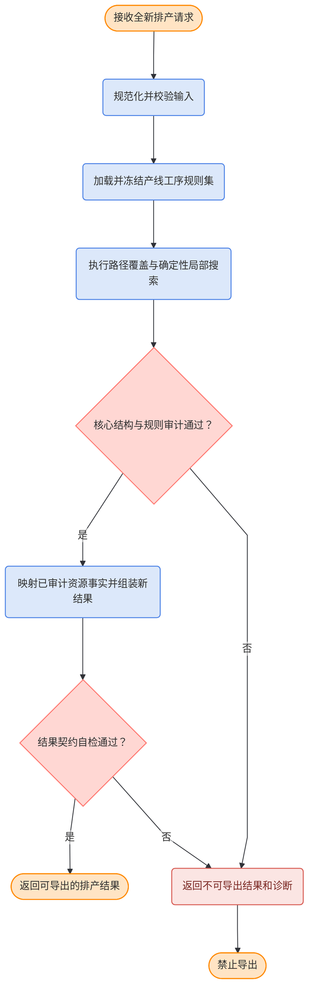
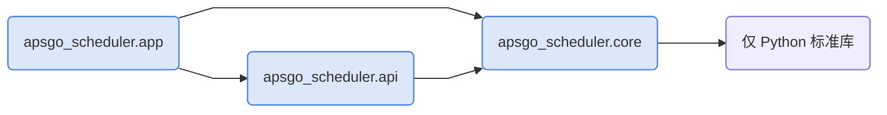
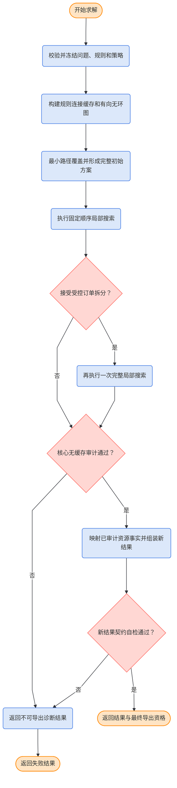
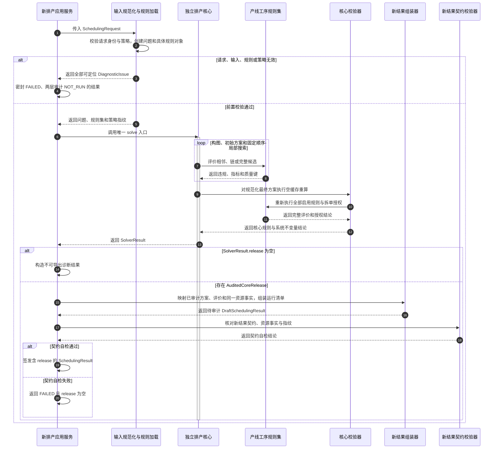

# APSGo V6 全新实现：基于 `solver.py` 的规则驱动全局最小路径覆盖与确定性局部搜索详细设计

> V7 专项衔接（2026-09-04）：本文保留为迁入的基础设计及历史记录。链间宽差进一步优化见 [V7 专项设计](apsgo_v7_inter_chain_width_optimization_design.md) 和 [V7 专项实施计划](../implementation/apsgo_v7_inter_chain_width_optimization_implementation_plan.md)，目前仅文档、未改算法。本文第 5、7、20 节的固定流程仍是原修复阶段，第 21 节的受控拆单和一次原搜索重放保持；新方案在其后接集中精修，不再将“仅整链移位、不回跳”作为整个 V7 宽差搜索的能力上限。第 23、24、28、30、32 节相应流程、计数及验证扩展以专项设计第 11 节为准；未涉及的规则、契约、构造、授权和审计继续有效。下文旧版本、“当前”状态和提交 SHA 保持历史含义，不整体作废本文。

## 1. 文档信息

| 项目 | 内容 |
|---|---|
| 文档版本 | v0.18 |
| 文档状态 | 用户已确认宽差升至第 5 项、链数降至第 7 项并取消链数验收上限；本次配置与验证见实施计划，完整功能 21 验收未完成 |
| 适用项目 | APSGo V6 冷轧排产求解器 |
| 适用分支 | `codex/solverpy-path-cover-clean` |
| 分支基线 | orphan（Git 中没有父提交的新根分支，不继承任何历史分支文件树） |
| 核验日期 | 2026-09-04 |
| 主要读者 | 求解算法开发人员、规则开发人员、测试人员、架构评审人员 |
| 配套实施文档 | [`apsgo_v6_solverpy_rule_driven_path_cover_local_search_implementation_plan.md`](../implementation/apsgo_v6_solverpy_rule_driven_path_cover_local_search_implementation_plan.md) v0.61，第 8.23.10 节 |

### 1.1 文档职责

本文回答以下问题：

1. APSGo V6 新求解器应该采用什么算法框架；
2. 如何把指定 `solver.py` 中已经在 GQGA4 数据上取得较好结果的流程产品化；
3. 规则、求解流程、新应用输入输出契约之间如何解耦；
4. 初始方案、局部搜索、同计划期拆分或未来借入拆分归还、预算与最终审计如何工作；
5. 哪些业务语义需要重新实现，哪些历史 V6 代码不得进入新分支；
6. 后续实施文档必须按什么依赖顺序拆解、验证和提交。

本文是**目标态设计**，不是当前实现说明。当前分支从没有父提交的新根建立；首次根提交只包含本文，不包含旧 V6 的规则、求解域、规格图、审计、契约或应用代码。后续实现从本文定义的最小契约开始全新编写，完成情况以配套实施文档为准。旧 V6 只可在分支外作为业务语义和差分证据读取，不是新代码的依赖源，也不得通过复制目录的方式重新带入。

**当前变更**：实施前 `495e4bf`，用户确认将原第 5、7 项互换，现为“禁止违规数、禁止严重度、欠重链数、欠重缺口、链间宽差、虚拟重量、非空链数”，全部最小化、严格逐级比较；同时取消最多 22 链的验收上限。第 12.2 节为当前规范，指标公式、其他业务规则和预算不变。本轮只做配置、门槛和回归验证，单独记录于实施计划第 8.23.10 节；不开展完整 GQGA4 复跑或新图表，不以旧顺序结果代替新验证。

**历史实绩**：规则、整链移位和审计/配置分别提交 `7445a33`、`091684b`、`b02ec8c`，功能 22.4 证据已由 `495e4bf` 提交。当时七级为 `(0,0,0,0,22,320,11218)`，达到当时质量门，21 处边界与图表按同一发布序核对；单次服务约 109.46 秒，较旧版约 62.94 秒增加，不能宣称性能改善或完整验收。原六级、原七级顺序、配置身份、结果与图表保持历史含义。

v0.15 的文档同步以 `bb5d92c` 为基线，当时只同步三份文档；该历史范围不再限制后续已获授权的代码实施。v0.18 的优先级和链数门槛修订来自用户明确要求，不改变零欠重、零禁止、来源覆盖守恒、虚拟比例 5%、200000 次预算和 180 秒性能门槛。

### 1.2 权威边界

本文在本专项中的事实优先级为：

1. 用户在当前会话最新确认的目标和边界；
2. 指定的独立参考实现 `solver.py` 及其输入输出证据；
3. 本文新定义的自包含输入输出契约和系统不变量；
4. orphan 分支上后续实际实现与测试证据；
5. V3 代码和指定结果基线；
6. 既有自适应大邻域搜索、滚动时域和迭代局部搜索文档。

发生冲突时，不允许用旧代码或旧文档覆盖本文确认的新目标。下一份实施文档只规划空分支上的全新实现，不承担旧分支清理、旧入口切换或旧文档同步；这些事项必须等本算法独立验收后，作为单独的集成设计处理。

### 1.3 参考实现身份

| 项目 | 内容 |
|---|---|
| 本机路径 | `/Users/miles/Documents/Codex/2026-09-02/gqga4-531-1-input-orders-csv/outputs/solver.py` |
| 文件行数 | 2759 |
| SHA-256 | `87f564407f0cefeef3c66a7724e534f3621ac0a52207fd5b114a0e33f7f97318` |
| 当前用途 | 算法流程、候选顺序、评价顺序、结果台账和性能行为的首要参考 |
| 禁止用途 | 不得把其中 GQGA4 固定数量、阈值、规则编号和验收门槛原样写进通用核心 |

## 2. 一句话设计结论

APSGo V6 新求解核心采用：

> **固定种子、规则驱动的有向无环图最小路径覆盖与字典序顺序多邻域局部搜索。**

对外汇报可简称为：

> **规则驱动的路径覆盖局部搜索排程算法。**

求解流程、轻量搜索状态、初始方案和结构调整优先吸收 `solver.py`；规则模型、任务取消、运行记录、结果契约和审计边界在空分支中以最小、自包含方式重新建立，不复用旧 V6 实现。

## 3. 背景与问题定义

### 3.1 当前问题

此前 V6 先后尝试了自适应大邻域搜索、问题修复路径、资源能力分层、滚动时域迭代局部搜索和 V3 行为复现。虽然形成了较完整的领域状态、候选事务、规则运行时和若干结构动作，但仍存在三个根本问题：

1. 求解流程逐步偏离已验证的有效控制流；
2. 每个候选穿过过多旧状态、事务、物化和评价层，性能成本高；
3. 局部动作虽然存在，但组合顺序、初始方案和接受规则与效果较好的参考实现不同。

指定 `solver.py` 证明了一个更直接的流程能够在 GQGA4 数据上工作：一次加载所有计划期订单，构建有向兼容图，使用最大二分匹配得到最小路径覆盖，形成完整初始方案，再按固定顺序做局部改善和可选拆单。参考脚本只对未来借入订单执行拆单归还；用户已确认目标业务同时允许同计划期订单拆分，因此目标实现必须把这项限制登记为产品化差异，不能照搬。

### 3.2 需要解决的设计问题

新设计必须同时满足：

- **结果正确**：每个必须排产的输入支持节点完整覆盖，来源重量、拆单和生成型虚拟材料守恒；
- **业务可用**：最终除链重低于下限外，不允许保留其他禁止性违规；
- **效果对齐**：在相同 GQGA4 输入、种子和确定性候选预算下，除已登记的用户确认规则与评分差异外，对齐 `solver.py` 的阶段行为和最终质量；参考七级、旧目标六级与新目标七级分别命名报告，不能因向量长度相同就宣称语义一致，不改写原始基线；
- **性能可控**：按已冻结的同机完整流程复测口径验收，中位数和第 95 百分位均不超过 180 秒；参考搜索参数 30 秒不等于新实现全流程门槛；
- **多产线扩展**：新增产线通过不同 `ProcessRuleSet` 组合规则，不复制求解器，不在核心中判断产线名称；
- **实现简单**：不重新引入没有证据收益的通用事务框架、算法调度平台或多套并行求解逻辑。

## 4. 术语说明

| 术语 | 含义 |
|---|---|
| 输入支持节点 | 调用方提供且必须被完整覆盖的真实材料节点；包括普通真实订单和实际过渡材料 |
| 真实订单节点 | 输入支持节点中的真实业务订单；搜索中可在授权条件下形成拆单片段 |
| 虚拟过渡材料 | 从虚拟材料原型生成、用于连接或补重的非真实订单节点，必须有生成来源和重量记录 |
| 实际过渡材料 | 输入中的真实材料，只是业务角色特殊；它仍属于真实订单和重量守恒范围 |
| 来源计划期 | 真实订单原本所属的计划期 |
| 排产计划期 | 某条链最终被安排到的计划期 |
| 未来借单 | 来源计划期晚于链排产计划期的真实订单或拆单片段 |
| 受控订单拆分 | 第一轮局部搜索后，由具体规则授权把一个普通真实订单完整分成两个或多个重量片段，并在片段之间强制加入隔离材料；同计划期和未来借入订单均可成为候选 |
| 同计划期拆分 | 父订单来源计划期与拆前排产计划期相同；全部片段仍安排在该计划期，不发生跨期归还 |
| 未来借入拆分归还 | 父订单来源计划期晚于拆前排产计划期；拆分后的片段整体安排回来源计划期 |
| 有向无环图 | 边只沿稳定构造顺序向后连接、不会形成回路的订单连接图 |
| 最大二分匹配 | 在拆分后的左右节点集合中寻找尽可能多的不冲突连接边 |
| 最小路径覆盖 | 用数量最少的若干条有向路径覆盖图中所有订单节点，每个节点恰好出现一次 |
| 字典序质量向量 | 按优先级逐项比较的质量元组；先比较第一项，只有相等时才比较下一项 |
| 首次改善 | 候选严格优于当前方案时立即接受，不继续寻找同一轮的其他候选 |
| 顺序多邻域局部搜索 | 多种结构调整按固定顺序逐类执行，每类运行到没有严格改善再进入下一类 |
| 完整候选 | 已覆盖全部必须排产的输入支持节点、结构自洽并可执行完整评价的临时方案 |
| 系统不变量 | 无论规则如何配置都必须成立的正确性条件，例如覆盖唯一和重量守恒 |
| 结果导出门禁 | 判断新结果能否作为已审计排程交给上层消费者的规则与不变量检查 |
| 基准验收门禁 | 只用于 GQGA4 对标测试的订单数量、目标链数和性能等冻结期望 |
| orphan 分支 | Git 中没有父提交的新根分支；不会继承旧分支的文件树和提交历史 |
| clean-room 实现 | 净室式实现；只依据已确认设计和可验证外部行为重新编码，不复用旧实现模块 |
| `release` | 已通过核心语义审计和结果契约自检的正式结果载荷；为空表示结果不可导出 |
| A/B 对照 | 在相同输入、规则、种子和预算下分别运行参考实现与新实现，并逐阶段比较 |
| GQGA4 | 当前固定用于结果与性能对标的冷轧排产场景代号；其数量和阈值不能写入通用核心 |
| IF 钢 | 无间隙原子钢；本文只把它作为 GQGA4 具体业务规则识别的钢种类别 |
| SPHC | GQGA4 虚拟过渡材料规则使用的钢种标识；通用核心不按该名称写分支 |

## 5. 算法分类与边界

### 5.1 准确分类

参考实现包含以下算法成分：

1. 固定种子提供可重复的同值候选次序；
2. 按稳定业务顺序构造有向无环兼容图；
3. 用最大二分匹配求图的最小路径覆盖；
4. 把路径直接追加或切链，得到不生成虚拟材料的完整初始方案；
5. 按“整链调整、单订单移动、虚拟材料填充”的固定次序执行首次改善局部搜索；
6. 规则允许时只对未来借入订单执行一次专项拆分归还；
7. 如果至少接受一次拆单，再完整执行一次相同局部搜索；
8. 对最终方案重新完整评价和审计。

目标产品保持同一个末端拆单阶段，但把资格扩展为“同计划期拆分和未来借入拆分归还共用一套受控动作”；同时移除未来借用比例限制及借用重量评分。v0.15 在原六项之后增加链间宽差目标，并在每轮局部搜索末尾增加同大辊期内的整链移位阶段，见第 12.2.2、20.7 节。这些变化来自用户确认的业务语义，不是参考脚本事实，并在第 30.4 节作为预期差异验收。

因此它不是：

- 自适应大邻域搜索：没有破坏算子和修复算子的自适应权重选择；
- 经典迭代局部搜索：没有“局部最优、扰动、重新搜索”的反复外循环；
- 经典变邻域搜索或变邻域下降：后续邻域改善后不会自动回到第一个邻域；
- 滚动时域求解：所有计划期订单一次性进入同一个全局图；
- 精确优化算法：不证明全局最优。

### 5.2 “最大”与“最小”的准确含义

参考函数名为 `maximum_path_cover()`，但函数实际执行的是：

```text
有向无环图
→ 构造二分图
→ 求最大二分匹配
→ 还原覆盖全部节点的最少路径集合
```

最大的是**匹配边数量**，最小的是**最终路径数量**。新代码和文档必须使用准确术语，不再把结果称为“最大路径覆盖”。

## 6. 目标、非目标与质量优先级

### 6.1 设计目标

1. 用一个独立、轻量、可测试的 Python 核心复现参考流程；
2. 把固定 `RuleBook` 改成“规则基类 + 具体规则类”的两级规则模型；
3. 通过产线工序规则集支持多产线和不同规则参数；
4. 保留确定性、严格改善、完整候选隔离和最终重新审计；
5. 将 GQGA4 专用常量与生产求解逻辑彻底分离；
6. 建立新的 `SchedulingRequest`、`SchedulingResult`、资源事实和审计契约；
7. 空分支内从第一天只有一个求解入口，不引入旧入口、双轨或失败回退。

### 6.2 明确非目标

第一版不实施：

- 逐计划期滚动发布和资源扣减；
- 自适应大邻域搜索、破坏—修复组合和算子权重学习；
- 扰动—重建外循环；
- 四级资源能力范围；
- 交期累计时间投影和显式交期评分；
- 单一链池和约束规划精修；
- 旧 V6 `PlanState`、候选事务、正式物化器或任何历史求解模块；
- 搜索中动态解释规则描述语言；
- 按产线名称编写条件分支；
- 为每条产线生成独立求解器文件；
- 在结果等价前引入复杂增量评价、并行搜索或 NumPy 向量化；
- 数据库、前端、旧 V6 API 适配或生产写回变更；
- 全局最优性声明。

### 6.3 质量优先级

发生取舍时按以下顺序处理：

1. 系统不变量和禁止规则正确性；
2. 除用户已确认的产品化差异外，与参考流程的候选顺序和接受语义一致；
3. GQGA4 结果质量；
4. 确定性与可审计性；
5. 同机运行性能；
6. 多产线扩展性；
7. 局部代码复用率。

代码复用不得凌驾于流程等价和实现简单之上。

## 7. 已冻结的设计原则

| 编号 | 设计原则 | 直接后果 |
|---|---|---|
| 1 | `solver.py` 是求解流程的首要参考 | 初始构造、搜索顺序和接受规则先保持一致，再做通用化 |
| 2 | 只有一套搜索状态 | 当前方案就是当前最好方案，不维护候选池或第二套全局最好对象 |
| 3 | 规则只保留两级类结构 | 不增加“连续规则”“链规则”等中间抽象基类 |
| 4 | 规则对象决定业务语义，求解器决定搜索控制 | 规则不负责调度邻域，求解器不按规则编号写业务公式 |
| 5 | 所有计划期订单一次性求解 | 未来借单由来源计划期与链排产计划期的差异自然产生 |
| 6 | 完整候选才可以比较和接受 | 不完整路径、半拆分状态、未闭合链不得替换当前方案 |
| 7 | 只接受严格字典序改善 | 不接受同分替换，不使用概率接受 |
| 8 | 局部搜索顺序固定 | 整链调整、单订单移动、虚拟材料填充依次执行；启用链间宽差目标时，最后执行同大辊期内整链移位，不回跳前三类 |
| 9 | 拆单是末端专项修复 | 同计划期和未来借入订单都可由规则授权；共用一套动作，接受后只重放一次完整局部搜索 |
| 10 | 系统不变量不可配置关闭 | 覆盖、重量、拆单、身份和虚拟来源始终检查 |
| 11 | 生产门禁与 GQGA4 基准分离 | `531`、`29333.91`、`37`、`3` 等只能存在于测试基线 |
| 12 | 新分支采用 clean-room（净室式）实现 | 新代码只依据本文和外部参考的可验证行为编写，不导入、复制或改造旧 V6 模块 |
| 13 | 先复现、后剖析、再优化 | 历史规格矩阵、增量缓存或向量化只能在独立验收后凭等价性和性能证据重新设计 |
| 14 | 不引入旧入口或回退 | 空分支只有一个新求解入口；失败必须显式返回，禁止调用旧求解器兜底 |

## 8. 系统上下文与职责边界

### 8.1 总体上下文



### 8.2 模块职责

| 模块 | 负责 | 不负责 |
|---|---|---|
| 新应用服务 | 接收新的 `SchedulingRequest`、建立总预算、传递取消信号、调用唯一求解入口 | 不参与候选生成和规则公式计算 |
| 输入规范化器 | 校验新请求并构造轻量 `SchedulingProblem` | 不读取或转换旧 V6 契约，不保存运行时引用 |
| 规则集加载器 | 把产线、工序、版本和冻结配置转为具体规则对象 | 不在搜索中解释动态规则文本 |
| 新求解核心 | 构图、最小路径覆盖、初始方案、局部搜索、拆单和评价 | 不读写文件、数据库或 HTTP |
| 核心最终校验器 | 使用空搜索缓存重新计算规则、动作授权、覆盖和派生资源事实 | 不继续搜索，不修改方案 |
| 结果组装器 | 把核心审计产生的方案、评价和同一份资源事实映射为全新的结果草稿与运行清单 | 不重算资源事实，不重新决定候选优劣 |
| 结果契约校验器 | 核对新结果的结构、资源事实、指纹和状态组合 | 不调用历史运行时，不继续搜索 |
| GQGA4 基准测试 | 保存固定输入、预期质量和性能证据 | 不定义通用结果导出资格 |

### 8.3 依赖方向



依赖约束：

- `apsgo_scheduler.core` 只依赖 Python 标准库和自身模块，**禁止反向导入 `apsgo_scheduler.api`**；
- `apsgo_scheduler.api` 定义全新、不可变的请求和结果契约，并公开重导出核心诊断契约；它可以引用 `apsgo_scheduler.core` 中已冻结的值类型，因此唯一合法方向是 `api -> core`；
- `apsgo_scheduler.app` 只依赖 `apsgo_scheduler.api`、`apsgo_scheduler.core` 和 Python 标准库；
- 空分支不得导入、复制或生成 `apsgo.rules`、`apsgo.audit`、`apsgo.solving`、`shared_kernel` 或 `kernel_contracts` 等历史包；
- 未来如需并回 V6，必须新增单向外部适配器，适配器依赖本项目公开契约；本项目不得反向依赖旧 V6；
- 该未来集成不属于本文首轮实施范围，不能提前成为核心接口的设计理由。

## 9. 推荐代码结构

```text
src/apsgo_scheduler/
├── __init__.py
├── api/
│   ├── __init__.py
│   ├── request.py
│   ├── result.py
│   └── diagnostics.py
├── core/
│   ├── __init__.py
│   ├── contracts.py
│   ├── model.py
│   ├── budget.py
│   ├── rules/
│   │   ├── __init__.py
│   │   ├── base.py
│   │   ├── concrete.py
│   │   ├── rule_set.py
│   │   └── helpers.py
│   ├── evaluation.py
│   ├── compatibility.py
│   ├── path_cover.py
│   ├── virtual_material.py
│   ├── initial_solution.py
│   ├── neighborhoods.py
│   ├── controlled_split.py
│   ├── resource_facts.py
│   ├── final_audit.py
│   └── solver.py
└── app/
    ├── __init__.py
    ├── input_normalizer.py
    ├── rule_set_loader.py
    ├── result_assembler.py
    ├── contract_audit.py
    └── service.py
```

文件职责遵循单一职责原则：图构造、匹配、初始方案、局部搜索、拆单和最终审计不得重新合并成一个数千行文件。另一方面，不把每条规则或每个简单动作机械拆成独立文件；第一版具体规则集中在 `concrete.py`，达到可维护规模后再按相邻、链和方案作用域拆分。

`DiagnosticIssue`、`DiagnosticSeverity` 和 `DiagnosticPhase` 的唯一所有者是 `core/contracts.py`，因为核心 `SolverResult` 必须直接使用它们且核心禁止依赖 API。`api/diagnostics.py` 只原样重导出这三个类型，不再定义第二套同名类；公开层和核心层看到的必须是同一个 Python 类身份。

`SolverPolicy` 的唯一所有者同样是 `core/contracts.py`，因为 `core.solve()` 直接消费该策略且核心禁止反向依赖 API。`api/request.py` 只在 `SchedulingRequest` 中引用或原样重导出同一个类型，不能再定义第二套策略 DTO。

## 10. 核心领域模型

### 10.1 `SchedulingProblem`

`SchedulingProblem` 是一次求解的轻量、深度不可变输入：

```python
@dataclass(frozen=True, slots=True)
class SchedulingProblem:
    problem_id: str
    product_line_code: str
    process_code: str
    scenario: str
    nodes: tuple[Node, ...]
    period_order: tuple[str, ...]
    virtual_prototypes: tuple[VirtualMaterialPrototype, ...]
    input_fingerprint: str
```

约束：

- `nodes` 只包含输入支持节点，即普通真实订单和实际过渡材料；虚拟节点从来不是输入节点，只能由求解器根据虚拟原型按需生成；
- `period_order` 属于任务，不属于规则；
- 节点标识、来源订单标识和计划期标识必须非空且稳定；
- 所有数值在进入核心前转换为 `Decimal`；
- `input_fingerprint` 覆盖规范化节点次序、字段、计划期和虚拟原型目录。

`VirtualMaterialPrototype` 只保存生成虚拟材料所需事实：`prototype_id`、单位重量、宽度、厚度、温度生成策略和冻结规则属性；它不是排程节点，没有 `node_id`、来源计划期或链位置。具体虚拟节点只由 `virtual_material.py` 创建。

### 10.2 `Node`

核心从零定义轻量枚举和标量类型，不以任何历史枚举作为运行时依赖：

```python
class MaterialRole(str, Enum):
    NORMAL_REAL = "normal_real"
    ACTUAL_TRANSITION = "actual_transition"
    GENERATED_VIRTUAL = "virtual_sphc"

class ControlledSplitMode(str, Enum):
    SAME_PERIOD_SPLIT = "same_period_split"
    FUTURE_BORROW_RETURN = "future_borrow_return"

RuleScalar = str | int | Decimal | bool | None
```

前两类是输入支持节点，必须参与覆盖和来源重量守恒；只有 `GENERATED_VIRTUAL` 可以由求解器按原型生成。

```python
@dataclass(frozen=True, slots=True)
class Node:
    node_id: str
    source_order_id: str | None
    source_resource_id: str | None
    source_period: str | None
    weight: Decimal
    width: Decimal | None
    thickness: Decimal | None
    min_temperature: Decimal | None
    max_temperature: Decimal | None
    grade: str
    material_role: MaterialRole
    rule_attributes: Mapping[str, RuleScalar]
    virtual_lineage: VirtualLineage | None = None
    split_lineage: SplitLineage | None = None
```

设计约束：

- 节点不可变；移动节点只改变链中的引用位置；
- `material_role` 是材料类别的唯一事实源；实际过渡材料通过 `ACTUAL_TRANSITION` 表达，不再保留第二个布尔字段；
- GQGA4 的实际过渡材料识别须同时满足：客户等级非战略客户、热轧牌号 `SPHC`、执行标准 `Q/TB 305-2017`。这是输入数据适配的分类条件，不是允许逆宽的牌号白名单；`Node.grade` 不得冒充热轧牌号，搜索规则只读取既有材料角色，不重复推断分类。虚拟材料不使用这三个真实订单识别条件；
- 两类输入支持节点的 `source_order_id`、`source_resource_id` 和 `source_period` 必须非空，`virtual_lineage` 必须为空；
- 生成型虚拟节点的三个来源字段必须为空，`virtual_lineage` 必须非空；
- 拆单片段共享 `source_order_id`，但拥有唯一 `node_id` 和完整 `SplitLineage`；
- 真实订单和拆单片段保留同一个 `source_resource_id`，虚拟材料使用独立虚拟来源身份；
- `source_resource_id` 用于追溯真实输入和拆单重量守恒；第一版资源守恒只处理重量，不引入通用多度量资源模型；
- `rule_attributes` 只承载不同产线确需的扩展字段，不得替代重量、规格和身份等核心字段；
- 映射在构造时深度冻结，调用方不能在搜索期间修改。

#### 10.2.1 `VirtualLineage`

```python
class VirtualPurpose(str, Enum):
    EDGE_BRIDGE = "edge_bridge"
    WEIGHT_FILL = "weight_fill"
    SPLIT_SEPARATOR = "split_separator"

@dataclass(frozen=True, slots=True)
class VirtualLineage:
    prototype_id: str
    purpose: VirtualPurpose
    related_partition_id: str | None
    accepted_sequence: int
```

拆单隔离材料必须带 `related_partition_id`；普通连接桥和补重材料不得带该字段。编号只在候选接受时提交。

#### 10.2.2 `SplitLineage`

```python
@dataclass(frozen=True, slots=True)
class SplitLineage:
    partition_id: str
    parent_node_id: str
    parent_source_order_id: str
    source_resource_id: str
    source_period: str
    origin_assigned_period: str
    split_mode: ControlledSplitMode
    target_assigned_period: str
    accepted_source_sequence: int
    parent_weight: Decimal
    piece_index: int
    piece_count: int
    authorization_rule_id: str
    authorization_rule_version: str
    authorization_decision_fingerprint: str
    reason_code: str
```

约束：

- 同一分区所有片段除 `piece_index` 外的谱系字段完全一致；
- `piece_index` 必须恰好覆盖 `1..piece_count`；
- 片段重量之和精确等于 `parent_weight`；
- `split_mode` 和 `target_assigned_period` 必须成对来自授权决策：同计划期拆分取 `SAME_PERIOD_SPLIT + origin_assigned_period`，未来借入拆分归还取 `FUTURE_BORROW_RETURN + source_period`；
- `accepted_source_sequence` 是本次求解中已接受拆单来源的 1 起连续序号；它用于最终授权重放，不是候选尝试编号；
- `partition_id` 由父节点、来源资源、来源计划期、拆前排产期、授权模式、拆后目标期、接受来源序号、授权规则身份和片段规格生成，不含候选尝试次数；
- 第一版只允许 `MaterialRole.NORMAL_REAL` 的输入节点拆分，并只支持重量分区；如果未来需要同步分摊长度、时间或其他资源量，必须先扩展新契约并补守恒测试；
- 搜索候选编号和事务编号不进入核心谱系。核心审计直接输出已接受的 `SplitPartitionFact`。`partition_fingerprint` 必须覆盖父节点、来源资源、来源期、拆前排产期、授权模式、拆后目标期、接受来源序号、授权决策、原因、有序片段及隔离材料等分区语义字段，不包含下游结果指纹，从而避免哈希循环。

### 10.3 `Chain`

```python
@dataclass(frozen=True, slots=True)
class Chain:
    chain_id: str
    nodes: tuple[Node, ...]
    assigned_period: str
```

派生属性包括：

- 总重量、真实重量、虚拟重量；
- 首尾规格；
- 真实节点、虚拟节点和拆单片段数量。

`assigned_period` 在每次候选规范化时按第 22.2 节从节点重新计算并写入新的不可变 `Chain`，评价函数只读取、不修改。`Chain` 不缓存可变摘要。搜索评价可以在单次评价对象中保存摘要，但链本身始终是唯一结构事实。

### 10.4 `SchedulePlan`

```python
@dataclass(frozen=True, slots=True)
class SchedulePlan:
    chains: tuple[Chain, ...]
```

第一版不增加 `PlanState`、链池、保护集、变更日志或事务对象。一个候选通过替换受影响链形成新的 `SchedulePlan`；拒绝候选只需丢弃该对象。

启用第 12.2.2 节目标时，`chains` 同时是唯一的实际生产链序：先完成各链所属期规范化，再按 `SchedulingProblem.period_order` 稳定分组，同一期内保留候选相对顺序。不增加第二份排序字段，不按链 ID 或大辊期名称排序；评价器、审计器不得自行生成另一份顺序。未启用该目标时保留现有枚举顺序，不能通过停用规则留下隐藏的排序优化。

### 10.5 `SearchState`

```python
@dataclass(slots=True)
class SearchState:
    current_plan: SchedulePlan
    current_evaluation: PlanEvaluation
    accepted_move_count: int
    virtual_sequence: int
    split_sequence: int
    accepted_same_period_split_count: int
    accepted_future_borrow_return_count: int
```

由于所有候选只接受严格改善，`current_plan` 同时就是搜索目前找到的最好方案，不再保存语义重复的 `global_best`。

候选使用派生的临时虚拟编号状态和拆单编号状态；只有候选被接受时，相关序列才提交到 `SearchState`。被拒绝候选不得消耗正式编号，也不得影响后续结果指纹。`split_sequence` 同时是已接受拆单来源总数；任何时刻必须满足：

```text
split_sequence
= accepted_same_period_split_count
+ accepted_future_borrow_return_count
```

## 11. 两级规则类与产线工序规则集

### 11.1 规则类结构

规则只保留两级继承：

```text
Rule
├── WidthTransitionRule
├── ThicknessTransitionRule
├── TemperatureOverlapRule
├── SoftHardConnectionRule
├── StrategicCustomerPriorityRule
├── ChainWeightRangeRule
├── ReverseWidthCountRule
├── ConsecutiveReverseWidthRule
├── ConsecutiveVirtualMaterialRule
├── HighSurfaceRunCountRule
├── ContinuousNarrowSteelWeightRule
├── SameSpecContinuousRealWeightRule
├── LateOriginalPeriodMoveRule
├── VirtualOutputRatioRule
├── FutureFillWeightTargetRule
└── ControlledOrderSplitRule
```

不建立 `ContinuousRule`、`EdgeRule`、`ChainRule` 等中间抽象类。连续片段扫描、数值区间比较和空值规范化通过普通工具函数复用。

上表列可配置业务规则。逆宽规则还有直接继承 `Rule` 的私有链级执行类 `_VirtualBridgeWidthRule`，只由规则集依据同一份宽度配置派生，不增加配置记录、用户开关或继承层级；精确边界见第 11.8.3 节。

### 11.2 `Rule` 基类

```python
class Rule(ABC):
    rule_id: str
    name: str
    scope: RuleScope
    enabled: bool
    version: str
    parameters: Mapping[str, RuleParameterValue]

    @abstractmethod
    def required_fields(self) -> tuple[str, ...]: ...

    def evaluate(
        self,
        subject: RuleSubject,
        context: RuleEvaluationContext,
    ) -> RuleContribution:
        raise UnsupportedRuleSubjectError(type(subject))
```

首次出现的代码术语说明：

- `RuleScope`（规则作用域）：规则作用于相邻节点、整条链、完整方案或特定动作资格；
- `RuleDisposition`（规则处置类别）：区分禁止违规和允许残留偏差；优化目标通过命名指标表达，不伪装成违规；它属于一次具体规则贡献，不固定在整个规则对象上；
- `RuleSubject`（规则判定对象）：带明确类型的节点、相邻节点、链、方案或动作候选；
- `RuleContribution`（规则贡献）：包含零到多个违规和命名指标，不直接修改方案。

普通节点、相邻、链和方案规则覆盖 `evaluate()`；默认实现失败关闭，防止把错误作用域静默当作“通过”。`ControlledOrderSplitRule` 仍直接继承 `Rule`，但不参与普通规则聚合，只实现第 11.5 节类型明确的动作资格接口。这样仍是两级规则类，不需要增加“连续规则”或“动作规则”中间抽象层。

关键类型固定为：

```python
@dataclass(frozen=True, slots=True)
class NodeRuleSubject:
    subject_id: str
    node: Node

@dataclass(frozen=True, slots=True)
class EdgeRuleSubject:
    subject_id: str
    left: Node
    right: Node

@dataclass(frozen=True, slots=True)
class ChainRuleSubject:
    subject_id: str
    chain: Chain

@dataclass(frozen=True, slots=True)
class NodeAssignmentFact:
    node_id: str
    source_order_id: str | None
    source_resource_id: str | None
    material_role: MaterialRole
    chain_id: str
    assigned_period: str
    position: int
    weight: Decimal

@dataclass(frozen=True, slots=True)
class FutureBorrowFact:
    node_id: str
    source_order_id: str
    source_resource_id: str
    source_period: str
    assigned_period: str
    weight: Decimal

@dataclass(frozen=True, slots=True)
class VirtualGenerationFact:
    node_id: str
    prototype_id: str
    purpose: VirtualPurpose
    related_partition_id: str | None
    accepted_sequence: int
    chain_id: str
    assigned_period: str
    weight: Decimal

@dataclass(frozen=True, slots=True)
class SplitPartitionFact:
    partition_id: str
    partition_fingerprint: str
    parent_node_id: str
    parent_source_order_id: str
    source_resource_id: str
    source_period: str
    origin_assigned_period: str
    split_mode: ControlledSplitMode
    target_assigned_period: str
    accepted_source_sequence: int
    authorization_rule_id: str
    authorization_rule_version: str
    authorization_decision_fingerprint: str
    reason_code: str
    piece_node_ids: tuple[str, ...]
    piece_weights: tuple[Decimal, ...]
    separator_virtual_node_ids: tuple[str, ...]
    parent_weight: Decimal

@dataclass(frozen=True, slots=True)
class ActualTransitionFact:
    node_id: str
    source_order_id: str
    source_resource_id: str
    chain_id: str
    assigned_period: str
    weight: Decimal

@dataclass(frozen=True, slots=True)
class PlanDerivedFacts:
    assignments: tuple[NodeAssignmentFact, ...]
    future_borrows: tuple[FutureBorrowFact, ...]
    virtual_generations: tuple[VirtualGenerationFact, ...]
    split_partitions: tuple[SplitPartitionFact, ...]
    actual_transitions: tuple[ActualTransitionFact, ...]
    input_real_weight: Decimal
    scheduled_real_weight: Decimal
    generated_virtual_weight: Decimal
    future_pool_weight: Decimal
    borrowed_future_weight: Decimal
    facts_fingerprint: str

@dataclass(frozen=True, slots=True)
class EvaluationResourceView:
    borrowed_node_ids: tuple[str, ...]
    generated_virtual_node_ids: tuple[str, ...]
    split_partition_ids: tuple[str, ...]
    scheduled_real_weight: Decimal
    generated_virtual_weight: Decimal
    future_pool_weight: Decimal
    borrowed_future_weight: Decimal

@dataclass(frozen=True, slots=True)
class PlanRuleSubject:
    subject_id: str
    plan: SchedulePlan
    resource_view: EvaluationResourceView

@dataclass(frozen=True, slots=True)
class ControlledSplitRuleSubject:
    subject_id: str
    parent_node: Node
    origin_assigned_period: str
    source_period: str
    accepted_split_source_count: int

RuleSubject = (
    NodeRuleSubject
    | EdgeRuleSubject
    | ChainRuleSubject
    | PlanRuleSubject
    | ControlledSplitRuleSubject
)

@dataclass(frozen=True, slots=True)
class MetricContribution:
    metric_key: str
    value: Decimal | int

@dataclass(frozen=True, slots=True)
class RuleContribution:
    violations: tuple[RuleViolation, ...]
    metrics: tuple[MetricContribution, ...]

@dataclass(frozen=True, slots=True)
class QualityCriterion:
    criterion_id: str
    metric_key: str
    direction: QualityDirection
    aggregation: QualityAggregation
    numeric_projection: NumericProjection

@dataclass(frozen=True, slots=True)
class RuleEvaluationContext:
    period_order: tuple[str, ...]
    period_index: Mapping[str, int]
    virtual_prototype_ids: tuple[str, ...]
```

`RuleEvaluationContext`（规则评价上下文，即本次任务供规则读取的只读数据）沿用上述设计已有字段，类型在实施计划功能 4 落地，不为拆单再建一套上下文。由权威 `SchedulingProblem.period_order` 和虚拟原型目录生成；`period_index` 必须恰好等于对 `period_order` 从零开始枚举的结果，计划期目录非空且标识唯一，虚拟原型目录允许为空，序列与映射均冻结。本轮局部搜索开始前构造一次，供局部搜索、拆单和再次搜索共用，不在每个拆单候选上重复生成；最终审计从同一权威问题重新构造等值上下文，不读取搜索状态。不同任务使用各自上下文，规则集和具体规则对象不保存它。

`QualityDirection` 只允许 `MINIMIZE` 或 `MAXIMIZE`；`QualityAggregation` 第一版只允许 `NAMED_VALUE`、`COUNT`、`SUM` 或 `MAXIMUM`；`NumericProjection` 允许 `EXACT_DECIMAL`、`REFERENCE_FLOAT_ROUND_6` 和第 12.2 节定义的 `UNDERWEIGHT_GAP_ROUND_2_THEN_SUM`（欠重缺口逐链两位后汇总，配置值 `underweight_gap_round_2_then_sum`）。新投影只允许用于 `metric_key=underweight_total_gap`、`aggregation=SUM`、`direction=MINIMIZE`，非法组合在加载前置阶段以结构化诊断拒绝。同一个 `metric_key` 在一份规则集中只能有一个生产者，规则集冻结时发现重复生产者即失败。

`RuleViolation` 的 `reason_code` 和 `disposition` 在第 12.1 节定义。这样同一个 `ChainWeightRangeRule` 可以同时产生：

- `chain_weight_below_minimum`：`ALLOWED_FINAL_DEVIATION`；
- `chain_weight_above_maximum`：`PROHIBITED`。

不得按整个 `rule_id` 放行链重规则，否则会把超重一并误判为允许残留。

`RuleDisposition` 第一版只允许 `PROHIBITED` 和 `ALLOWED_FINAL_DEVIATION`。允许偏差能否正式返回还必须同时满足 `allowed_final_deviation_codes`；两者任一不匹配都按禁止发布处理。

`PlanDerivedFacts` 使用三个可直接核对的重量口径：`input_real_weight` 是全部输入支持节点的来源重量；`scheduled_real_weight` 是最终方案中普通真实材料、实际过渡材料及其拆单片段重量；`generated_virtual_weight` 是搜索生成的虚拟材料重量。三者不是可任意相加的三类资源，而是输入守恒对照和最终产出的分项。

核心审计必须验证：

```text
input_real_weight = scheduled_real_weight
最终输出总重量 = scheduled_real_weight + generated_virtual_weight
```

拆单前后 `scheduled_real_weight` 不变；搜索只能改变 `generated_virtual_weight`。以上值和明细均由核心最终审计从规范化方案一次派生。

`EvaluationResourceView` 只是 `evaluate_plan()` 单次调用内的临时、不可变计算视图，用于让方案级规则计算比例和指标；它不是 `PlanDerivedFacts`，不对外输出、不作为第二台账、不被最终审计复用。

`RuleScope` 第一版固定为：

| 值 | 判定对象 | 示例 |
|---|---|---|
| `NODE` | 一个规范化输入支持节点 | 战略客户优先级和构造排序等级 |
| `EDGE` | 有方向的左右相邻节点 | 宽度、厚度、温度、钢种连接 |
| `CHAIN` | 一条完整有序链 | 链重、逆宽次数、连续虚拟材料、连续真实重量 |
| `PLAN` | 完整方案及所有资源 | 虚拟材料比例、延后计划期、未来填充缺口统计 |
| `ACTION_ELIGIBILITY` | 特定业务动作候选 | 同计划期或未来借入订单的受控拆单资格、目标计划期和拆分参数 |

### 11.3 规则启停和参数语义

必须满足：

1. 启用规则必须存在对应具体规则对象；未知启用规则在求解前失败；
2. 停用规则不得通过默认参数继续影响连接、候选、评分或最终审计；
3. 启用规则的必需参数缺失时失败，不套用其他产线的隐藏默认值；
4. 空值行为由具体规则明确声明，不能由公共求解器统一猜测；
5. 规则参数允许单值、有序列表和字符串键分组配置，构造后递归冻结为不可变值，具体边界见第 11.6 节；订单和虚拟原型的扩展属性仍只允许 `RuleScalar` 单值；
6. 规则只返回判断和指标，不持有搜索状态；
7. 规则编号只用于身份、诊断和映射，不作为求解器业务分支条件。

### 11.4 `ProcessRuleSet`

```python
@dataclass(frozen=True, slots=True)
class ProcessRuleSet:
    product_line_code: str
    process_code: str
    scenario: str
    version: str
    rules: tuple[Rule, ...]
    quality_spec: tuple[QualityCriterion, ...]
    allowed_final_deviation_codes: frozenset[str]
    fingerprint: str
```

它负责：

- 验证规则标识唯一和参数完整；
- 按作用域索引已启用规则；
- 提供 `evaluate_edge()`、`evaluate_chain()`、`evaluate_plan()`；受控拆单只通过类型明确的 `evaluate_controlled_split(subject, context) -> ControlledSplitDecision` 调用，不暴露含义模糊的通用动作资格入口；
- 提供 `construction_priority(node)`，只使用已启用的 `NODE` 规则生成构造排序等级；
- 把规则贡献汇总为完整评价；
- 按 `quality_spec` 生成可比较的质量键；
- 按具体 `reason_code` 声明最终允许保留的偏差类型；
- 提供覆盖身份、规则类型、参数和评价顺序的稳定指纹。

`rules` 是启用的规范业务配置对象；作用域索引是执行视图，不保证它只是对 `rules` 按作用域过滤。宽度配置会派生同一业务身份的链级检查，故后续评价和审计必须调用对应作用域入口，不能只遍历 `rules` 后自行按 `rule.scope` 分组，否则会漏掉虚拟桥端点检查。具体规则对象仍各自只有一个作用域，公共基类和请求契约不变。

它不保存：

- 订单、计划期顺序和虚拟材料原型；
- 随机种子和运行预算；
- 当前方案和候选；
- GQGA4 对标数字；
- HTTP、文件或数据库对象。

### 11.5 受控订单拆分资格契约

`ACTION_ELIGIBILITY` 不使用普通违规列表代替结构化动作参数。第一版冻结一个明确返回类型：

`ControlledSplitMode` 已在第 10.2 节作为核心契约枚举定义。动作规则返回：

```python
@dataclass(frozen=True, slots=True)
class ControlledSplitDecision:
    eligible: bool
    rule_id: str
    rule_version: str
    reason_code: str
    mode: ControlledSplitMode | None
    target_assigned_period: str | None
    maximum_piece_weight: Decimal | None
    minimum_piece_weight: Decimal | None
    maximum_accepted_source_count: int
    maximum_separator_node_count: int
    maximum_separator_weight: Decimal
    decision_fingerprint: str
```

`ProcessRuleSet` 的公开入口与 `ControlledOrderSplitRule` 的具体实现使用相同签名，由前者把两个参数原样传给唯一启用的生产者：

```python
def evaluate_controlled_split(
    self,
    subject: ControlledSplitRuleSubject,
    context: RuleEvaluationContext,
) -> ControlledSplitDecision:
    ...
```

`subject` 保存父订单、拆前排产期、来源期及已接受来源数量，`context` 提供本次任务已有的大辊期顺序。生产者确认两个计划期都在 `context.period_index` 中，且 `subject.source_period == subject.parent_node.source_period`；不满足时返回规范拒绝决策，不按名称猜测顺序，也不把未知计划期当成首期。先后判断只比较两个索引值，相等、较晚、较早分别适用下文的同计划期、未来借入、延后三种关系。

这与 `solver.py` 从 `RuleBook.period_index` 读取已有顺序的作用相同；参考脚本把任务顺序和规则参数放在同一个对象里，本文把任务数据作为显式参数传入可复用规则集。此次补全只修正文档漏掉的参数，不改变拆分算法、扫描顺序、预算、评价或已确认的同计划期拆分能力。

已形成分区不再调用含义不匹配的通用 `evaluate()`；最终审计按接受顺序重建同一个资格输入和权威上下文，再比较决策与实际分区。目标计划期锁定是系统不变量，不做成可由规则关闭的布尔参数。

返回态不变量：

- `eligible=True` 时，`rule_id`、`rule_version`、`reason_code`、`mode`、`target_assigned_period`、`maximum_piece_weight` 和 `minimum_piece_weight` 必须全部有效；最小片重和最大片重均大于零且最小片重不大于最大片重，三个数量或重量上限均不得为负；
- `eligible=False` 时，`mode`、`target_assigned_period`、`maximum_piece_weight` 和 `minimum_piece_weight` 必须为 `None`，三个数量或重量上限规范化为零，并保留非空拒绝原因；
- `decision_fingerprint` 覆盖完整资格输入（含接受来源计数）、规范化 `RuleEvaluationContext` 的全部字段、规则身份和除指纹自身外的全部返回字段；映射按稳定键编码，计划期有序序列保持原顺序。它不包含上下文对象地址、缓存或耗时；同值重建上下文必须得到相同指纹，改变任务计划期顺序必须反映到指纹，不能只覆盖 `eligible`。

动作资格和动作参数的唯一事实源是 `ControlledOrderSplitRule`。`ContinuousNarrowSteelWeightRule` 只评价已形成链的连续真实重量违规，不向拆单动作提供阈值或隐式授权。GQGA4 的两条具体规则可以使用同一个配置来源生成各自冻结参数，基线测试必须证明两者预期值均为 500 吨；通用核心不假定两者在所有产线都相等。窄 IF 等重复判定逻辑通过无状态纯函数复用，不通过规则对象互相调用。

合并规则保持简单且失败关闭：

1. `ProcessRuleSet` 对动作键 `controlled_order_split` 只允许零个或一个已启用的具体规则生产者；
2. 零个生产者表示功能关闭，返回 `eligible=False` 和明确原因；
3. 多个生产者在规则集冻结阶段失败，不在搜索时猜测取最小值或最大值；
4. 生产者必须同时验证材料角色、是否已有拆单谱系、规则触发条件、来源重量、计划期关系、最大片重和最小片重；来源计划期等于拆前排产计划期时不得仅因“不是未来借入”而拒绝；
5. 来源计划期与拆前排产计划期相同时，决策模式必须是 `SAME_PERIOD_SPLIT`，目标期就是拆前排产计划期；来源计划期晚于拆前排产计划期时，决策模式必须是 `FUTURE_BORROW_RETURN`，目标期就是来源计划期；第一版不授权来源计划期早于拆前排产计划期的延后订单拆分；
6. 计划期关系只决定拆后目标期，不替代具体业务条件；GQGA4 的 `ControlledOrderSplitRule` 自行使用其冻结的窄 IF、材料角色和最大片重参数作资格判定；
7. 最终审计按 `accepted_source_sequence` 排序分区，要求序号恰好覆盖 `1..split_sequence`；对第 `k` 个分区用原始父节点、拆前排产期、来源期和 `accepted_split_source_count=k-1` 重建 `ControlledSplitRuleSubject`，使用从权威问题重新生成的 `context` 调用 `evaluate_controlled_split(subject, context)`，再把返回模式、目标期、参数和决策指纹与实际分区比较。

### 11.6 规则集加载

`RuleParameterValue`（规则参数值）只用于规则配置，允许一个单值，或由这些值组成的有序序列、字符串键映射。冻结后的类型定义归属已有的 `core/contracts.py`，不新建规则层级或参数框架：

```python
from collections.abc import Mapping
from typing import TypeAlias, Union

RuleParameterValue: TypeAlias = Union[
    RuleScalar,
    tuple["RuleParameterValue", ...],
    Mapping[str, "RuleParameterValue"],
]
```

`RuleScalar` 继续保持 `str | int | Decimal | bool | None`。本次不扩大第 10 节节点、第 13 节订单输入和虚拟原型的 `rule_attributes`，也不改变现有 `freeze_scalars()` 的其他调用方。

公开请求中的冻结配置契约为：

```python
@dataclass(frozen=True, slots=True)
class RuleDefinitionSpec:
    rule_id: str
    rule_type: str
    name: str
    scope: RuleScope
    enabled: bool
    version: str
    parameters: Mapping[str, RuleParameterValue]

@dataclass(frozen=True, slots=True)
class QualityCriterionSpec:
    criterion_id: str
    metric_key: str
    direction: str
    aggregation: str
    numeric_projection: str

@dataclass(frozen=True, slots=True)
class RuleSetSpec:
    product_line_code: str
    process_code: str
    scenario: str
    version: str
    rules: tuple[RuleDefinitionSpec, ...]
    quality_spec: tuple[QualityCriterionSpec, ...]
    allowed_final_deviation_codes: frozenset[str]
    fingerprint: str
```

参数构造入口统一使用 `core/contracts.py` 中的 `freeze_rule_parameters()`（规则参数递归冻结函数）：`RuleDefinitionSpec.parameters` 和 `Rule.parameters` 都调用它；加载器直接传递冻结后的参数，不另写一套转换逻辑。该函数只负责数据形状和不可变性，不判定具体业务规则。

| 输入 | 冻结与校验要求 |
|---|---|
| 字符串、整数、布尔值、空值、有限 `Decimal` | 保持值和类型，不把字符串自动解析为数字，不混淆布尔值与整数 |
| `list` 或 `tuple` | 逐项递归冻结为 `tuple`，保留输入顺序和重复项，不排序、不去重 |
| 字符串键映射 | 复制内容并逐值递归冻结为只读映射；每层键都必须通过已有非空白字符串校验，不把其他类型的键转成字符串 |
| 空序列、空映射、标量空值 | 数据形状允许；是否是有效业务配置由具体启用规则判断，不由公共函数删掉或填默认值 |
| 浮点数、非有限 `Decimal`、`set` / `frozenset`、自定义值对象及其他不支持的值 | 构造时拒绝，不隐式转换或引入额外解析协议 |
| 循环引用 | 构造时拒绝并给出参数定位；只检测当前递归路径形成的环，同一个无环子容器被多个字段引用仍允许 |

冻结必须与调用方可变对象脱离：调用方随后修改任意层列表或字典，都不能改变请求、规则对象或指纹；不得仅冻结最外层映射。所有启用、停用定义都通过相同的数据形状校验。停用未知规则仍不查注册表、不调用具体构造器、不检查具体业务必需参数，但不能利用停用状态绕过非法值、非法键或循环引用检查。

例如，配置可以直接表达如下结构，不需要把列表塞进 JSON 字符串或编号参数键。以下只示意形状，不提前冻结具体规则的全部参数名、区间语义或默认值：

```python
high_surface_parameters = {
    "surface_grades": ["FC", "FD"],
    "max_run_count": 5,
}
thickness_parameters = {
    "thickness_rules": {
        "basis": "thinner",
        "ranges": [{"upper": Decimal("0.6"), "limit": Decimal("0.2")}],
    },
}
```

指纹直接沿用已有 `canonical_json()` 和 `fingerprint()`，不另建编码器：映射键的插入顺序不影响身份；序列元素顺序保留，等值列表和元组归一后身份相同。嵌套叶值、序列顺序或规则启停发生变化，完整配置指纹随之变化；停用定义仍属于完整配置身份。对规则身份、版本及其他字段相同的既有扁平参数配置，规范编码和指纹必须与修订前完全一致，不强制改写其版本或指纹。

加载器必须重新计算并核对完整配置 `fingerprint`，不能信任调用方声称的指纹。`rule_type` 只用于注册表查找具体二级规则类，核心搜索不得按该字符串写业务分支。列表和分组配置只是规则数据，不是表达式语言，不携带可执行代码，也不引入动态类加载。

规则集加载发生在进入搜索前：

```text
产线 + 工序 + 场景 + 规则版本
→ 读取冻结规则配置
→ 注册表定位具体规则构造器
→ 校验必需参数和字段声明
→ 创建具体规则对象
→ 创建并冻结 ProcessRuleSet
→ 计算规则集指纹
```

第一版只读取本分支自有、版本化且带指纹的 `RuleSetSpec`。GQGA4 规则可由分支外工具一次性导出为中立 JSON 基线后纳入新测试数据，但生产代码不得导入、调用或通过本地路径访问旧 V6 规则编译、绑定或运行时。

### 11.7 新增规则的扩展边界

新增一条规则时：

- 如果现有结构动作能够改善它，只增加具体规则类、加载映射和测试；
- 如果现有动作无法改变该规则相关结构，必须另行设计新的局部动作；
- 规则配置化不等于自动生成修复算法；
- 新动作不得通过规则类直接调用，仍由求解流程显式编排。

### 11.8 GQGA4 规则逐项映射

原始冻结基线包含 17 条规则记录，其中 15 条启用、2 条停用，原始文件保持不变。用户已明确排除 `future_pool_borrow_limit_ratio` 和 `grade_connection_policy`：目标映射其余 15 条 DSL 规则（14 条启用、1 条停用），再加入独立拆单资格规则，共 16 条可配置业务规则。下表保留两条被排除记录用于追溯，不创建对应规则类、注册项或目标配置，也不能把它们伪装成停用目标规则。其余有效规则仍须逐项实现，不能只保留影响连接的部分。

上述 16 条为旧六级实现基线。`InterChainWidthGapRule` 是用户新增的独立方案级目标，非原始规则映射；当前 GQGA4 仍为 17 条配置、16 条启用、连续逆宽 1 条停用，质量规格为 7 项。功能 22.3 的历史规则指纹 `cd4e21b37e815c9100edd9f72b0dd0b76bb5d315463719c5e1fdf546ce96deef` 对应宽差末项，不能用于本轮新顺序；22.5 仅交换质量规格第 5、7 项并生成新身份，不改规则定义、公式和原始参考输入。旧六级与旧七级配置/证据分别保留。

| 原规则标识 | 原始启用 | 目标具体规则 | 作用域 | 目标处置或用途 | 参考实现现状 |
|---|---:|---|---|---|---|
| `chain_high_surface_run_count_lte` | 是 | `HighSurfaceRunCountRule` | `CHAIN` | 超限为禁止违规 | 已执行 |
| `chain_if_narrow_real_weight_lte` | 是 | `ContinuousNarrowSteelWeightRule` | `CHAIN` | 超限为禁止违规；不直接授权拆单 | 已执行 |
| `chain_same_spec_real_weight_lte` | 是 | `SameSpecContinuousRealWeightRule` | `CHAIN` | 超限为禁止违规 | 已执行 |
| `chain_weight_range` | 是 | `ChainWeightRangeRule` | `CHAIN` | 欠重允许残留、超重禁止、目标重量提供指标 | 已执行 |
| `forbid_consecutive_reverse_width` | 否 | `ConsecutiveReverseWidthRule` | `CHAIN` | 启用禁止连续相邻增宽，停用完全无影响；不检查承载牌号 | 参考使用保留基准而非相邻判断，且受上下文默认值影响；目标按第 11.8.1 节修正 |
| `forbid_late_original_due_period` | 是 | `LateOriginalPeriodMoveRule` | `PLAN` | 晚于来源计划期为禁止违规 | 参考代码无条件执行，目标改为严格服从启停 |
| `future_fill_weight_target` | 是 | `FutureFillWeightTargetRule` | `PLAN` | 逐链计算总重低于目标的缺口，再汇总；仅审计指标 | 参考仅保留配置，不计算缺口、不进入七级接受键；目标公式见第 11.8.4 节，不新增排序级 |
| `future_pool_borrow_limit_ratio` | 是 | 明确排除，不创建目标规则 | 不适用 | 不限制借用比例，不产生禁止违规或评分 | 参考执行比例上限 1；原始记录只保留为历史对照 |
| `gqga4_soft_hard_connection` | 是 | `SoftHardConnectionRule` | `EDGE` | 不允许连接时为禁止违规 | 已执行 |
| `grade_connection_policy` | 否 | 明确排除，不创建目标规则 | 不适用 | GQGA4 使用已有软硬材连接规则，不增加牌号策略过滤 | 原始记录停用；参考仅列入支持名称，无参数解析或执行实现 |
| `max_consecutive_virtual_sphc` | 是 | `ConsecutiveVirtualMaterialRule` | `CHAIN` | 超限为禁止违规 | 已执行 |
| `max_reverse_width_count` | 是 | `ReverseWidthCountRule` | `CHAIN` | 超限为禁止违规 | 已执行 |
| `reverse_width_limit` | 是 | `WidthTransitionRule` | 配置为 `EDGE`，自动派生同身份 `CHAIN` 检查 | 真实材相邻增宽和跨虚拟段真实端点净增宽共用 20，虚拟相邻边绝对差为 200 | 参考已同时实现相邻和虚拟桥端点检查；两类真实材共用上限，不新增真实过渡材 200 分支 |
| `strategic_customer_priority_objective` | 是 | `StrategicCustomerPriorityRule` | `NODE` | 生成构造排序等级和结果指标 | 只影响参考构造排序，不进入七级接受键 |
| `temperature_overlap_min` | 是 | `TemperatureOverlapRule` | `EDGE` | 温度重叠不足为禁止违规 | 已执行 |
| `thickness_jump_limit` | 是 | `ThicknessTransitionRule` | `EDGE` | 厚度跳跃超限为禁止违规 | 已执行 |
| `virtual_output_weight_ratio_limit` | 是 | `VirtualOutputRatioRule` | `PLAN` | 超限为禁止违规 | 已执行 |

`ControlledOrderSplitRule` 来自 `RuleSetSpec` 中独立的末端拆单业务配置，是上述 15 条目标 DSL 映射之外的独立规则，不改写原始 DSL 快照，也不隐藏在时间或预算策略中；它必须具有独立规则身份、版本、参数和指纹。GQGA4 配置必须显式允许 `SAME_PERIOD_SPLIT` 和 `FUTURE_BORROW_RETURN`，不能沿用参考脚本的 `only_return_future_borrowed_orders=true` 限制。`future_fill_weight_target` 若以后要加入质量键，必须修订 `quality_spec` 并重新冻结参考差异，不能在实现中顺手启用。

### 11.8.1 已确认的连续逆宽、幅度与材料识别边界

以下三项职责分开，不把参考中的额外承载牌号过滤当作目标业务规则：

| 职责 | 目标行为 | 实施位置 |
|---|---|---|
| 是否禁止连续逆宽 | 只检查是否连续出现相邻增宽边，不按真实材料类别或牌号豁免、拒绝 | 功能 5.5，`ConsecutiveReverseWidthRule` |
| 单次逆宽幅度 | 两端均为真实材料时共用 `max_reverse_width`，不区分普通材和实际过渡材；GQGA4 显式配置 `Decimal("20")`，不写死在核心 | 功能 5.13，`WidthTransitionRule` |
| 真实过渡材识别 | 第 10.2 节三个条件同时满足，在输入适配时产生/核验材料角色，不限制普通真实材逆宽资格 | 功能 6 的 GQGA4 输入映射验证 |

生成型虚拟材料的相邻边保持参考既有边界：相邻任一端为虚拟节点时，使用单独配置的宽度绝对差容限，GQGA4 为 200 mm；不改为真实过渡材特权。两条相邻边分别通过不代表整个虚拟桥合法，还必须满足第 11.8.2 节新增的真实端点净增宽约束。不存在另一个 `reverse_width_carrier_grades` 许可过滤；历史原始配置仍完整冻结，新目标映射不将该字段转成执行规则。

连续逆宽的明确契约：

1. 相邻边 `left -> right` 在宽度均非空且 `float(right.width) > float(left.width) + 1e-9` 时记为增宽。连续两条增宽边构成一次连续逆宽，从第二条增宽边起逐条报告；宽度为空、相等或下降均打断连续状态。判断不保留更早的宽度基准。
2. 例如 `1000→1010→1020` 报一次，`1000→1010→1020→1030` 报两次；`1000→1010→1005` 与 `1000→1010→1010` 均不报连续逆宽。普通真实材、实际过渡材、虚拟节点及拆单片段均按实际宽度参与，不按材料角色重置状态。
3. `enabled=True` 表示禁止上述连续连接，`False` 表示该规则不产生违规、指标或必需字段；启用对象使用空业务参数，拒绝多余参数，不再增加意义相反的 `allow_consecutive_reverse_width` 第二开关。GQGA4 新配置保持原规则停用；旧允许标记只保留在原始基线，不传入新目标规则参数。
4. 唯一指标为 `consecutive_reverse_width_violation_count`；原因码 `consecutive_reverse_width`，每次禁止违规严重度为 `Decimal(1)`。主体按链主体、规则身份和当前相邻边的零起位置组成，顺序与链扫描一致；不产生逆宽幅度或链内总逆宽次数指标。
5. 本规则允许宽度为空并打断，因此 `required_fields()` 为空；原始 GQGA4 宽度必填仍由启用的宽度连接规则要求。只接受链主体，停用对象也不能把错误作用域当作合法调用。

**范围隔离**：本次纠正的是连续相邻增宽定义，不顺带重写功能 5.12 的独立链内逆宽次数口径。后者仍按参考保留最近非逆宽宽度基准计数；例如 `1000→1010→1005` 的参考次数为 2，但不构成两条连续相邻增宽边。两种统计不得复用同一个增宽标记；功能 5.12 须保留该差别的金样，若业务另行要求统一次数定义，再单独确认。

### 11.8.2 逆宽规则补充：跨虚拟材的真实端点净增宽

**已确认业务**：在 `A（真实）→B（虚拟）→C（真实）` 中，除了逐条检查虚拟相邻边的 200 mm 绝对差，还必须检查 `C.width - A.width <= 20 mm`。中间先增宽后减宽也不能绕过此限制；它不是“禁止连续逆宽”的附加条件，该连续规则停用时仍须检查。20 使用与真实材相邻逆宽相同的配置来源，数值比较沿用第 12.2 节的物理容差，不改变原始宽度。

用户进一步确认：中间连续放置多个虚拟材时采用同样处理，即 `A（真实）→V1→…→Vk→C（真实）`、`k >= 1` 均检查真实端点 `C-A`。这不放宽连续虚拟材数量、重量等其他规则。

**业务归属已确认**：本项属于“逆宽规则”的幅度补充，不仅针对连续逆宽。是否允许连续增宽、相邻节点增宽幅度和跨虚拟材真实端点净增宽是不同检查条件；允许连续逆宽不等于取消幅度限制。不新增供用户单独维护的“跨虚拟材规则”开关或另一份 20 mm 配置；沿用逆宽业务配置来源。业务归组与代码按相邻节点或整条链执行检查是两个层次，下文具体类划分只是实现建议。

边界解释：

- 比较连续虚拟段前后最近的两个真实节点，普通真实材、实际过渡材及真实订单拆分片段均是端点；遇到下一个真实节点就更新基准，不保留整条链的最早或最窄真实节点。
- 中间每条相邻连接（含虚拟材之间）仍分别受 200 mm 绝对差约束；不把多个 200 相加成真实端点的可用增宽额度，也不因中间宽度下降或相等而重置真实端点基准。
- 真实端点约束只限制净增宽，不是 `abs(C.width - A.width) <= 20`；端点净减宽不因这一条被拒绝，但仍须满足各条相邻边及其他规则。
- 没有跨虚拟段的两个相邻真实节点，仍由已有相邻宽度规则判断，避免重复报同一违规；链首或链尾的虚拟段没有两个真实端点，不虚构端点。
- 已启用宽度约束时缺少必要宽度应在输入或虚拟材料生成校验中处理，不能把缺失值替换为零以绕过限制。

以下例子单位均为 mm，“通过”仅指本节端点约束与相邻宽度约束，不代表完整方案满足所有规则：

| 有序节点 | 相邻虚拟边绝对差 | 真实端点净增宽 | 宽度结论 |
|---|---|---:|---|
| 真实 1000 → 虚拟 1010 → 真实 1020 | 10、10 | 20 | 通过，包含上限 |
| 真实 1000 → 虚拟 1010 → 真实 1030 | 10、20 | 30 | 禁止：端点净增宽超限 |
| 真实 1000 → 虚拟 1100 → 真实 1050 | 100、50 | 50 | 禁止：先增后减也不能绕过；这是用户本次确认的案例 |
| 真实 1000 → 虚拟 1200 → 真实 1020 | 200、180 | 20 | 通过，两个上限均包含边界 |
| 真实 1000 → 虚拟 1201 → 真实 1020 | 201、181 | 20 | 禁止：相邻虚拟边超限 |
| 真实 1000 → 虚拟 1100 → 真实 950 | 100、150 | -50 | 通过，本条不限制真实端点净减宽 |
| 真实 1000 → 虚拟 1100 → 虚拟 1120 → 真实 1050 | 100、20、70 | 50 | 禁止：多个虚拟节点不能绕过真实端点限制 |
| 真实 1000 → 虚拟 1100 → 虚拟 1120 → 真实 1020 | 100、20、100 | 20 | 通过，多虚拟段也包含端点上限 |
| 真实 1000 → 虚拟 1010 → 真实 1020 → 虚拟 1030 → 真实 1040 | 10、10、10、10 | 两段各 20 | 通过，不是整链累计只能增加 20 |

**参考勘误**：v0.7 仅核对相邻函数及前段连续扫描，误称参考缺少端点检查。完整核对指定 SHA 的 `solver.py:1067-1095` 后确认：参考已对一个或多个虚拟节点两端的最近真实节点调用 `width_allowed()`，使用同一逆宽开关和上限；先增后减同样不能绕过。此项是对齐参考，不是新增产品约束，不制造预期搜索差异；原始参考数据及门槛不改。

后续候选链评价及最终无缓存审计执行第 11.8.3 节同一规则实现；仅相邻边检查通过不能豁免。快速预筛与完整评价的现有分工不变，不新增搜索专用判定器。用户已批准将此项提前到原订单延后计划期规则之前实施，具体接线按下节落实，不再作为未来的开放设计项。

### 11.8.3 逆宽幅度检查的实现契约

1. **一份配置**：公开注册 `WidthTransitionRule`，配置作用域仍为 `EDGE`；启用参数必须恰为 `max_reverse_width` 和 `virtual_width_tolerance` 两个非负、有限 `Decimal`，且转成 float 后仍有限，允许零，不使用隐藏默认值。GQGA4 分别显式映射 20 与 200：前者来自冻结宽度规则参数，后者来自冻结 `resolved.evaluation.virtual_sphc_width_tolerance`。停用配置只校验通用形状，不检查业务参数。
2. **自动链级执行**：`ProcessRuleSet` 建立作用域索引时，按规范业务列表顺序，为每个启用的宽度对象派生一个 `_VirtualBridgeWidthRule`。私有对象作用域为 `CHAIN`，继承父对象的 `rule_id/name/version/parameters`；它只进入链级索引，不进入规范 `rules`、公开注册表或配置指纹源。禁止手工向规则集传入该私有对象（包括停用对象），避免第二个配置入口；既有未知停用配置跳过策略不变。
3. **身份与启停**：父规则停用时，两处检查都不产生贡献；连续逆宽禁止规则的启停不控制幅度检查。规范业务身份保持唯一，同一业务 `rule_id` 可分别产生 `EDGE` 与 `CHAIN` 违规，由各入口校验其作用域。父/派生对象都不新增命名指标；启用时必需字段为 `("width",)`，停用为空。
4. **数值与严重度**：先将两个宽度转成 float，再相减；真实材比较有向差值，任意一端为虚拟材则比较绝对差。判断 `delta <= limit + 1e-9`，不能等价改写为 `right <= left + limit + 1e-9`，大数下舍入行为不同。超过容差时按第 12.2.1 节公式保存 `Decimal(str(max(1.0, (delta-limit)/max(limit,1.0))))`，不先舍入六位。跨虚拟段调用同一幅度函数，两端均真实，因此复用真实材额度；不按整条链累计。
5. **直接调用与空值**：相邻入口只接受边主体，派生入口只接受链主体，停用也拒绝错误主体。实际参与本次比较的端点缺宽度时报告一条 `missing_width` 禁止违规；Decimal 宽度投影非有限时报告 `invalid_width`，严重度均为 1，不抛浮点异常或用零代替。链级入口只负责跨虚拟段端点，不重复检查所有相邻边；中间虚拟节点缺宽度不抑制真实端点检查，相邻入口会检查该缺失。没有两端真实节点的首尾虚拟段不虚构端点。搜索前仍须由功能 6 校验所有原始节点和原型的必需宽度，不能把单次规则调用当完整输入校验。
6. **输出定位**：相邻超限原因码为 `width_transition_exceeded`，沿用调用方边主体身份；跨虚拟段超限为 `virtual_bridge_reverse_width_exceeded`，主体为 `<链主体>:<业务rule_id>:virtual_anchor:<左真实位置>-<右真实位置>`，位置从零开始。按链扫描顺序逐段产生禁止违规，普通真实材、实际过渡材、拆分片段一视同仁，不做承载牌号过滤。
7. **签名与复用**：加载器仍校验整个 `RuleSetSpec`（含停用定义）的原有配置指纹，派生视图不新增用户字段或第二参数源；不承诺将整个 `ProcessRuleSet` 对象重新序列化的指纹与未派生版本相同，因为现有通用编码包含执行索引。旧配置字面指纹金样保持不变；不为本项改通用编码器或引入通用派生框架。

正常非空且可投影的宽度必须与参考相邻和端点判断一致。直接调用遇到缺宽度时，参考底层允许、目标明确报告禁止；这是输入保护差异，须单独记录，不把端点检查本身说成参考差异。功能 5.13 的独立提交覆盖这一个业务配置的两处执行、加载和组合测试；未来完整评价、边缓存、最终审计及真实 GQGA4 运行仍在各自步骤验收。

### 11.8.4 已确认的未来填充目标：逐链总重单向缺口

**业务口径**：每条链按全部节点重量之和统计，包含普通真实材、实际过渡材、真实订单拆片及生成型虚拟材；不只统计未来借用量，不按计划期或是否借用筛选链。GQGA4 目标为 1200 吨，只记录不足，不计算超过目标的偏差。

```text
单链填充缺口 = max(0, 填充目标重量 - 该链总重量)
方案填充总缺口 = 各条链填充缺口之和
```

先逐链截断为非负数，再求和。两条链分别为 1000、1400 吨时，总缺口为 200 吨，不能由第二条链多出的 200 抵消第一条链的不足。

| 单链总重（吨） | 1200 吨目标的填充缺口（吨） | 链重范围判定（仅此规则组） |
|---:|---:|---|
| 600 | 600 | 低于既有 700 下限，另记允许残留的欠重偏差 |
| 1000 | 200 | 在 700～2000 范围内，不是链重违规 |
| 1200 / 1400 / 2000 | 0 | 范围内；超过 1200 不算填充偏差 |
| 2001 | 0 | 超过 2000，由链重上限规则报告禁止违规 |

**实现契约**：保留 `PLAN` 作用域，用已有 `PlanRuleSubject.plan.chains` 扫描逐链计算；唯一启用参数 `future_fill_weight_target` 必须为有限非负 `Decimal`，GQGA4 从原始配置显式映射 `Decimal("1200")`，通用核心不设默认值。唯一贡献 `future_fill_total_gap` 为精确 `Decimal`；复用链总重、正向差和精确求和，不做浮点投影、容差截断或两位舍入。本指标不生成任何违规，不加入七级质量键，也不驱动搜索填充动作。

停用时无贡献、无必需字段，仍拒绝错误主体；启用时拒绝缺失或多余参数。节点重量已由领域模型保证必需与合法，因此 `required_fields()` 为空。不依赖资源视图、不新建台账、不改写方案；后续功能 7 通过既有方案规则入口汇总。

**与链重规则分开**：已有链重下限 700、上限 2000 不变，上限比较仍沿用既有重量容差；1200 不是新的链重下限。已有 `chain_target_weight_deviation` 是距链重配置目标 2000 的诊断距离，也不进入质量键，不是本节填充偏差或违规；本项不修改或重复实现它。比如 1400 吨链的填充缺口为 0，旧目标距离为 600，但这不表示违规或需要拒绝该链。

参考脚本保留该配置但未计算填充缺口；本项是已确认的可观测指标补充，不宣称与参考指标逐字段等价。独立验证须分别证明参考入口对目标变化不敏感，以及新规则遵守本节公式；不得把参考缺少指标解释为新规则应退回不计算。

### 11.8.5 未来借用限制与评分的明确移除

用户已确认：本专项不实施 `future_pool_borrow_limit_ratio`，GQGA4 目标样本和默认求解流程也不把 `borrowed_future_weight` 作为质量项。指定参考脚本的分子是排产期早于来源期的真实重量，分母是来源期在任务首期之后的全部真实重量；合法方案中分子属于分母子集，因此 GQGA4 原始上限 1 不会额外限制借用。这是删除规则的依据，不是把上限改小或换一种分母的授权。

目标规则集和注册表不保留该比例规则，搜索及最终审计不产生对应禁止违规，也不执行借用比例快速拒绝。在 GQGA4 目标样本和默认流程中，借用重量、比例、订单数均不能通过别名、附加权重、同分裁决或隐藏惩罚影响接受。当前使用第 12.2 节七级质量键；七项相同时只减少借用，仍拒绝同分候选。前四项相同而链间宽差降低则由第五项决定接受，不属于恢复借用评分。通用质量声明 API 和固定统计指标目录不因此全局禁用借用指标，其他产线的显式质量配置仍按第 12.3 节处理。

`FutureBorrowFact`、`borrowed_future_weight` 及现有资源视图字段保留，用于展示、审计和参考对照，不删除订单的来源期、排产期或借用明细。第 22.3 节明确统计口径；链归最早来源期、原订单不得延后及拆片锁定授权目标期的已有约束均不改变。未来如需重新限制或惩罚借用，必须另行获得用户确认并修订设计与对照口径，不能由后续实现自行恢复。

### 11.8.6 牌号连接策略规则的明确取消

用户已确认取消 `grade_connection_policy`，而非暂缓实现或继续保留为停用目标规则。GQGA4 使用已有 `SoftHardConnectionRule`，该规则的分类、缺失值处理、材料角色优先级及三个业务参数均保持不变。不创建 `GradeConnectionRule`、注册项或占位放行类，也不把被取消策略的白名单、产品大类或钢种大类条件转移到软硬材规则、输入校验、连接缓存或求解流程。

参考脚本只在支持名称集合中列出该标识，没有读取其策略参数或执行 `grade_connection_allowed`；原始 GQGA4 记录本来就停用。删除目标配置不代表已经实现该规则，也不产生新的正常输入连接行为差异。原始快照和哈希仍保留，目标映射明确排除该记录，完整目标配置指纹须反映记录移除。通用加载器对未知停用配置的既有处理不改变；误传启用但未注册的类型仍按既有规则拒绝。

实施计划保留功能 5.10 的取消记录并推进下一个有效项目，不将其标为实现完成。未来其他产线确需牌号连接策略时，须另行确认参数结构、判定顺序、材料边界和测试样本，不能由后续实现自行恢复。

## 12. 方案评价与字典序质量

### 12.1 评价对象

```python
@dataclass(frozen=True, slots=True)
class RuleViolation:
    rule_id: str
    scope: RuleScope
    subject_id: str
    reason_code: str
    message: str
    disposition: RuleDisposition
    severity: Decimal

@dataclass(frozen=True, slots=True)
class ChainEvaluation:
    chain_id: str
    summary: ChainSummary
    violations: tuple[RuleViolation, ...]
    metrics: Mapping[str, Decimal | int]

@dataclass(frozen=True, slots=True)
class PlanEvaluation:
    chain_evaluations: tuple[ChainEvaluation, ...]
    violations: tuple[RuleViolation, ...]
    metrics: Mapping[str, Decimal | int]
    quality_key: tuple[Decimal | int, ...]
```

所有映射必须深度冻结。`evaluate_plan()` 不得修改输入链的排产计划期；计划期在规范化方案时确定并由评价读取。

#### 12.1.1 明细与全局汇总

用户确认：每条链的指标分别保存在对应 `ChainEvaluation.metrics`，全局值保存在 `PlanEvaluation.metrics`；两条链最长连续数分别为 3、5 时，明细保留 3、5，全局为 5，不覆盖明细，也不把两段拼成 8。

`ChainSummary` 仅保存既有链属性的只读快照：`assigned_period`、`total_weight`、`real_weight`、`virtual_weight`、`real_node_count`、`virtual_node_count`、`split_piece_count`。不增加缓存或另一份资源台账。

原始指标的汇总方式由规则声明：`Rule.metric_aggregation` 默认 `SUM`，高表面连续数、窄钢连续重量、同规格连续重量、连续虚拟数四类规则声明 `MAXIMUM`。声明只允许求和或最大值，不根据指标名称猜测。原始指标不舍入；停用规则不生成指标。链内保留该规则在本链的原值，跨链汇总使用同一声明。规则集在创建时校验声明，配置指纹不因计算实现接线改变。

质量项的 `NAMED_VALUE` 读取该原始全局值；`COUNT` 统计该指标实际贡献条数，`SUM`、`MAXIMUM` 分别对原始贡献序列计算，空序列为 0。同一指标可被不同质量项引用，不能用其中一个质量项的聚合覆盖报告原值。质量值只包含有限 Decimal 或整数；最大化通过精确取负统一比较。禁止严重度原始指标为精确总和，但参考六位投影必须按违规发出顺序逐项转浮点相加；其他六位投影先按声明聚合，再转浮点舍入。非有限投影明确拒绝，不能进入质量键。

固定结构指标也保留明确的质量贡献序列：禁止数量为每条禁止记录各贡献 1，禁止严重度为每条禁止记录的原始严重度，链数为每条链各贡献 1；虚拟重量和借用重量各为资源视图已经精确汇总的单个总量。因此 `COUNT` 禁止记录能正确得到 0 或实际数量，不会误数一个汇总标量；`MAXIMUM` 禁止严重度读取最大单条严重度，不读取总和。报告中的固定原始全局值仍为实际计数/精确总量。GQGA4 使用既有 NAMED_VALUE/SUM 声明及各自投影，原六项聚合口径不变。

#### 12.1.2 完整评价执行边界

完整链入口由规则集统一调度，复用现有贡献身份、作用域和指标声明检查。按配置中第一个相邻规则的位置插入整批相邻检查；每对相邻节点按启用相邻规则原序检查。其余链规则保持既有链作用域顺序，包括自动派生的跨虚拟材真实端点检查。GQGA4 因而为链重/逆宽次数/连续虚拟 → 全部相邻边的宽/厚/温/软硬 → 内部端点/高表面/窄钢/同规格。不存在相邻规则时直接执行全部链规则，原来仅执行 CHAIN 的公开入口不改变含义。

方案入口按方案原序评价各链，再按节点原序收集节点规则贡献，最后调用方案规则。动作资格不进入评价。原始违规完整保留，禁止统计只计 `PROHIBITED`；允许偏差仍按原因码保留，不在评价阶段冒充发布审计。快速链禁止轮廓复用完整链贡献及唯一禁止严重度投影函数。

本功能接通既有搜索状态、核心候选、核心释放及公开释放中的 `PlanEvaluation` 类型；这些载体只做类型保护，不自行执行审计或第二次求解。单次资源视图按实际排产期派生，拆分分区标识按首次出现顺序去重；不生成最终 `PlanDerivedFacts`。

### 12.2 GQGA4 目标质量顺序

用户最新确认：交换原七级评分的第 5、7 项，将“相邻小辊期首尾宽度差总和”提前到第五，将“非空链数量”放到最后，虚拟重量仍为第六。七项公式及前四项次序不变，全部越小越好；取消最多 22 条链的验收上限，链数只保留末级优化。参考原第七项“最小化未来借用重量”仍删除。指定参考、旧六级和旧七级输出保持原样，不重标其位置。

| 优先级 | 指标 | 越小越好 | 说明 |
|---|---|---|---|
| 1 | 禁止性违规记录数量 | 是 | 与参考实现一致，先减少正式评价产生的禁止性违规记录数量；同一对象命中多条规则时分别计数 |
| 2 | 禁止违规严重度总和 | 是 | 主体数量相同时减少违规程度 |
| 3 | 欠重链数量 | 是 | 链重低于下限是当前唯一允许最终残留的偏差 |
| 4 | 欠重总缺口评分值 | 是 | 欠重链数量相同时比较逐链保留两位后汇总的缺口 |
| 5 | 相邻链首尾宽度差总和（mm） | 是 | 前四项全部相同时，优先选择包括跨大辊期交界在内、链间衔接宽差更小的方案 |
| 6 | 虚拟材料总重量 | 是 | 前五项相同时减少虚拟资源消耗 |
| 7 | 非空链数量 | 是 | 前六项相同时进一步减少最终链数；无 22 链或其他数量验收上限 |

领域重量、规则阈值和规则贡献的权威值统一使用 `Decimal`。指定 `solver.py` 的禁止严重度按发出顺序转 `float` 累加并六位舍入，虚拟重量、借用重量分别对已汇总的值转 `float` 后六位舍入；欠重缺口则先将每条真正欠重链的缺口经 `decimal_text()` 量化六位，再以 Decimal 求和，最后转 `float` 并六位舍入，不能统一解释成“所有值先转浮点再累加”。

七项依次绑定 `prohibited_violation_count`、`prohibited_violation_severity`、`underweight_chain_count`、`underweight_total_gap`、`inter_chain_width_gap`、`generated_virtual_weight`、`chain_count`。GQGA4 目标 `quality_spec` 中不得追加 `borrowed_future_weight` 或其替代借用指标，也不得在默认比较函数中补一个隐式末项；这不要求通用加载器全局拒绝其他产线显式声明的借用指标。

用户已确认：**第四项欠重总缺口逐条欠重链保留两位小数，再汇总。**本轮只交换第五和第七的位置，不改变数值投影：禁止严重度、虚拟重量保持各自的参考六位投影，宽差精确求和，链数为整数；借用重量只保留精确统计，不再有接受键投影。目标链重和未来填充缺口仅产生审计指标，不加入目标质量键。

GQGA4 的第四项显式使用 `UNDERWEIGHT_GAP_ROUND_2_THEN_SUM`，处理顺序固定为：

1. 用精确原始重量及 `WEIGHT_EPSILON` 判断是否欠重，只有真正欠重的链产生非零 `underweight_total_gap`；
2. 对每条链的精确缺口分别量化至 `Decimal("0.01")`，沿用参考舍入方式 `ROUND_HALF_EVEN`（五恰好处于中点时取末位偶数），不受调用方 Decimal 上下文影响；
3. 精确累加量化后的 Decimal，作为第四项质量值，不再叠加浮点六位投影；
4. 原始链/方案指标和违规严重度不回写、不截断；报告区分精确原始缺口与既有质量键中的两位评分值，不另造一套指标。

例如两条链各欠 `0.0149`，评分为 `0.01 + 0.01 = 0.02`，不能先求和再舍入为 `0.03`；`0.005→0.00`、`0.015→0.02`、`0.025→0.02`。仅欠 `0.00000149` 的链仍计为一条欠重链、仍有允许偏差记录，只是第四项贡献为 `0.00`。该粗化可能将原严格改善变为同分并影响接受轨迹，属于第 30.4 节登记的用户确认差异，不宣称与参考第四项等价；最终零欠重门槛不变。

这是一项有名称的兼容语义，不是核心中任意使用浮点数的许可。为了不只对齐最终质量键、却在连接边和候选排序上提前分叉，`numeric_semantics_key=solverpy_float_epsilon_1e_9` 还冻结以下决策投影：

1. 宽度、厚度、最低/最高温度在连接阈值、构造排序、后继厚度差和虚拟平滑度中，按参考实现使用 Python 二进制 `float`；
2. 物理连接边界使用 `EPSILON = 1e-9`，包括厚度公差、温度重叠、宽度反向和初始图宽度方向；
3. 重量、重量守恒、链重和比例仍使用 `Decimal`，兼容比较使用 `WEIGHT_EPSILON = Decimal("0.000001")`；唯独初始图后继排序的重量键按参考 `-float(target.weight)` 投影，相同浮点值保持打散次序，不回写原始重量；
4. 虚拟原型同分时保留冻结目录的首个最小项，不用二次排序改变 `min()` 稳定结果；
5. 第二、六项按各自参考路径执行六位浮点投影，第一、三、七项保持整数；第四项由 `quality_spec` 显式选择上述逐链两位 Decimal 汇总，第五项为精确 Decimal 宽差，不改变物理数值语义或精确重量判定。参考原第七项只在历史对照报告中保留，目标比较器不读取借用重量。

输入契约仍以 `Decimal` 保留原始规范值，上述适配器只在明确的决策点产生参考投影，且其身份进入策略指纹。其他产线若改用 `exact_decimal` 等纯十进制语义，必须使用不同策略与规则版本并做独立 A/B，不能宣称与指定 `solver.py` 的边、路径或接受轨迹完全一致。

#### 12.2.1 物理连接严重度与快速禁止轮廓

`numeric_semantics_key=solverpy_float_epsilon_1e_9` 时，四类物理连接违规必须按指定参考实现的浮点运算和固定发出顺序复现：逆宽、厚度、温度、软硬材连接。严重度公式为：

```text
逆宽：max(1.0, (delta - limit) / max(limit, 1.0))
厚度：max(1.0, (difference - tolerance) / max(tolerance, 1e-9))
温度：max(1.0, (minimum_overlap - overlap) / max(minimum_overlap, 1e-9))
软硬材：1.0
```

公式中的量先按第 12.2 节投影成 Python `float`。规则对象生成权威 `RuleViolation` 时使用 `Decimal(str(severity_float))` 保存该结果；需要复现参考比较时再按规则发出顺序读取并转回 `float`，不得先排序违规或改用无序集合累加。

`quick_chain_prohibited_profile(nodes)` 的精确定义是：对完整有序 `nodes` 执行一次链评价，只保留 `disposition == PROHIBITED` 的违规，然后返回：

```text
(
    禁止违规记录数量,
    round(按发出顺序逐项累加 float(severity), 6),
)
```

初始方案只在“追加后的轮廓小于等于当前前缀轮廓”时直接追加；整链反转只在“反转后的轮廓小于等于原轮廓”时产生反转变体。该二元组是局部预判，不代替完整方案质量键；新目标不进入前缀禁止预判。

#### 12.2.2 第五级：相邻小辊期首尾宽度差最小化

**规则已实现；本轮只调整优先级，不改计算公式。**设按实际生产顺序排列的非空链为 `C1…Ck`，目标值为 `Σ abs(width(Ci.last_node) - width(Ci+1.first_node))`，其中 `i=1…k-1`，单位 mm。不取带符号差、不取平方或最大值、不按重量加权。降低总和不保证每一处都同时降低，因此报告必须保留各处差值；最大差可作诊断，但不另加第八级。

| 项目 | 冻结口径 |
|---|---|
| 规则模型 | 新具体类 `InterChainWidthGapRule` 直接继承已有 `Rule`，作用域 `PLAN`，建议规则身份 `inter_chain_width_gap_objective`；不新增抽象层级 |
| 输入 | 既有 `PlanRuleSubject.plan`、只读期序上下文以及节点 `width`；不读取客户、牌号、来源期、重量或交货日期来改变本目标 |
| 端点 | 每链实际最后一个、下一链实际第一个节点；普通真实材、实际过渡材、拆片和生成型虚拟材一视同仁，不跳过虚拟端点 |
| 边界 | 同一大辊期内及跨大辊期交界均计算；无链的计划期不造节点或边，取实际相邻链；不把全方案尾链回接首链 |
| 数量 | `k` 条非空链有 `k-1` 处衔接；单链贡献 0；22 链为 21 处，不把 22 写进通用核心 |
| 数值 | `width` 必须有值且为合法有限数值，复用输入数值校验；按其十进制值精确求绝对差及总和，声明 `SUM / MINIMIZE / EXACT_DECIMAL`，不追加容差或两位/六位舍入 |
| 缺失或非法宽度 | 启用时通过 `required_fields()` 声明 `width`，校验全部真实输入和虚拟原型；直接规则调用也拒绝无效端点，不跳过、不补零，不以减少可计算边界来获得较低分 |
| 贡献 | 每对相邻链一项 `inter_chain_width_gap`，主体身份同时标明前后链；单链显式贡献零。复用既有规则贡献和汇总，不产生禁止违规或允许偏差 |
| 启停 | 启用参数为空；只设已有 `enabled`。停用时无贡献、无宽差质量项、无链序移位阶段及其候选开销；质量规格仍引用已停用生产者时沿用加载错误，不能默认为零 |
| 顺序 | 使用第 10.4 节已规范化的唯一生产链序；规则只校验和读取，不在内部排序或修改链 |

例：链 A 尾宽 1200、链 B 首宽 1500，贡献 300；即使 A、B 属于相邻大辊期也不重置。三链两处差值为 300、80 时总分 380；第一条链前端和最后一条链后端不另作惩罚。

本项是方案优化目标，不是原链内逆宽 20 mm 或虚拟边 200 mm 规则的扩展：不把两条链合成一条，不把链内连续计数跨链累计，也不因链间宽差较大新增禁止违规。前四项保持优先，不能用降低宽差补偿其中任意一项变差。前四项相同时，宽差下降可以优先于虚拟重量或链数的增加；系统不变量及虚拟比例等禁止性规则仍独立保护，不能因软目标调序而绕过。

输入和初始完整方案、每个完整候选、最终审计均使用同一口径。纯链移位只改变顺序，不改变期归属、链内节点或资源，因此链数与虚拟重量也不变；若原禁止严重度的浮点累加因换序出现前置项漂移，不能将该数值漂移视为链序优化收益，须记录并验证宽差之前的四项一致后才接受。通用实现按质量声明定位前置项，不固定检查六项。

### 12.3 多产线质量顺序

不同产线可以通过 `quality_spec` 调整目标项和次序，但必须遵守：

1. 系统不变量永远不进入可权衡质量键，违反即候选无资格或结果不可发布；
2. 禁止性违规记录数量和严重度必须先于软目标；
3. 每个质量项必须引用已启用规则或固定结构指标实际产生的命名指标；
4. 所有项必须可确定性比较，并明确最小化或最大化方向；
5. 不使用一个混合权重总分替代明确的业务优先级；
6. 同一规则集版本的质量顺序不得在搜索期间变化；
7. 本专项 GQGA4 目标样本和默认流程的借用事实仅供统计，不得借自定义 `quality_spec` 恢复已删除的惩罚；其他产线仍可按已明确的业务配置声明质量项，通用 API 和指标目录不增加全局禁用。

### 12.4 候选接受

唯一接受规则为：

```python
candidate_evaluation.quality_key < current_evaluation.quality_key
```

结果是：

- 候选必须严格改善；
- 同分候选不替换；新 GQGA4 七项相同，即使未来借用重量减少也不接受；前四项相同时宽差严格降低可以接受，宽差也相同时再依次比较虚拟重量与链数，七项严格改善时不得再因借用增加而额外拒绝；
- 不进行模拟退火式概率接受；
- 不维护候选池；
- 不学习动作权重；
- 当前方案质量单调不增，因此当前方案即当前最好方案。

## 13. 求解器外部契约

### 13.1 `SchedulingRequest`

新应用不接收旧 `OptimizationProblem`。它公开一份从零定义、版本化的请求：

```python
@dataclass(frozen=True, slots=True)
class OrderInput:
    node_id: str
    source_order_id: str
    source_resource_id: str
    source_period: str
    weight: Decimal
    width: Decimal | None
    thickness: Decimal | None
    min_temperature: Decimal | None
    max_temperature: Decimal | None
    grade: str
    material_role: MaterialRole
    rule_attributes: Mapping[str, RuleScalar]

@dataclass(frozen=True, slots=True)
class PeriodInput:
    period_id: str
    sequence: int

@dataclass(frozen=True, slots=True)
class VirtualPrototypeInput:
    prototype_id: str
    unit_weight: Decimal
    width: Decimal | None
    thickness: Decimal | None
    min_temperature: Decimal | None
    max_temperature: Decimal | None
    grade: str
    rule_attributes: Mapping[str, RuleScalar]

@dataclass(frozen=True, slots=True)
class SchedulingRequest:
    contract_version: str
    request_id: str
    product_line_code: str
    process_code: str
    scenario: str
    orders: tuple[OrderInput, ...]
    periods: tuple[PeriodInput, ...]
    virtual_prototypes: tuple[VirtualPrototypeInput, ...]
    rule_set_spec: RuleSetSpec
    policy: SolverPolicy
```

`OrderInput` 不允许携带搜索期谱系，其 `material_role` 只允许 `NORMAL_REAL` 或 `ACTUAL_TRANSITION`；`PeriodInput.sequence` 必须从 `0` 开始连续且不重复；`VirtualPrototypeInput` 只描述可生成虚拟材料的原型，不冒充输入节点。

请求校验必须强制：`SchedulingRequest.product_line_code/process_code/scenario` 与 `RuleSetSpec` 中的同名三个字段逐字符完全相等。任一不同即在规则实例化和搜索前返回 `INPUT_INVALID`，不允许由加载器猜测哪一组身份优先。所有扩展映射都必须深度冻结。CSV、Excel、JSON、数据库或未来 V6 调用方如需接入，必须在核心外转换为此契约；核心不识别来源系统。

### 13.2 `SolverPolicy`

```python
@dataclass(frozen=True, slots=True)
class SolverPolicy:
    seed: int
    total_time_limit_seconds: Decimal
    finalization_reserve_seconds: Decimal
    candidate_check_limit: int
    construction_order_key: str
    numeric_semantics_key: str
    whole_chain_pair_scan_slack_weight: Decimal
    maximum_virtual_bridge_nodes: int = 2
```

规则：

- 固定邻域顺序不是可任意调整的配置，属于本算法定义；
- `construction_order_key` 第一版只支持参考实现对应的稳定构造顺序，用显式身份防止隐藏行为；
- `numeric_semantics_key` 第一版至少支持 `solverpy_float_epsilon_1e_9`，具体语义见第 12.2 节；
- `whole_chain_pair_scan_slack_weight` 是整链候选外层预筛的扫描松弛重量，GQGA4 参考兼容配置为 `Decimal("40")`，不能作为核心隐藏常量；
- 虚拟桥节点数量同时受策略上限和启用规则上限约束，取两者较小值；
- 总时间从新应用服务收到调用时开始，不从初始方案之后才开始；
- `finalization_reserve_seconds` 从总时间中预留给核心审计、结果组装和结果契约自检，必须大于零且小于总时间；
- 候选检查数量是确定性回归的主要工作量门槛；允许取 `0`，表示形成并审计初始方案但不尝试任何搜索候选；其消费位置必须与参考实现一致；
- 时间门槛是安全上限，不能用于跨机器结果完全一致的声明。

策略冻结时必须拒绝未知 `construction_order_key`、未知 `numeric_semantics_key`、负的链对扫描松弛重量、负的候选上限，以及不合法的总时间/收尾预留组合。`candidate_check_limit == 0` 是合法边界，不得被“必须为正数”的通用校验误拒绝。

### 13.3 核心求解入口

```python
def solve(
    problem: SchedulingProblem,
    rule_set: ProcessRuleSet,
    policy: SolverPolicy,
    runtime: SolveRuntimeBudget,
) -> SolverResult:
    ...
```

`SolveRuntimeBudget` 由唯一应用服务在输入规范化前创建，持有搜索截止时间、最终硬截止时间、候选检查计数和取消信号。核心入口只接收内存对象，不读取命令行、CSV、JSON、数据库或环境变量。

### 13.4 `SolverResult`

```python
class SolveStatus(str, Enum):
    SUCCESS = "success"
    PUBLISHABLE_WITH_ALLOWED_DEVIATION = "publishable_with_allowed_deviation"
    COMPLETE_NOT_PUBLISHABLE = "complete_not_publishable"
    NO_COMPLETE_PLAN = "no_complete_plan"
    CANCELLED = "cancelled"
    FAILED = "failed"

class DiagnosticSeverity(str, Enum):
    ERROR = "error"
    WARNING = "warning"
    INFO = "info"

class DiagnosticPhase(str, Enum):
    REQUEST_VALIDATION = "request_validation"
    INPUT_NORMALIZATION = "input_normalization"
    RULE_LOADING = "rule_loading"
    CONSTRUCTION = "construction"
    SEARCH = "search"
    CORE_AUDIT = "core_audit"
    RESULT_ASSEMBLY = "result_assembly"
    RESULT_AUDIT = "result_audit"

@dataclass(frozen=True, slots=True)
class DiagnosticIssue:
    code: str
    phase: DiagnosticPhase
    field_path: str | None
    subject_id: str | None
    message: str
    severity: DiagnosticSeverity

@dataclass(frozen=True, slots=True)
class SolveMetrics:
    graph_edge_check_count: int
    graph_allowed_edge_count: int
    matching_edge_count: int
    path_count: int
    initial_chain_count: int
    candidate_check_count: int
    complete_candidate_evaluation_count: int
    accepted_move_count: int
    accepted_split_count: int
    accepted_same_period_split_count: int
    accepted_future_borrow_return_count: int
    final_chain_count: int
    stage_duration_seconds: Mapping[str, Decimal]

@dataclass(frozen=True, slots=True)
class CoreAuditReport:
    status: CoreAuditStatus
    passed: bool
    audited_evaluation_fingerprint: str | None
    invariant_failure_codes: tuple[str, ...]
    action_authorization_failure_codes: tuple[str, ...]
    derived_resource_fingerprint: str | None
    audited_split_count: int | None
    audited_same_period_split_count: int | None
    audited_future_borrow_return_count: int | None
    search_evaluation_matches: bool | None
    report_fingerprint: str

@dataclass(frozen=True, slots=True)
class CoreCandidateSnapshot:
    plan: SchedulePlan
    search_evaluation: PlanEvaluation

@dataclass(frozen=True, slots=True)
class AuditedCoreRelease:
    canonical_plan: SchedulePlan
    audited_evaluation: PlanEvaluation
    resource_facts: PlanDerivedFacts
    plan_fingerprint: str
    evaluation_fingerprint: str
    resource_fingerprint: str
    core_audit_fingerprint: str
    release_fingerprint: str

@dataclass(frozen=True, slots=True)
class SolverResult:
    status: SolveStatus
    stop_reason: SearchStopReason
    diagnostic_candidate: CoreCandidateSnapshot | None
    release: AuditedCoreRelease | None
    core_audit: CoreAuditReport
    metrics: SolveMetrics
    issues: tuple[DiagnosticIssue, ...]
    trace: tuple[AcceptedMoveTrace, ...]
    problem_fingerprint: str
    rule_set_fingerprint: str
    policy_fingerprint: str
    core_result_fingerprint: str
```

`SolveMetrics.accepted_split_count` 必须等于 `accepted_same_period_split_count + accepted_future_borrow_return_count`，并与最终 `SearchState.split_sequence` 相等。核心空缓存审计不接收可变搜索状态，而是从最终分区独立派生 `CoreAuditReport` 中的三个审计计数；`build_core_solver_result()` 在签发核心 `release` 前把搜索状态、`SolveMetrics` 和审计计数三方比较，结果契约自检再把公开指标与资源事实比较。任何不一致都失败关闭，不能只在日志中计算。

`CoreAuditStatus` 至少包含 `NOT_RUN`、`COMPLETED`、`CANCELLED`、`TIME_LIMIT` 和 `ERROR`，避免用一个布尔值混淆“未审计”和“审计失败”。`search_evaluation_matches=None` 表示比较因未运行、取消、超时或异常而没有完成，不允许伪造为 `False`。`status` 与 `stop_reason` 分开：前者说明核心有没有完整且满足核心导出条件的结果，后者说明搜索为什么停止。只有 `release is not None` 才允许进入新结果组装，这是唯一核心释放凭证；搜索末次评价只保留在诊断快照中，不与审计评价争夺正式事实源。预算耗尽不自动等于结果不可导出，但必须记录搜索被截断且不能宣称局部最优或全局最优。

`AuditedCoreRelease.resource_facts.facts_fingerprint`、`AuditedCoreRelease.resource_fingerprint` 和 `CoreAuditReport.derived_resource_fingerprint` 必须是同一个规范指纹值；任一不一致都不得创建核心 `release`。`AuditedCoreRelease.release_fingerprint` 是核心释放的唯一聚合指纹，覆盖方案、审计评价、资源事实和核心审计指纹；`DraftSchedulingRelease.core_release_fingerprint` 只能原样复制它，应用层不得自行重算。

### 13.5 `SchedulingResult`

应用层对外只返回新契约。`RunManifest`、`SchedulingRelease`、`ResultAuditReport` 和 `SchedulingResult` 属于 `apsgo_scheduler.api`；`DraftSchedulingRelease` 和 `DraftSchedulingResult` 只属于 `apsgo_scheduler.app` 内部，不从公开包导出：

```python
@dataclass(frozen=True, slots=True)
class RunManifest:
    algorithm_version: str
    code_revision: str
    request_fingerprint: str
    problem_fingerprint: str | None
    rule_set_fingerprint: str | None
    policy_fingerprint: str | None
    stop_reason: SearchStopReason
    search_was_truncated: bool
    optimality_proven: bool
    counters: Mapping[str, int]
    diagnostic_codes: tuple[str, ...]
    stage_duration_seconds: Mapping[str, Decimal]
    trace_fingerprint: str
    deterministic_run_fingerprint: str

@dataclass(frozen=True, slots=True)
class DraftSchedulingRelease:
    plan: SchedulePlan
    evaluation: PlanEvaluation
    resource_facts: PlanDerivedFacts
    core_release_fingerprint: str

@dataclass(frozen=True, slots=True)
class DraftSchedulingResult:
    contract_version: str
    request_id: str
    proposed_status: SolveStatus
    stop_reason: SearchStopReason
    proposed_release: DraftSchedulingRelease
    core_audit: CoreAuditReport
    metrics: SolveMetrics
    issues: tuple[DiagnosticIssue, ...]
    run_manifest: RunManifest
    draft_fingerprint: str

@dataclass(frozen=True, slots=True)
class SchedulingRelease:
    plan: SchedulePlan
    evaluation: PlanEvaluation
    resource_facts: PlanDerivedFacts
    core_release_fingerprint: str
    release_fingerprint: str

@dataclass(frozen=True, slots=True)
class ResultAuditReport:
    status: ResultAuditStatus
    passed: bool
    failure_codes: tuple[str, ...]
    plan_fingerprint: str | None
    resource_fingerprint: str | None
    draft_fingerprint: str | None
    report_fingerprint: str

@dataclass(frozen=True, slots=True)
class SchedulingResult:
    contract_version: str
    request_id: str
    status: SolveStatus
    stop_reason: SearchStopReason
    release: SchedulingRelease | None
    diagnostic_candidate: CoreCandidateSnapshot | None
    core_audit: CoreAuditReport
    audit_report: ResultAuditReport
    issues: tuple[DiagnosticIssue, ...]
    run_manifest: RunManifest
    result_fingerprint: str
```

`ResultAuditStatus` 与核心审计同样区分 `NOT_RUN`、`COMPLETED`、`CANCELLED`、`TIME_LIMIT` 和 `ERROR`。`DraftSchedulingResult` 只是应用层内部草稿，无正式 `SchedulingRelease`、无最终审计结论，不得返回给调用方。结果组装器必须引用 `AuditedCoreRelease.resource_facts` 的同一不可变对象，只做契约映射，禁止重新派生或修改台账。

`release is not None` 是最终结果可以被上层系统消费的唯一导出凭证；不再同时保存一个可能与之矛盾的布尔字段。`confirmation_required` 由 `status == PUBLISHABLE_WITH_ALLOWED_DEVIATION` 唯一派生，不单独存储。运行清单同时保留确定性身份和实际耗时，但耗时不得污染确定性对比。本文不定义数据库写回。

`request_fingerprint` 由公开请求 DTO 在语义校验前按规范序列化计算，因而所有进入 `solve_request()` 的请求都能记录。如果规范化问题、冻结规则集或策略的某一阶段尚未完成，对应 `problem_fingerprint`、`rule_set_fingerprint` 或 `policy_fingerprint` 为 `None`；不得用空字符串或请求声称值冒充。只有进入核心搜索的运行才要求三个阶段指纹全部非空。`deterministic_run_fingerprint` 使用 `request_fingerprint`、已存在的阶段指纹、诊断代码、停止原因、计数器和轨迹指纹，不包含实际耗时。

`DiagnosticIssue` 是输入、规则、算法和两层审计共用的结构化诊断契约：`code + phase + field_path/subject_id` 供机器稳定定位，`message` 给人阅读。`SolverResult.issues` 只承载核心阶段事实；`SchedulingResult.issues` 合并应用前置、核心和结果审计问题，按阶段与发现顺序稳定排列。输入或规则失败不得塞入未运行的 `ResultAuditReport`：此时两层审计状态均为 `NOT_RUN`、`release=None`，并至少有一个 `ERROR` 级诊断。

指纹生成必须严格保持无环顺序：

```text
公开请求
→ 规范化问题 / 冻结规则集 / 冻结策略
→ 方案
→ 评价与资源事实
→ 核心审计与 AuditedCoreRelease
→ DraftSchedulingResult
→ ResultAuditReport
→ SchedulingRelease
→ SchedulingResult
```

任何一层都不得包含下游尚未生成的指纹。`SchedulingResult.result_fingerprint` 不包含请求时间、阶段耗时或日志时间；`SplitPartitionFact.partition_fingerprint` 更不得依赖它。
`SchedulingRelease.release_fingerprint` 覆盖草稿释放内容、`core_release_fingerprint` 和已完成的 `ResultAuditReport.report_fingerprint`；最终 `SchedulingResult.result_fingerprint` 再覆盖契约版本、状态、停止原因、释放指纹、核心审计报告指纹与结果审计报告指纹。

## 14. 端到端运行流程

### 14.1 阶段级流程



### 14.2 组件交互时序



## 15. 输入标准化与求解前校验

### 15.1 标准化

输入规范化器完成：

- 统一订单和计划期标识；
- 把重量、宽度、厚度和温度转换为 `Decimal`；
- 规范化钢种、软硬材、表面等级和客户字段；
- 区分普通真实订单、实际过渡材料和可生成虚拟原型；
- 规范化战略客户判断所需的客户字段；构造优先级由冻结 `ProcessRuleSet.construction_priority()` 计算并缓存，规则停用时所有节点该等级相同；
- 形成固定节点序列并计算输入指纹。

GQGA4 原始数据适配按第 10.2 节三条件产生或核验真实过渡材分类。现有公开请求仍显式传入 `OrderInput.material_role`，本次不增加第二个角色标志或在连接规则内重判；功能 6 的映射金样须覆盖每个条件不满足时仍为普通真实材，以及分类对连续段打断的影响。分类条件不限制这些普通真实订单使用统一 20 mm 逆宽额度。

用户确认 `surface_grade` 为可选输入：不存在、`None`、空字符串或仅空白均不阻止求解，不把该字段列为高表面连续规则的必需字段。提供文本时去首尾空白并转大写；非文本非空值仍作为字段类型问题报告，不隐式转字符串。普通真实材未提供等级时视为未命中高表面等级，并断开连续段：`FC → 空值 → FC` 是两段各 1 个，不跳过空值把两侧拼接成一段。实际过渡材和生成型虚拟材仍按既有角色口径打断；已配置等级、连续数量上限及其他字段要求不变。

核心不接受同时存在多种单位或未经规范化的空字符串。

### 15.2 校验清单

求解前必须一次性报告所有可定位问题：

| 类别 | 校验 |
|---|---|
| 身份 | 请求与规则集的产线/工序/场景一致；`node_id` 唯一，`source_order_id` 有效，计划期标识属于任务目录 |
| 数值 | 重量为正数，规格和规则数值有效，禁止 `NaN` 与无穷值；启用链重上限时，任一输入支持节点重量不得大于“上限 + `WEIGHT_EPSILON`” |
| 计划期 | `period_order` 非空且无重复，每个输入支持节点都有来源计划期 |
| 虚拟原型 | 原型身份唯一、单位重量为正、规格字段满足相关规则要求 |
| 规则 | 规则标识唯一、启用规则实现存在、必需参数齐全 |
| 字段 | 每个启用规则声明的必需字段在适用对象上存在 |
| 评分 | `quality_spec` 中每个指标有唯一生产者且比较方向明确 |
| 指纹 | 问题、规则和策略均可生成稳定指纹 |

每个问题都转换为第 13.4 节的 `DiagnosticIssue`：例如 `field_path=orders[17].weight`、`code=non_positive_weight`。同一阶段必须继续收集安全可定位问题，不得只返回第一个字符串异常。校验失败时不构图、不生成空壳方案、不返回可导出结果。

第一版没有“搜索前先拆超重原子订单”的通用动作。因此，当启用链重上限且 `node.weight > maximum_chain_weight + WEIGHT_EPSILON` 时，输入规范化阶段必须返回 `code=atomic_node_above_chain_maximum`、`phase=INPUT_NORMALIZATION` 和精确 `field_path`。等于上限或只在 `WEIGHT_EPSILON` 内高于上限仍按参考重量比较允许。指定 `solver.py` 会把路径首节点无条件放入单节点链，从而可能留下超重链；本文选择在搜索前拒绝这一当前算法无法修复的输入，这是第 30.4 节登记的产品正确性修正。

## 16. 连接判定缓存与有向无环图

### 16.1 两层连接语义

必须区分：

1. **规则连接关系**：`ProcessRuleSet.evaluate_edge(subject, context)` 使用包含左右节点的 `EdgeRuleSubject` 和任务上下文，判断两个节点按该方向在业务规则上能否相邻；
2. **初始构造有向边**：在规则允许的基础上，再应用稳定顺序和“初始图不允许宽度上升”等构造策略。

后续局部搜索可以使用规则允许的小幅反向增宽，因此不能把初始有向无环图直接当作所有搜索动作的完整连接矩阵。

两两连接判定不包含第 11.8.2 节跨虚拟段的真实端点约束；`A→B` 和 `B→C` 同时命中允许缓存，仍须由候选链评价检查 `C-A`。不把链历史加入边缓存键，也不据此新增第三套连接矩阵；最终审计重新检查完整链。

### 16.2 `RuleEdgeDecisionCache`

第一版只引入一个简单任务内缓存：

```text
键：rule_set_fingerprint + left.edge_semantic_fingerprint + right.edge_semantic_fingerprint
值：与主体身份无关的允许结论、原因代码和严重度模板
身份：problem_fingerprint + rule_set_fingerprint + numeric_semantics_key
生命周期：单次 solve
```

用途：

- 初始图的两两连接判断；
- 整链合并边界；
- 节点删除后的闭合边界；
- 节点插入两侧边界；
- 虚拟材料桥接和填充。

约束：

- `edge_semantic_fingerprint` 覆盖材料角色、宽度、厚度、温度、钢种等所有启用 `EDGE` 规则实际读取的字段，以及虚拟原型、虚拟用途、关联拆单分区和数值适配后的值；
- 它明确排除 `node_id`、候选序号、链标识和位置。具体规则禁止按这些非业务身份字段决定可连接性；所有实际读取字段由 `Rule.edge_semantic_fields()` 独立声明并纳入语义指纹，不能把非空必填的 `required_fields()` 当作完整读取目录。软硬类别可空，但仍参与缓存身份；不因为缓存收紧输入；
- 缓存值不是带 `subject_id` 的完整 `RuleViolation`。调用方命中后使用当前左右节点生成主体身份，避免把第一次调用的身份泄漏给另一候选；
- 候选私有虚拟节点可以复用临时显示编号，也不会发生缓存串值；语义完全相同的节点则允许安全共享连接结论；
- 最终审计禁止读取该缓存；
- 第一版使用普通映射，不预先引入 NumPy 或 V6 压缩矩阵；
- 如果剖析证明内存或速度不满足，再以同一缓存协议替换存储实现。

仅启用的 EDGE 规则需要读取字段声明；没有声明不能静默缓存。缓存持有同一次问题、规则和不可变任务上下文，调用时不替换上下文。缓存模板保留规则、原因、消息、严重度和指标，不存首次主体身份；边规则违规主体当前必须等于传入主体，不支持的主体变换明确拒绝，不能把别的节点身份复用出去。不可变节点的指纹可在任务内记忆以避免每条边重复编码，但对象地址只作内部加速索引并保留对象引用，绝不进入语义指纹。原始字段及对应数值投影一起编码，虚拟原型/用途/关联分区保留，已接受序号排除。

### 16.3 稳定构造顺序

第一版复现参考顺序：

1. 使用任务内 `random.Random(seed)` 对规范化节点索引做确定性打散；
2. 在打散结果上使用稳定排序，依次比较：宽度降序、战略客户等级数值升序、厚度升序、最低温度升序；完全同键节点保留固定种子打散后的次序；
3. 只从排序靠前节点指向排序靠后节点；
4. 初始图额外禁止宽度上升；
5. 对每个节点的候选后继集合再次使用同一个任务内随机源执行确定性打散；
6. 在后继打散结果上使用稳定排序，依次比较：与当前节点的厚度绝对差升序、目标节点重量降序、目标节点战略客户等级数值升序；完全同键后继保留打散次序。

空值排序必须与参考实现冻结：节点主排序中空宽度、空厚度和空最低温度均排在对应有效值之后；后继厚度差计算中空厚度按 `0` 参与差值。战略客户等级必须来自已启用的 `StrategicCustomerPriorityRule`；该规则停用时所有节点等级均为同一中性值，不能由输入适配器留下隐藏优先级。

节点原始序列属于问题指纹的一部分。相同问题指纹、规则指纹和种子必须产生相同节点顺序、邻接表和图指纹。

### 16.4 图构造结果

```python
@dataclass(frozen=True, slots=True)
class ConstructionDAG:
    ordered_node_ids: tuple[str, ...]
    adjacency: Mapping[str, tuple[str, ...]]
    checked_edge_count: int
    allowed_edge_count: int
    fingerprint: str | None
```

图包含全部必须排产的输入支持节点，包括普通真实订单和实际过渡材料；搜索期间生成的 `GENERATED_VIRTUAL` 节点和尚未形成的拆单片段不是构图输入。

同一结果附带缓存命中次数、规则允许但方向拒绝的边数、耗时及停止原因。停止原因为空才表示完整构图，只有完整图签发结构指纹；取消/搜索截止返回显式未完成结果及已完成检查数，不将部分邻接表交给后续最大匹配。构图只使用零计数探测，不消费完整候选额度。排序前、逐节点及逐边设安全点，完成返回前再检查一次；不可用时不启动下一阶段。

## 17. 最大二分匹配与最小路径覆盖

### 17.1 算法

对有向无环图中的每个节点建立左右两个副本，每条有向边 `u → v` 转换为左侧 `u` 到右侧 `v` 的二分图边。使用 Hopcroft–Karp 类型的分层增广算法求最大匹配，然后：

1. 找出右侧没有匹配前驱的节点作为路径起点；
2. 沿左侧匹配后继依次还原路径；
3. 每个节点恰好进入一条路径；
4. 路径数量等于 `节点数量 - 最大匹配边数量`。

最大匹配可能存在多组同样大小的解，因此还必须冻结遍历细节：

- 左侧节点的广度分层、深度增广和最终起点扫描都使用第 16.3 节的有序节点序列；
- 每个左侧节点的增广边严格使用其已排序邻接表顺序；
- 不使用集合迭代顺序决定增广；
- 路径还原沿已冻结匹配后继执行；
- 测试不仅比较路径数量，还比较每条路径的节点序列和图、匹配指纹。

### 17.2 不变量

- 每个输入支持节点恰好出现一次；
- 每条路径内所有相邻关系都存在于 `ConstructionDAG`；
- 图无边时不失败，每个节点形成一条单节点路径；
- 结果不包含搜索期生成的 `GENERATED_VIRTUAL` 节点；
- 该阶段不检查链重下限，也不保证最终生产可发布。

### 17.3 复杂度

设输入支持节点数量为 `N`，有向边数量为 `E`：

- 构图最坏执行 `O(N²)` 次规则连接判断；
- 邻接空间最坏为 `O(N²)`；
- 最大匹配为 `O(E√N)`；
- 路径还原为 `O(N)`。

## 18. 初始方案构造

### 18.1 构造目标

初始方案首先保证：

- 所有输入支持节点完整覆盖；
- 节点顺序和连接可以正式评价；
- 链重不超过当前规则上限；
- 第一版不在初始构造中生成虚拟材料。

初始方案**不要求满足链重下限**，也不以最终禁止违规清零为进入局部搜索的前提。禁止违规是局部搜索首先要改善的质量项；最终发布仍要求清零。

### 18.2 路径转链

对每条最小覆盖路径按顺序处理：

```python
for node in path:
    if current_chain is empty:
        start current_chain with node
    elif direct_append_is_eligible(current_chain, node):
        append node
    else:
        close current_chain
        start a new chain with node
close final current_chain
```

`direct_append_is_eligible()` 同时要求：

- 加入后链重不超过启用规则上限；
- 新边通过规则连接判断；
- 加入后禁止性违规记录数量和严重度不比当前链前缀更差。

欠重不计入上述禁止违规轮廓，否则短前缀将无法继续增长。

### 18.3 初始阶段不生成虚拟桥

第一版明确不在初始路径转链阶段生成非空虚拟桥。原因不是简化猜测，而是指定 `solver.py` 的实际可达行为：

1. 最小路径覆盖中的相邻节点已经通过 `edge_allowed()`；
2. `VirtualFactory.bridge()` 对已可直接连接的左右节点立即返回空列表；
3. 直接追加失败只可能来自链重上限或禁止违规轮廓变差；空桥不会改变这两个事实；
4. 因而参考实现中的非空初始桥分支实际不可达，失败时最终行为就是切链。

新实现直接表达这一实际行为，避免保留无效分支。一个或两个虚拟桥仍用于第 20.3 节整链边界连接；单个虚拟材料补重仍用于第 20.5 节。初始完整评价中的生成型虚拟重量必须为零。

### 18.4 初始方案后置条件

- 每个输入支持节点恰好出现一次；
- 初始方案不含 `GENERATED_VIRTUAL` 节点；
- 不存在空链；
- 链标识按路径次序稳定生成；
- 每条链已计算排产计划期；
- 启用链间宽差目标时，链 ID 生成后按权威期序稳定分组，同期保持路径构造相对顺序，不改变链内节点或初始构造算法；
- 已执行一次完整 `evaluate_plan()`；
- 已形成初始方案指纹、初始质量键和分阶段指标。

### 18.5 构造失败

正常情况下，即使没有任何兼容边，单节点路径仍可形成完整初始方案。如果单个输入订单本身违反不可修复的系统不变量、重量为非法值或无法形成合法身份，则应在输入校验阶段失败；不得在初始构造中静默丢弃订单。

## 19. 完整候选生命周期

### 19.1 生命周期

每个候选只经过以下步骤：

```text
读取当前完整方案
→ 创建受影响链和编号状态的临时副本
→ 执行一个结构调整
→ 删除空链并规范化计划期
→ 启用链间宽差目标时按权威期序稳定分组
→ 检查系统不变量的快速资格
→ 完整评价候选方案
→ 严格比较质量键
→ 接受并提交，或拒绝并丢弃
```

候选隔离通过不可变节点、不可变链和临时候选对象实现，不引入 V6 候选事务框架。

期序分组是新目标的候选规范化步骤，不是评分器的隐藏排序。初始构造与所有候选共用同一规则；提交的是刚刚完整评价的同一个方案。受影响链改期后可以移动到相应期组，未受影响链之间的相对次序仍保留；纯链移位则不允许任何链改期。不得在提交之后重排而继续沿用重排前评价。

### 19.2 候选资格快速检查

在昂贵的完整评价前可以执行不改变语义的快速检查：

- 受影响链不为空或空链将被明确删除；
- 节点身份在候选内不发生未授权重复；
- 受影响输入支持节点没有缺失；
- 拆单片段和虚拟节点具有完整身份；
- 所有拆单片段在候选规范化后仍归属各自 `SplitLineage.target_assigned_period`；
- 拆单不递归，已有谱系的片段不能再成为父节点。

链重、连接边、虚拟比例等规则只能在第 20、21 节明确写明的对应动作和对应位置做快速过滤，不得被提升为所有候选共用的隐藏硬门。快速检查只能拒绝确定不合法的候选，不得用近似评分直接接受候选。

### 19.3 完整评价

第一版保持参考实现的简单边界：**每个有资格的完整候选都执行完整 `evaluate_plan()`**。不在首次实现中加入变化链增量评分、全局指标差量合并或任何外部契约物化。

这样做的理由：

- 与参考实现行为最接近；
- 降低缓存失效和全局资源指标算错的风险；
- 531 个订单的参考实现已经证明该策略具备可接受的性能基础；
- 后续是否增量化由剖析数据决定，而不是预先增加复杂度。

### 19.4 接受后的提交

接受候选时一次性更新：

- `current_plan`；
- `current_evaluation`；
- 正式虚拟节点序列；
- 正式拆单片段序列；
- 接受动作计数；
- 可审计的动作轨迹。

拒绝、取消或异常候选不能泄漏任何结构、编号或资源中间状态。

## 20. 固定顺序多邻域局部搜索

### 20.1 唯一顺序

局部搜索固定执行：

```text
第一类：整链合并、反转和插入，直到没有严格改善
→ 第二类：单个真实订单移动，直到没有严格改善
→ 第三类：虚拟过渡材料填充，直到没有严格改善
→ 启用新目标时：同大辊期内整链移位，直到没有严格改善
```

后续邻域产生改善后，不返回第一类。只有末端受控订单拆分至少接受一次后，才从第一类开始再完整执行一次；启用时该完整重放同样包含最后的链序移位。新阶段不生成第二轮拆单或其他外循环。

### 20.2 总控伪代码

```python
def run_local_search(state, context):
    state = improve_whole_chain(state, context)
    if context.budget.must_stop:
        return state

    state = improve_real_node_relocation(state, context)
    if context.budget.must_stop:
        return state

    state = improve_virtual_filling(state, context)
    if context.budget.must_stop:
        return state

    if context.inter_chain_width_objective_enabled:
        state = improve_chain_order(state, context)
    return state
```

每类邻域内部采用：

```python
while budget.allows_search():
    accepted = False
    for candidate in candidates_in_stable_order(current_plan):
        if evaluate(candidate).quality_key < current_quality_key:
            accept(candidate)
            accepted = True
            break
    if not accepted:
        break
```

### 20.3 第一类：整链结构调整

#### 20.3.1 目的

用较大但直接的结构变化减少欠重链、链数和禁止违规，同时保持订单整体顺序或使用受控反转。

#### 20.3.2 候选顺序

1. 欠重链索引按当前次序排在供体列表前部，其余链索引保持当前次序跟随；
2. 对每个供体，接收链按当前索引从头到尾枚举并跳过自身；
3. 在生成变体前执行参考链对预筛：`供体重量 + 接收重量 <= 链重上限 + whole_chain_pair_scan_slack_weight + WEIGHT_EPSILON`；GQGA4 兼容策略把该扫描松弛量冻结为 `40` 吨，跳过的链对不消耗候选检查额度；如果某产线没有启用链重上限，则不做该链对预筛；
4. 供体变体外层先原序，再枚举“节点次序确实不同且禁止违规轮廓不变差”的反序；
5. 每个供体变体内，接收变体同样先原序、后合格反序；
6. 对一个供体—接收变体对，候选严格依次为 `接收 + 供体`、`供体 + 接收`、再把供体插入接收位置 `0..len(接收)`；
7. 插入位置 `0` 和末尾会与前两项产生重复结构，但仍分别消耗候选检查额度；第一版禁止去重，因为去重会改变相同预算下的停止点；
8. 每个结构尝试都先按第 23.2 节计数，再在连接边不允许时按需枚举一至两个虚拟桥；
9. 启用链重上限时，桥接后合并链重量超限则快速拒绝；候选方案规范化后，全局虚拟材料比例超过启用规则上限时快速拒绝；
10. 局部构造时按原顺序保留其他链，再把合并链追加到末尾；启用链间宽差目标后，按第 19.1 节先规范化所属期、再稳定分组，因此追加位置不是最终全局生产位置。未启用时仍保留参考的全局末尾位置；
11. 第一个严格改善候选立即接受，随后重新从本邻域起点扫描。

#### 20.3.3 链反转

整链反转不是无条件允许。反转版本必须：

- 对链内所有相邻边重新执行规则判断；
- 不增加禁止性违规记录数量和严重度；
- 不改变真实订单覆盖和来源身份；
- 满足拆单片段的计划期限制。

#### 20.3.4 整链插入

把供体链作为连续片段插入接收链。只检查连接边是不够的，候选必须完整评价连续重量、逆宽次数、链重、虚拟比例和计划期资源规则。

#### 20.3.5 虚拟边界桥的精确选择

`VirtualFactory.bridge(left, right, max_nodes)` 严格复现以下确定性顺序：

1. 左右边可直接连接时返回空桥，不生成节点；
2. 否则按冻结虚拟原型目录依次物化一个虚拟节点，保留同时满足 `left -> virtual` 和 `virtual -> right` 的候选；
3. 如果存在单节点候选，只在单节点候选中选择平滑度最小者，同分时保留目录中最先出现的原型，不再尝试双节点桥；
4. 只有单节点候选为空且 `max_nodes >= 2` 时，才按“第一个原型为外层、第二个原型为内层”的目录顺序枚举双节点桥；必须同时满足 `left -> first`、`first -> second` 和 `second -> right`；
5. 双节点桥按两个相邻三元组平滑度之和取最小，同分时保留嵌套目录顺序最先出现的组合；没有候选时返回无桥。

原型物化时，宽度、厚度、钢种和规则属性来自原型；生成节点最低温度取左右非空最低温度的最小值，最高温度取左右非空最高温度的最大值，左右均空则对应温度为空。该温度规则不是产线动态配置，而是本参考算法的虚拟边界构造语义。

平滑度按第 12.2 节的参考浮点语义计算：

```text
width_cost = abs(left.width_or_0 - middle.width_or_0)
           + abs(middle.width_or_0 - right.width_or_0)
thickness_cost = abs(left.thickness_or_0 - middle.thickness_or_0)
               + abs(middle.thickness_or_0 - right.thickness_or_0)
smoothness = width_cost + 100.0 * thickness_cost
```

双节点桥的分数为 `smoothness(left, first, second) + smoothness(first, second, right)`。候选物化使用私有临时身份；只有完整方案被接受才分配正式生成序号。第 16.2 节的语义边缓存不使用临时节点编号，因此不同原型或温度语义不会因临时编号复用发生串值。

#### 20.3.6 接受后效果

接受整链候选后供体链消失，合并链进入候选规范化流程。链标识在搜索轨迹中保留来源关系，最终输出时重新规范化为稳定标识。

### 20.4 第二类：单个真实订单移动

#### 20.4.1 目的

当整链合并无法继续时，用更小粒度动作把可转移真实订单插入欠重链，减少欠重链数量或欠重缺口。

#### 20.4.2 候选顺序与约束

1. 只枚举欠重链接收方；
2. 供体链按稳定次序；
3. 供体节点按当前链内次序；
4. 接收位置从头到尾；
5. 虚拟节点不能作为移动对象；
6. 移出节点后供体链必须仍满足链重下限；
7. 移出位置左右节点重新连接时必须通过规则；
8. 插入位置左右边必须通过规则；
9. 接收链不得超过链重上限；
10. 完整候选必须严格改善质量键。

供体链和接收链先在原索引替换，其他链顺序不变；启用链间宽差目标时，所属期规范化及稳定分组可以改变受影响链的最终索引。该动作不对其他未改变的方案级或链级违规做额外硬过滤，仍进入完整评价；新目标按七级比较，参考原七级和旧目标六级分别作已登记差异对照。

#### 20.4.3 拆单片段

第一次局部搜索尚无搜索期拆单片段。拆单后的第二次局部搜索把拆单片段与普通真实节点放入相同的供体、节点和接收位置枚举顺序，不通过缩小枚举集合改变参考候选检查顺序。每个位置仍先按第 23.2 节消耗候选检查额度；候选规范化后，只要任一片段不再归属其 `SplitLineage.target_assigned_period`，就由所有邻域共用的系统资格检查立即拒绝，不进入质量比较。同计划期片段锁定在原排产期；未来借入拆分片段锁定在来源期。

该硬资格同时约束整链合并、整链插入、单节点移动、虚拟填充和任何未来新增动作，不能只写在单节点移动内部。参考 `solver.py` 仅在完整评价中把错误归属记为禁止违规，理论上仍可能因减少更高优先级违规而暂时接受；本文把“片段必须留在授权目标期”提升为产品正确性约束，这是需要单独记录的预期行为差异。

### 20.5 第三类：虚拟过渡材料填充

#### 20.5.1 目的

当真实订单移动不能继续改善时，在欠重链合法位置生成虚拟过渡材料，以减少欠重链数量或缺口。

#### 20.5.2 候选顺序与约束

1. 只枚举欠重链；
2. 链内插入位置从头到尾；
3. 虚拟原型按冻结目录稳定次序；
4. 对位置左、右节点分别记为 `left`、`right`；物化温度锚点固定为 `anchor_left = left or right`、`anchor_right = right or left`，所以链首使用右节点两次、链尾使用左节点两次；
5. 只检查实际存在的左右相邻边；
6. 检查链重上限；
7. 检查全局虚拟材料比例；
8. 连续虚拟材料数量等链级规则不在快速阶段硬过滤，而由随后完整 `evaluate_plan()` 计入质量比较；新目标启用时，链首或链尾插入虚拟材造成的链间宽差变化也须纳入第五项；
9. 完整候选严格改善后才接受；
10. 接受后从本邻域起点重新扫描。

如果链为空、没有连接锚点或规则未启用虚拟材料，该候选族自然为空，不返回异常。

### 20.6 邻域自然结束与截断

必须区分：

- **自然结束**：完整扫描当前邻域，没有严格改善候选；
- **候选预算停止**：尚未扫描完候选，但候选检查数量达到上限；
- **时间预算停止**：达到总墙钟安全上限；
- **用户取消**：外部取消信号触发；
- **规则或系统异常**：候选生成或评价失败。

只有自然结束可以声明该邻域在当前候选顺序下达到局部稳定。任何截断都不能冒充“没有候选”。

### 20.7 新阶段：同大辊期内整链移位

**已由功能 22.2 实现；仅在第 12.2.2 节目标启用并进入质量规格时执行。**复用现有完整候选入口、共享预算、严格改善接受和动作轨迹，不新增搜索框架、全局最优算法或独立权重。

1. 按当前生产链序枚举待移动链；取出该链，按同一大辊期内从前到后的插入位置枚举，跳过恢复原序的无变化位置及跨期位置。
2. 首版只增加这一种整链移位动作，不另建交换、随机扰动或排列穷举框架。链内方向、节点、ID、重量、虚拟序号、拆单谱系及每条链的 `assigned_period` 完全保持。
3. 每个实际不同的候选在构造与评价前消费一次共享候选额度；无需检查新的链内连接边，因为链内并未变化，但完整评价及最终审计不能省略。
4. 每次完整评价包含所有实际相邻边界，尤其移动期组第一/最后一条链时，与前后大辊期的边界也随之重算；不能只计算被移动链原位置的一处差值。
5. GQGA4 要求前四项与当前方案一致且第五项宽差严格降低；第六项虚拟重量、第七项链数因纯移位不改资源和链内容而保持不变。通用接线按质量规格定位本指标及其前置项，不硬编码七项长度。第一个改善即通过既有入口原子接受并从本阶段起点重新扫描。同分、失败、取消或额度耗尽均不修改当前方案。
6. 没有改善即自然结束，不回跳前三类。固定链结构下也只保证本移位邻域没有找到更优候选，不宣称排列全局最优；后续是否增加动作需由复测证据决定。

首轮执行点位于虚拟填充之后；有拆单接受时，拆后唯一完整重放也以本阶段结束。拆单关闭或无接受时保留首轮已优化的链序；预算在任一位置耗尽时不补跑免费排序，最后已接受的规范化方案原样进入审计。

## 21. 受控订单拆分

### 21.1 定位

受控订单拆分是第一轮局部搜索后的专项修复，不属于普通局部邻域，也不是第四种资源范围。它使用一套动作同时覆盖：

1. **同计划期拆分**：父订单来源计划期等于拆前排产计划期，片段仍留在该计划期；
2. **未来借入拆分归还**：父订单来源计划期晚于拆前排产计划期，片段整体安排回来源计划期。

指定 `solver.py` 只实现第二种，并通过 `final_return_only_future_borrowed` 过滤同计划期订单；用户已确认目标业务允许第一种。因此目标实现保留参考脚本的扫描、分片、隔离、严格改善和一次重放结构，但扩展计划期资格。这是第 30.4 节必须度量首个差异的产品化修正，不得把参考脚本描述成已经支持同计划期拆分。

### 21.2 资格来源

资格只由 `ControlledOrderSplitRule` 给出，不在求解器中写死“窄 IF 钢”等产线条件，也不由其他具体规则隐式授权。规则决策至少提供：

- 功能是否启用；
- 允许的 `ControlledSplitMode`；
- 禁止拆分的材料类型；
- 触发拆分的具体业务事实；
- 最大单片重量；
- 最小有效片重；
- 每次求解最多接受的拆单来源数量；
- 虚拟隔离节点数量和重量上限；
- 拆后目标计划期；
- 拆单原因代码。

GQGA4 规则集把“窄规格 IF 钢、单个普通真实订单重量超过连续真实重量上限、非实际过渡材料”等条件实现为具体规则判定，并同时允许 `SAME_PERIOD_SPLIT` 与 `FUTURE_BORROW_RETURN`。**允许同计划期拆分不等于任意订单可以任意拆**：计划期相同不再是拒绝条件，但材料角色、规则触发、片重、隔离资源、严格改善和最终审计仍必须全部通过。

### 21.3 拆单步骤

在 `accepted_source_count < maximum_accepted_source_count` 且共享预算允许继续时，始终按“当前方案链顺序为外层、链内节点顺序为内层”扫描。对每个候选父节点：

1. 确认父节点是普通真实材料且尚无拆单谱系，禁止递归拆单；
2. 用父节点、拆前排产计划期、来源计划期和已接受来源数量构造 `subject`，连同本次任务已有的只读上下文 `context` 调用 `ProcessRuleSet.evaluate_controlled_split(subject, context)`；不合格时继续扫描；
3. 校验决策模式和目标期：同计划期必须返回 `SAME_PERIOD_SPLIT` 且目标期为拆前排产期；未来借入必须返回 `FUTURE_BORROW_RETURN` 且目标期为来源期；来源期早于拆前排产期时第一版不合格；
4. 使用十进制向上取整计算 `piece_count = ceil(node.weight / maximum_piece_weight)`；小于 2 时跳过；
5. 要求 `piece_count - 1 <= maximum_separator_node_count`；
6. 前 `piece_count - 1` 片的重量固定等于 `maximum_piece_weight`，最后一片重量等于原节点重量减去前面各片总重；禁止改成平均分片；
7. 逐片要求 `piece_weight >= minimum_piece_weight` 且 `piece_weight <= maximum_piece_weight + WEIGHT_EPSILON`，并确认有序片段完整、非重叠、总重量精确守恒；
8. 在相邻片段之间生成规则要求的虚拟隔离材料；
9. 要求所有隔离材料总重量 `<= maximum_separator_weight + WEIGHT_EPSILON`；等于该带误差判定边界时允许，严格超过才拒绝；
10. 从原链移除父节点；
11. 第一版把全部片段及隔离材料形成一条新链，并将其 `assigned_period` 设为决策的 `target_assigned_period`；同计划期拆分不跨期，未来借入拆分整体归还来源期；
12. 在原索引修改原链、删除空链，并把拆分链追加到局部候选末尾；先重算剩余链所属期并检查拆片目标期锁，启用链间宽差目标时再按权威期序稳定分组，不能让后期拆分链或改期剩余链留在错误期组；
13. 全局虚拟材料比例超过启用规则上限时快速拒绝；
14. 上述完整分片、隔离节点、隔离总重量和虚拟比例均通过后，按第 23.2 节消费一次候选检查，然后执行完整评价；
15. 只有质量键严格改善才接受；接受时令 `accepted_source_sequence = state.split_sequence + 1`，提交片段、隔离材料、授权模式和目标期身份，把 `state.split_sequence` 更新为该序号，并只递增对应模式计数；随后立即中断当前两层扫描，从新方案第一条链、第一个节点重新开始完整扫描。

第一版不在拆单动作内部尝试把多个片段分别插入其他已有链，也不建立“同计划期拆单”和“跨计划期归还”两套流程；两种模式只在资格原因和拆后目标期上分支。

#### 21.3.1 隔离虚拟材料的精确选择

每一对相邻片段必须强制插入一个虚拟隔离节点，即使两个片段本来可以直接连接。选择过程按冻结原型目录稳定枚举：

1. 用第 20.3.5 节相同的温度物化规则生成一个候选虚拟节点；
2. 只保留 `left_piece -> virtual` 和 `virtual -> right_piece` 均允许的候选；
3. 对三节点链 `[left_piece, virtual, right_piece]` 计算第 12.2.1 节的快速禁止轮廓；
4. 按 `(禁止违规记录数, 禁止违规严重度, 虚拟平滑度)` 取字典序最小候选；
5. 三项完全相同时保留原型目录中最先出现的候选；没有候选时整个拆单候选失败，不保留任何片段或临时虚拟节点。

隔离选择只决定原型，不消费一次完整候选检查额度；完整拆单结构形成并通过第 21.3 节第 13 项后，才按第 23.2 节消费一次。临时候选身份同样不进入边缓存键和正式生成序号。

### 21.4 完整分区不变量

对每个被拆订单：

- 片段数量至少为 2；
- `piece_index` 从 1 连续到 `piece_count`；
- 所有片段 `source_order_id` 相同；
- 所有片段重量之和精确等于原订单重量；
- 原订单节点不再出现在方案中；
- 片段不能再次拆分；
- 同一分区全部片段最终排产计划期必须等于授权决策中的 `target_assigned_period`；
- 同计划期拆分的目标期等于 `origin_assigned_period`，未来借入拆分归还的目标期等于 `source_period`；
- 所有分区的 `accepted_source_sequence` 恰好连续覆盖 `1..split_sequence`，并且 `split_sequence` 等于两种模式接受计数之和；
- 每个虚拟隔离节点有唯一生成身份。

### 21.5 拆单后的再次搜索

只要至少接受一次拆单，执行一次：

```text
整链结构调整到稳定
→ 单个真实订单或合格片段移动到稳定
→ 虚拟材料填充到稳定
→ 启用新目标时，同大辊期内整链移位到稳定
```

再次搜索与第一次共享同一个总时间预算和候选评价预算，不获得新预算。完成后不再进入第二轮拆单，避免形成隐含外循环。

## 22. 计划期、未来借用与资源语义

### 22.1 全局计划期输入

所有合格计划期订单一次进入图和求解器，不按计划期逐批求解，也不在每期结束后发布并扣减资源。

大辊期先后属于任务输入：公开 `PeriodInput.sequence` 决定规范化后的 `SchedulingProblem.period_order`，规则评价上下文据此生成顺序索引，不按大辊期名称排序，也不限定任务必须有四期。当前 GQGA4 基线的顺序已由用户确认是 `BR_00000001 → BR_00000002 → BR_00000003 → BR_00000006`，与 `tests/baselines/gqga4/inputs/solver_config.json` 的 `period_order` 一致；它是当前基线数据，不是通用核心常量。

### 22.2 链排产计划期

第一版沿用参考语义：

```text
链排产计划期 = 链内所有真实订单和拆单片段来源计划期中的最早者
```

生成型虚拟材料没有来源计划期，不参与链最早期和未来借用计算。只包含生成型虚拟材料的链违反系统不变量。

该语义实现了未来借单：当较晚来源期订单与较早来源期订单进入同一链时，整条链归属较早计划期，晚期订单被记录为借入。

启用链间宽差目标时，在计算完所属期后，按权威期序稳定分组形成生产链序；优化只改变同组链的先后，不为减小宽差修改 `assigned_period`。已有合并、节点移动、拆单动作引起的合法归属变化仍按原规则处理，随后重新分组。目标读取最终实际相邻链，跨期边界也计分；这不是按大辊期重新运行滚动求解。

### 22.3 未来借用计算

未来借用必须按链逐个普通真实材料、实际过渡材料或拆单片段派生：

```text
is_borrowed(node) = period_index[node.source_period]
                    > period_index[chain.assigned_period]
```

未来借用重量 `borrowed_future_weight` 是所有满足上述关系的真实节点重量之和；普通真实材料、实际过渡材料和拆单片段均计入，生成型虚拟材料排除。统计仅从当前方案派生，不成为第二份可变资源台账，也不影响质量键。

为保留现有视图及历史报告，`future_pool_weight` 明确定义为当前方案中 `period_index[node.source_period] > 0` 的全部真实节点重量，包含已借用和未借用部分，不是“每条链的剩余可借资源”。这是指定参考 `solver.py:1351-1358` 的报告分母，不是目标业务限制。若报告保留 `future_pool_borrowed_ratio`，仅用借用重量除以该统计分母，零池且零借用记为 0；比例是可选审计字段，不创建比例规则、不设置上限、不进入评分或候选过滤。零池却有正借用属于派生事实不一致，由资源正确性校验处理，不能解释为业务比例违规。

### 22.4 资源事实来源

资源台账不作为搜索期间的第二事实源。以下内容都从当前方案派生：

- 真实订单排产位置；
- 未来借用订单及重量；
- 虚拟材料生成和使用；
- 拆单原订单、片段和重量；
- 实际过渡材料排产位置。

核心最终审计是 `PlanDerivedFacts` 的**唯一生成方**：它在空搜索缓存下，从规范化最终方案一次性派生 `assignments`、`future_borrows`、`virtual_generations`、`split_partitions` 和 `actual_transitions`，并计算稳定 `facts_fingerprint`。应用结果组装器只映射这一已审计事实对象，不得从链重算。候选被拒绝时，因为方案没有替换，资源事实也不会泄漏。

### 22.5 实际过渡材料

实际过渡材料是必须排产的输入支持节点，同时属于真实来源材料：

- 必须参加完整覆盖和重量守恒；
- 可以由具体规则决定连接和链级行为；
- 不能被当作无限生成的虚拟材料；
- 第一版一律不允许作为拆单父节点或片段。这是新算法第一版的明确能力边界，用来保持 GQGA4 行为和重量分区模型简单；不是由旧 V6 契约倒推出来的限制。

## 23. 预算、取消与停止

### 23.1 时间和候选预算

第一版使用一个带收尾预留的总时间和一个确定性候选门槛：

| 门槛 | 用途 | 确定性 |
|---|---|---|
| 搜索截止时间 | `总时间 - 收尾预留`；限制适配、校验、构图、初始方案和搜索 | 受机器负载影响，不保证跨机器结果相同 |
| 最终硬截止时间 | 从服务入口起的总墙钟上限；收尾阶段不得越过 | 受机器负载影响 |
| 候选检查数量 | 限制局部搜索、拆单和再次搜索的确定性工作量；第一版复现参考实现的检查点 | 相同输入和顺序下可重复 |

唯一应用服务在进入时立即捕获 `started_at_monotonic`；策略结构校验通过后、输入规范化前，使用该原始时刻创建：

```python
class CancellationToken(Protocol):
    def is_cancelled(self) -> bool:
        """返回调用方是否已请求取消；调用必须无副作用且不阻塞。"""
        ...

@dataclass(slots=True)
class SolveRuntimeBudget:
    started_at_monotonic: float
    search_deadline_monotonic: float
    final_deadline_monotonic: float
    candidate_check_limit: int
    candidate_check_count: int
    cancellation: CancellationToken | None
    stop_reason: SearchStopReason | None = None
```

其中：

```text
search_deadline = started_at + total_time_limit - finalization_reserve
final_deadline  = started_at + total_time_limit
```

搜索截止后不得再开始构图、匹配、初始构造或候选枚举；若已经存在完整方案，则进入收尾预留期。收尾预留共同覆盖核心空缓存审计、新结果组装和结果契约自检。任何一层在最终硬截止前没有完成，都返回不可导出结果。这样总墙钟仍覆盖完整流水线，同时不会出现“时间已耗尽却无界继续审计”的矛盾。

### 23.2 候选检查计数

为保证相同候选预算下的停止位置可以与参考实现逐阶段对齐，第一版必须在以下位置调用同一个 `consume_candidate_check()`：

1. 整链邻域中，每次准备尝试一个“前接、后接或指定插入位置”的结构序列时，在构造边界桥之前计数；
2. 单订单移动中，每次准备检查一个接收位置时，在左右边资格检查之前计数；
3. 虚拟材料填充中，每次准备检查一个“插入位置 + 虚拟原型”组合时，在连接和重量检查之前计数；
4. 受控订单拆分中，片段和隔离材料已经完整形成后、执行完整方案评价之前计数；
5. 新链序移位阶段中，每个非原位、同期内的实际移位候选，在构造与完整评价前计数一次；非法跨期位置和无变化位置不计数。

预算方法的边界语义同样属于复现契约：

```python
def permit(self, count: int = 1) -> bool:
    if count < 0:
        raise ValueError("count must be non-negative")
    if self.candidate_check_count + count > self.candidate_check_limit:
        self.stop_reason = SearchStopReason.CANDIDATE_LIMIT_REACHED
        return False
    if self.cancellation_is_requested():
        self.stop_reason = SearchStopReason.USER_CANCELLED
        return False
    if self.search_deadline_reached():
        self.stop_reason = SearchStopReason.SEARCH_TIME_LIMIT_REACHED
        return False
    self.candidate_check_count += count
    return True
```

必须是“相加后严格大于上限才拒绝”；拒绝时计数不增加。`permit(0)` 只探测额度、取消和搜索截止，不增加计数；当上限为 `0` 时，外层循环可以完成探测，但第一个 `permit(1)` 必须以候选额度耗尽停止，因此最终只有初始方案进入审计。本文在候选额度判断后增加取消判断，这是应用化安全边界；正式 A/B 应在不触发取消和时间门槛的条件下比较候选计数。

`stop_reason=None` 只表示流程仍在运行，不得对外输出。预算方法只在额度、取消或搜索截止触发时写入终止原因；固定流程自然执行完且仍为 `None` 时，由求解总控唯一写入 `LOCAL_SEARCH_COMPLETE`。构造错误、审计错误和最终硬截止由各自边界写入对应原因。创建任何 `SolverResult` 或 `SchedulingResult` 前都必须断言 `stop_reason is not None`，不能把 `LOCAL_SEARCH_COMPLETE` 兼作运行中哨兵值。

这些检查中有一部分会在快速资格阶段被拒绝，未必形成完整候选或调用 `evaluate_plan()`。因此必须同时记录两个不同指标：

- `candidate_check_count`：受 `candidate_check_limit` 约束，并用于与参考实现确定性对齐；
- `complete_candidate_evaluation_count`：实际执行完整方案评价的次数，只用于性能诊断，不单独停止搜索。

以下工作不消耗候选检查额度，但必须分别计量：

- 原始相邻边检查和构图循环；
- 候选所属期规范化、稳定分组及规则指标汇总（归入所属候选已有计数，不额外重复计数）；
- 最大匹配增广；
- 初始方案前缀评价；
- 整链边界桥和拆单隔离材料内部的虚拟原型组合；
- 最终审计。

这种计数粒度并不代表全部计算成本，只是参考流程的确定性停止契约。若以后要把虚拟原型内部组合也纳入预算，必须先修订设计并重新冻结 A/B 基线，不能以“补计数”名义静默改变停止点。

### 23.3 取消安全点

至少在以下位置检查取消和时间：

- 每固定批次的 `O(N²)` 图边枚举；
- 每轮最大匹配增广开始前；
- 每条路径和每个初始节点处理前；
- 每个邻域候选外层循环；
- 每个虚拟原型组合批次；
- 每个拆单来源节点；
- 核心审计、结果组装和结果契约自检各自开始前。

### 23.4 停止后的返回

| 停止位置 | 返回语义 |
|---|---|
| 完整初始方案形成前 | 无完整方案，禁止导出为可用排程 |
| 完整初始方案形成后、搜索截止或候选额度耗尽 | 停止搜索，在剩余收尾时间内执行核心审计、结果组装和契约自检 |
| 核心审计、结果组装或契约自检期间取消或达到最终硬截止 | 结果未完成正式审计，禁止导出 |
| 两层自包含审计完成且通过 | 按第 26 节签发新结果；同时保留真实停止原因 |

取消不允许返回可导出结果，即使内存中存在一个此前完整方案；这是为了避免用户明确取消后仍自动发布。

## 24. 确定性设计

### 24.1 确定性条件

在以下条件同时成立时，期望得到相同搜索轨迹和结构结果：

- 相同问题指纹；
- 相同规则集指纹；
- 相同策略指纹和随机种子；
- 相同数值决策语义和整链扫描松弛重量；
- 相同候选检查数量上限；
- 未触发墙钟时间停止；
- 未收到外部取消；
- 相同代码版本。

### 24.2 实现要求

- 使用求解会话私有 `random.Random(seed)`，禁止全局随机状态；
- 所有映射输出前按稳定键排序；
- 规则集合按冻结次序执行；
- 候选枚举顺序显式固定；
- 新目标启用时期序按输入索引、组内顺序按候选原序；同周期整链移位按源位置和移除后的目标位置稳定枚举。指纹编码必须保留链元组顺序，不按链 ID 把不同生产序列折叠为同一方案；
- 权威输入数值保留 `Decimal`；GQGA4 的物理边、排序、虚拟平滑度和接受键严格使用第 12.2 节有名称的参考数值投影；
- 拒绝候选不消耗正式节点编号；
- 同分候选不替换；
- 结构结果指纹不包含时间戳、实际耗时或日志写入时间。

### 24.3 确定性边界

墙钟时间是安全门槛而非确定性证明。若在不同机器上由时间门槛停止，可能停在不同候选位置。正式 A/B 必须以相同候选预算为主，并把时间上限设置到不会触发的值。

## 25. 两层最终审计与导出资格

### 25.1 第一层：核心结构、规则与资源事实审计

最终方案规范化后，核心在收尾预留时间内执行：

1. 从权威 `SchedulingProblem.period_order` 和虚拟原型目录重新创建 `RuleEvaluationContext`，包括与目录一致的计划期索引，不复用搜索期上下文或从拆单谱系推测顺序；
2. 不复用搜索期相邻边缓存、链摘要或方案评价；
3. 重新计算所有节点、相邻、链级和方案级启用规则；
4. 从权威输入重新检查全部输入支持节点覆盖；
5. 检查每个来源订单重量守恒；
6. 检查拆单完整分区、非递归性和材料角色；
7. 按 `accepted_source_sequence` 排序全部拆单分区，要求序号连续；对第 `k` 个分区使用权威父节点、`origin_assigned_period`、来源计划期和 `accepted_split_source_count=k-1` 重建 `subject`，连同步骤 1 新建的上下文调用 `ProcessRuleSet.evaluate_controlled_split(subject, context) -> ControlledSplitDecision`；
8. 核对拆单模式、目标计划期、片段数、片重、最小片重、最大接受来源数、隔离节点数量和隔离重量均未超出重新取得的 `ControlledSplitDecision`，并要求重算后的决策指纹与谱系记录一致；
9. 检查虚拟材料生成来源和身份唯一；
10. 检查计划期身份、链归属以及所有拆单片段的授权目标期锁定；新目标启用时同时验证链序按权威期序非递减，不在审计内部修正乱序；
11. 从方案重新派生未来借用、虚拟生成、拆单和实际过渡材料事实，并按拆单模式独立统计总数、同计划期数和未来借入归还数；
12. 重新生成最终质量键并比较搜索末次评价。

搜索评价与核心审计任一指标不一致、拆单授权无法复现或系统不变量失败时，`SolverResult.release=None`，禁止进入结果组装，并报告首个差异及完整差异清单。

`audit_core_without_search_cache()` 只接收规范化方案、问题、规则集和运行边界，不读取 `SearchState` 或 `SolveMetrics`。它把独立派生的三个拆单计数写入 `CoreAuditReport`；随后 `build_core_solver_result()` 才执行三方计数一致性检查。审计未运行或未完成时三个字段为 `None`，不得伪造为零。

第一层通过新评价上下文和空搜索缓存发现状态、缓存、聚合及候选泄漏问题，但它仍复用同一批具体规则类，**不能单独证明规则公式正确**。规则公式的正确性必须由逐规则金样和适用的参考差分证明；参考没有的新链间目标需独立小样本手算对照。违规集合可以按 `rule_id + reason_code + 主体语义身份` 对齐，不能把这一无序对齐规则用于生产链序、相邻链宽差贡献或相应质量项。即使宽差总和相同，顺序被篡改也不能与原方案混认。

### 25.2 核心始终启用的系统不变量

- 每个输入支持节点完整覆盖；
- 未经授权不得重复订单；
- 每个来源订单重量守恒；
- 拆单片段完整、连续编号且总重量守恒；
- 拆单来源接受序号恰好覆盖 `1..split_sequence`，且总数等于两种授权模式的接受计数之和；
- 拆单父节点必须为普通真实材料，且权威动作资格重新审计通过；
- 虚拟节点拥有有效原型和唯一生成身份；
- 链、节点和计划期身份有效；
- 不存在空链和纯虚拟链；
- 已执行同计划期拆分的所有片段仍在拆前排产期，已执行未来借入拆分归还的所有片段均在来源计划期；
- 由方案派生的借用、拆单、虚拟生成和实际过渡材料事实内部一致。

这些条件不属于可关闭规则。

### 25.3 第二层：新结果组装与契约自检

只有第一层通过，`apsgo_scheduler.app` 才创建一个尚未签发导出资格的 `DraftSchedulingResult`，包含：

- 规范化计划期、排程链和节点；
- 核心审计已生成的同一份 `PlanDerivedFacts`，其中包含输入资源分配、未来借用、虚拟生成、拆单分区和实际过渡材料位置；
- 最终规则评价、允许偏差清单、运行指标和接受轨迹摘要；
- 输入、规则、策略、方案、资源事实和核心审计指纹。

新结果契约校验器随后独立核对：

1. 草稿结果中的节点、链和计划期与核心规范化方案按原序逐项对应，不能只比较集合或按 ID 排序后宣称相同；
2. `SplitPartitionFact` 的父子身份、重量、来源资源、来源计划期、拆前排产期、授权模式、授权目标期、接受来源序号和分区指纹与 `SplitLineage` 一致；
3. 未来借用、虚拟生成、节点分配和实际过渡材料事实与链结构一致；
4. 所有输入来源重量与输出分配重量守恒；
5. 状态、允许偏差、确认要求、导出资格、评价和指纹组合符合第 13、26 节的新契约；
6. 最终硬截止时间尚未到达且取消未触发；任一条件不满足都必须保持 `release=None`。

只有该层完成并通过，才密封最终 `SchedulingResult` 并写入非空 `release`。第二层失败不得调用旧求解器，也不得把核心方案伪装成已审计结果返回。

### 25.4 新结果导出门禁

当前确认口径为：

- 只允许保留“链重低于下限”这一类偏差；
- 其他禁止性违规记录数量必须为零；
- 系统不变量必须全部通过；
- 规则集声明的资源上限必须通过；
- 搜索评价与核心空缓存审计必须一致；
- 新结果组装与契约自检必须通过。

链重不足仍需完整报告欠重链数量、欠重总量和具体链，不得因为允许残留而隐藏。

本文的“导出”只表示结果可交给上层消费者，不等于写入旧 V6 数据库或调用旧 API。未来生产集成必须另行设计并验证自己的写回门禁。

### 25.5 GQGA4 基准门禁

以下数字只存在于 GQGA4 回归测试和证据中：

- 输入真实订单数量 `531`；
- 输入总重量 `29333.91` 吨；
- 固定计划期和规则身份；
- 参考链数和欠重链数量；
- 用户观察的 30 秒以内运行量级。

生产求解器不读取、比较或输出这些固定期望作为通用成功条件。

## 26. 结果状态与失败语义

### 26.1 完成状态

核心和新应用共用一套明确状态语义：

| 状态 | 含义 | 可进入新结果组装 |
|---|---|---|
| `SUCCESS` | 完整方案无任何允许残留偏差，核心审计通过 | 是 |
| `PUBLISHABLE_WITH_ALLOWED_DEVIATION` | 完整方案只剩规则集明确允许的链重不足，核心审计通过 | 是 |
| `COMPLETE_NOT_PUBLISHABLE` | 核心内有完整结构，但仍有禁止违规或核心门禁失败 | 否 |
| `NO_COMPLETE_PLAN` | 校验、构造或截止导致没有完整方案 | 否 |
| `CANCELLED` | 用户明确取消 | 否 |
| `FAILED` | 规则实现、审计一致性或程序执行失败 | 否 |

`COMPLETE_NOT_PUBLISHABLE` 可以在核心诊断结果中保留内存方案和评价，以便分析为什么失败；结果组装器不得为它签发导出资格。

### 26.2 搜索停止原因

| 原因 | 含义 |
|---|---|
| `LOCAL_SEARCH_COMPLETE` | 固定流程自然执行结束 |
| `CANDIDATE_LIMIT_REACHED` | 候选检查额度耗尽 |
| `SEARCH_TIME_LIMIT_REACHED` | 搜索截止时间到达，已有完整方案时转入收尾 |
| `FINALIZATION_TIME_LIMIT_REACHED` | 最终硬截止时间到达，结果不可导出 |
| `USER_CANCELLED` | 外部取消信号触发 |
| `INPUT_INVALID` | 输入或规则冻结校验失败 |
| `SYSTEM_ERROR` | 发生非业务异常 |

代码标识在开发文档中保留英文，但所有 API 信息和日志必须同时提供可理解的中文说明，避免只返回含义不清的缩写。

### 26.3 新 `SchedulingResult` 签发矩阵

| 条件 | `SchedulingResult.status` | `release` | 可导出 | 需要确认（派生） |
|---|---|---:|---:|---:|
| 核心 `SUCCESS`，两层自包含审计均通过 | `SUCCESS` | 有 | 是 | 否 |
| 核心 `PUBLISHABLE_WITH_ALLOWED_DEVIATION`，且偏差只有链重不足，两层审计均通过 | `PUBLISHABLE_WITH_ALLOWED_DEVIATION` | 有 | 是 | 是 |
| 核心有完整结构但不可发布 | `COMPLETE_NOT_PUBLISHABLE` | 无；结构只在 `diagnostic_candidate` 中 | 否 | 否 |
| 请求、规则或策略校验失败 | `FAILED` | 无 | 否 | 否 |
| 没有完整方案 | `NO_COMPLETE_PLAN` | 无 | 否 | 否 |
| 用户取消 | `CANCELLED` | 无 | 否 | 否 |
| 核心审计不一致、结果组装失败、契约自检失败或程序异常 | `FAILED` | 无 | 否 | 否 |

因此“只剩欠重可以作为最终结果”的自包含语义是：结果可导出，但状态必须明确为允许偏差，由该状态查询得到的 `confirmation_required` 派生值为 `True`。未来旧 V6 或其他系统如何映射这些状态，属于独立集成契约，不在本文中预设。

### 26.4 搜索截断事实

`RunManifest.search_was_truncated` 直接由停止原因派生：候选额度、搜索时间、最终收尾时间或用户取消均为截断；固定流程自然结束不是截断。候选额度耗尽不得冒充时间超限，两个事实分别保留，不再为兼容旧枚举做二次映射。

### 26.5 不宣称最优

无论自然结束还是预算停止，`optimality_proven` 均为 `False`。自然结束只表示当前固定顺序邻域没有找到严格改善候选，不表示其他邻域或全局空间不存在更好方案。

## 27. 性能与缓存策略

### 27.1 复杂度符号

| 符号 | 含义 |
|---|---|
| `N` | 输入支持节点数，包含普通真实订单和实际过渡材料 |
| `M` | 当前方案节点总数，包含虚拟节点和拆单片段 |
| `K` | 当前非空链数量 |
| `E` | 构造有向图边数量 |
| `P` | 虚拟材料原型数量 |
| `L` | 单条链最大节点数 |
| `B` | 候选检查数量上限；完整评价次数不大于该值，但不与其相等 |
| `R` | 启用规则数量 |

### 27.2 主要成本

| 阶段 | 主要复杂度 |
|---|---|
| 输入规范化 | `O(N)`，必要排序为 `O(N log N)` |
| 全局构图 | 最坏 `O(N² × 边规则成本)` |
| 最大匹配 | `O(E√N)` |
| 路径转链 | 参考完整前缀评价时最坏约 `O(ΣL² × R)`；第一版初始阶段不枚举虚拟桥 |
| 局部搜索 | 已完整评价候选约 `O(B × M × R)`，另含候选生成和桥接检查 |
| 拆单 | 受最大接受次数约束；每个完整候选仍需 `O(M × R)` |
| 核心审计 | `O(M × R + N)`，拆单分组和授权重放可能含排序成本 |
| 新结果组装与契约自检 | `O(M + 资源事实记录数)`，指纹生成按输出规模线性增长 |

### 27.3 第一版缓存

只允许：

- 单次求解的有向规则连接判断缓存；
- 构造有向图的邻接表；
- 不可变规则集按作用域的索引；
- 单次评价内部的链摘要。

第一版不允许：

- 跨求解任务共享含节点对象的缓存；
- 搜索评价缓存用于最终审计；
- 未证明正确的增量方案评价；
- 同时引入历史规格矩阵和新邻接表两套连接事实；
- 为追求形式上的高性能预先引入 NumPy。

### 27.4 后续优化门槛

只有剖析证明某阶段是实际热点，才允许按顺序评估：

1. 减少重复规则连接判定；
2. 只复制受影响链；
3. 优化虚拟桥原型枚举；
4. 在严格等价测试下引入链评价缓存；
5. 最后才评估压缩矩阵、NumPy 或并行化。

任何优化必须证明：候选集合、枚举顺序、接受轨迹和最终质量不变；如果有意改变算法语义，必须先修订设计，而不是作为“性能优化”混入。

## 28. 可观测性与可复现产物

### 28.1 阶段指标

每次求解至少记录：

| 阶段 | 指标 |
|---|---|
| 输入校验 | 节点数、总重量、计划期数、启用规则数、错误数 |
| 构图 | 节点数、检查边数、允许边数、缓存命中数、图指纹、耗时 |
| 最大匹配 | 匹配边数、路径数、最大路径长度、耗时 |
| 初始方案 | 链数、质量键、虚拟节点数、禁止违规、欠重链、耗时 |
| 整链调整 | 评价候选数、接受数、质量变化、自然结束或截断 |
| 单订单移动 | 评价候选数、接受数、质量变化、自然结束或截断 |
| 虚拟材料填充 | 评价候选数、接受数、生成重量、质量变化 |
| 同期整链移位（新目标启用时） | 检查数、完整评价数、接受数、宽差前后值、自然结束或截断 |
| 受控订单拆分 | 按 `SAME_PERIOD_SPLIT`、`FUTURE_BORROW_RETURN` 分别记录检查来源节点数、完整候选数和接受数，并记录原因码、原排产期、目标期、片段和隔离节点数 |
| 再次搜索 | 各启用邻域的候选数、接受数和质量变化，包含新目标启用时的末尾整链移位 |
| 核心审计 | 违规数、动作授权、系统不变量结果、搜索评价差异、是否生成 `AuditedCoreRelease`、耗时 |
| 新结果契约自检 | 结果节点数、资源事实记录数、状态与指纹结果、是否生成最终 `SchedulingRelease`、耗时 |

### 28.2 接受动作轨迹

```python
@dataclass(frozen=True, slots=True)
class AcceptedMoveTrace:
    sequence: int
    action_name: str
    affected_chain_ids: tuple[str, ...]
    affected_source_order_ids: tuple[str, ...]
    quality_before: tuple[Decimal | int, ...]
    quality_after: tuple[Decimal | int, ...]
    candidate_check_count: int
```

`action_name` 使用完整、可读的动作名称，例如 `whole_chain_insertion`，报告中同时给出中文解释“整链插入”。不得只写含义不清的阶段代号。

新目标的最终报告另列每处衔接的前后链身份、所属期、实际端点身份、宽度及绝对差，按同一发布顺序输出；明细之和必须等于质量规格中声明的宽差项，当前为第五项。历史图表继续绑定其对应的旧配置，不用当前位置重新解释旧向量。复用现有规则贡献与证据输出，不在领域模型再维护一份可变边界台账。

### 28.3 指纹

| 指纹 | 覆盖内容 |
|---|---|
| 问题指纹 | 规范化订单次序、字段、计划期和虚拟材料目录 |
| 规则集指纹 | 产线、工序、版本、全部规则类型与启停、递归参数内容、评价顺序和允许残留偏差；含停用定义，参数序列有序、映射键顺序无关，沿用第 11.6 节规范编码 |
| 策略指纹 | 随机种子、预算、构造顺序、数值决策语义、整链扫描松弛重量和虚拟桥上限 |
| 图指纹 | 有序节点和有向邻接表 |
| 结果指纹 | 规范化计划期、链、节点、拆单、虚拟材料、审计状态和释放身份，不含请求时间、耗时或日志时间 |
| 轨迹指纹 | 按顺序排列的接受动作及前后质量键 |

新欠重评分投影作为 `quality_spec.numeric_projection` 的值纳入规则集指纹；配置变化必须得到不同规则集身份，不能沿用旧身份冒充参考等价。无需为此改动物理 `solverpy_float_epsilon_1e_9` 策略键，原始参考输入、规则快照及其哈希保持不变。

### 28.4 文件输出边界

核心只返回内存 `SolverResult`。新命令行或应用服务可以按需写：

- 排程明细；
- 链摘要；
- 规则违规；
- 未来借用、虚拟材料和拆单台账；
- 阶段指标；
- 输入、规则、策略、结果和轨迹指纹；
- 运行清单。

文件格式不是核心算法契约，不能反向影响候选顺序。

## 29. orphan 分支与自包含实现边界

### 29.1 分支事实

当前分支为 `codex/solverpy-path-cover-clean`，使用 `git switch --orphan` 建立，没有父提交，也不继承任何历史分支的文件树。首次根提交只允许包含本文。旧 V6 的源码、测试、配置、构建产物和文档都不是本分支内容。

原工作区可能仍有未跟踪的缓存或旧草图；它们只是本地磁盘残留，不属于分支事实。每次提交必须使用显式文件白名单，并检查 `git diff --cached --name-only`，禁止把这些残留带入根提交或后续提交。

### 29.2 首轮实现允许进入的内容

| 新建范围 | 用途 |
|---|---|
| `src/apsgo_scheduler/core/` | 自包含算法、规则、模型、评价、搜索和核心审计 |
| `src/apsgo_scheduler/api/` | 全新请求、结果和诊断契约 |
| `src/apsgo_scheduler/app/` | 输入规范化、规则集加载、结果组装、契约自检和唯一服务 |
| `tests/core/` | 规则、图、路径覆盖、初始方案、局部搜索、拆单、预算和确定性测试 |
| `tests/api/`、`tests/app/` | 新请求、结果、状态、资源事实和应用服务测试 |
| `tests/baselines/gqga4/` | 经哈希固定的中立输入、规则快照和阶段差分期望 |
| 最小工程文件 | Python 版本、依赖、静态检查和测试配置；不得顺带恢复旧项目目录 |

### 29.3 严格禁止的依赖方式

新生产代码和测试基架均禁止：

- 导入、复制或修改历史 `apsgo.rules`、`apsgo.audit`、`apsgo.solving`、`shared_kernel`、`kernel_contracts`；
- 通过绝对路径、`PYTHONPATH`、软链接、子模块或动态加载访问旧 V6 源码；
- 捕获新算法失败后调用旧求解器；
- 用旧对象作为新公开接口的字段类型；
- 为方便 A/B 而把外部 `solver.py` 直接作为生产依赖。

允许的只读行为只有两类：一是在开发期阅读旧代码理解业务事实；二是在独立差分测试进程中运行 SHA-256 已固定的参考实现并比较产物。两类行为都不得进入新应用运行链路。

### 29.4 新应用边界

唯一应用服务负责：

```text
SchedulingRequest
→ 创建共享运行预算
→ 输入规范化与新规则集冻结
→ apsgo_scheduler.core.solve
→ 核心无缓存审计并唯一派生 PlanDerivedFacts
→ 映射同一份已审计事实，组装 DraftSchedulingResult
→ 新结果契约自检
→ 密封 SchedulingResult，签发非空 release 或明确失败结果
```

规则集加载器只读取本分支新格式的 `RuleSetSpec`；结果组装器只创建第 13 节的新契约。输入和输出都不出现旧 V6 类型。

### 29.5 未来与 V6 合并的边界

算法核心、GQGA4 结果和性能独立验收通过后，才能另立“V6 集成设计与实施文档”。未来适配遵循单向依赖：外部适配器把 V6 请求转换为 `SchedulingRequest`，再把 `SchedulingResult` 转回调用方格式；`apsgo_scheduler` 不反向依赖旧 V6。任何为了集成而改变候选顺序、规则语义、质量键或结果状态的需求，都必须先做新的设计评审，不能在本专项中预埋。

## 30. `solver.py` 产品化映射

### 30.1 函数映射

| 参考实现 | 目标模块 | 保留语义 | 必要修正 |
|---|---|---|---|
| `parse_rule_book()` | `apsgo_scheduler.app.rule_set_loader`、`apsgo_scheduler.core.rules` | 一次冻结规则 | 固定字段改为具体规则对象，无隐藏默认值 |
| `normalize_nodes()` | `input_normalizer.py`、`model.py` | 统一轻量节点 | 输入字段和扩展属性显式化、深度不可变 |
| `validate_inputs()` | `input_normalizer.py` | 求解前完整校验 | GQGA4 固定期望移入回归测试 |
| `edge_rule_failures()`、`edge_allowed()` | `rules`、`compatibility.py` | 有向相邻规则 | 每条规则严格按自身启停执行 |
| `evaluate_chain()` | `evaluation.py` | 线性链重放和违规汇总 | 具体规则负责公式，禁用规则完全无影响 |
| `assign_period()` | `model.py` 或 `evaluation.py` | 最早真实来源期 | 从规则对象中移出，使用任务计划期 |
| `evaluate_plan()` | `evaluation.py` | 完整方案评价和显式质量键 | 不修改输入链或链序；各指标公式不变，按声明顺序比较，当前第五项按实际相邻链精确累计宽差、链数位于最后；借用仅统计 |
| `maximum_path_cover()` | `compatibility.py`、`path_cover.py` | 固定种子排序、最大匹配和路径还原 | 函数准确命名为最小路径覆盖 |
| `VirtualFactory` | `virtual_material.py` | 一个或两个虚拟桥和确定性选择 | 拒绝候选不消耗正式编号 |
| `construct_initial_plan()` | `initial_solution.py` | 路径中直接追加或切链、前缀违规轮廓；初始阶段不生成虚拟材料 | 删除参考代码中实际不可达的初始桥分支 |
| `local_search()` | `neighborhoods.py` | 固定顺序首次改善 | 原三类后按目标启停接入整链移位；拆后唯一重放相同，不回跳前一邻域 |
| `final_cross_period_split_return()` | `controlled_split.py` 的 `run_controlled_order_split()` | 末端受控拆分、严格改善和再搜索 | 保留参考扫描与分片结构；由具体规则提供条件，并新增同计划期授权模式，禁止递归拆分 |
| `coverage_report()` | `final_audit.py` | 覆盖、重量和拆单事实 | 纳入全部系统不变量和空缓存重算；新资源事实接受第二层契约自检 |
| `success_gate()` | 新结果导出门禁 + GQGA4 回归断言 | 结果检查表 | 通用规则与固定基准彻底分开 |
| `solve()` | `apsgo_scheduler.core.solver` + `apsgo_scheduler.app.service` | 唯一总控顺序 | 核心无文件 I/O，共享总预算从新服务入口开始并预留收尾时间 |

### 30.2 必须移出的硬编码

| 当前硬编码 | 目标位置 |
|---|---|
| 531 个订单、29333.91 吨 | GQGA4 回归基线 |
| 四个固定计划期和各期数量 | GQGA4 回归基线 |
| 规则版本 59 和固定指纹 | GQGA4 规则集样本与基线 |
| 原始固定 17 个规则编号 | 按第 11.8 节显式排除借用比例和牌号连接策略规则，其余 15 条 DSL 映射（14 启用、1 停用）加独立拆单规则，共 16 条目标业务规则；原始记录不变 |
| 链重 700/2000 等默认值 | 对应具体规则参数 |
| 逆宽、温度、虚拟比例等默认值 | 对应具体规则参数 |
| 整链链对预筛固定 40 吨 | `SolverPolicy.whole_chain_pair_scan_slack_weight`；GQGA4 兼容样本显式取 `40` |
| 初始桥分支中的固定 40 吨 | 不进入生产配置；该分支在路径边已允许的前提下不可产生非空桥，目标实现直接删除 |
| 窄 IF 钢拆单判断 | GQGA4 的 `ControlledOrderSplitRule` |
| 最多 37 条链、最多 3 条欠重链 | GQGA4 基准验收 |
| 5% 虚拟材料门槛 | 若为业务规则则进入规则集；若为基准期望则进入测试 |
| `BEST_EFFORT` 也返回成功退出码 | 明确区分完整但不可发布与真正成功 |

### 30.3 已知参考实现缺口的处理

产品化不能照搬以下缺口：

- 某些规则列在支持目录中但没有独立执行实现；只补充仍在目标范围内且语义已确认的规则，已取消的牌号连接策略不因此重新实现；
- 某些规则停用后仍通过默认字段影响评价；
- 延后计划期检查存在无条件执行路径；
- 虚拟比例检查在部分路径中未严格遵守规则启停；
- `RuleBook` 只是浅层冻结；
- `evaluate_plan()` 修改传入链的计划期；
- 虚拟节点编号受被拒绝候选尝试次数影响；
- 时间预算不覆盖构图和初始方案；
- 候选检查预算不覆盖虚拟桥内部组合，不能代表全部工作量；
- 末端拆单通过 `final_return_only_future_borrowed` 只允许未来借入订单，同计划期的大订单即使满足相同业务拆分条件也被排除；
- `SUCCESS` 与 `BEST_EFFORT` 的进程退出语义没有区分发布资格。

修正这些缺口不得改变已冻结的总体阶段顺序。会改变候选或输出身份的修正必须按下节记录首个预期差异；不会改变搜索的修正也必须有独立测试。

### 30.4 参考行为与产品化修正清单

| 主题 | 指定 `solver.py` | 本文目标 | 对标方式 |
|---|---|---|---|
| 候选检查预算 | 在整链位置、单节点位置、虚拟原型和完整拆单候选处计数 | 保持相同计数点 | 相同预算比较停止点和检查数 |
| 最大匹配同值顺序 | 两次固定种子打散加稳定排序 | 完整复现 | 比较有序节点、邻接表、匹配和路径指纹 |
| 候选额度边界 | 允许额度为 `0`；相加后严格超过才拒绝，拒绝不增量，`count=0` 只探测 | 完整复现并增加取消探测 | 比较 `0`、刚好到上限和超过上限三个停止轨迹 |
| 物理数值语义 | 宽、厚、温度和平滑度用二进制 `float` 及 `1e-9`，重量用 `Decimal` 及 `0.000001` | GQGA4 通过 `solverpy_float_epsilon_1e_9` 完整复现；其他语义使用新策略身份 | 比较阈值边界边、构造排序、虚拟原型选择和图指纹 |
| 质量数值（除欠重缺口） | 严重度按发出顺序转 float 求和并六位舍入；虚拟和借用重量分别汇总后转 float 六位舍入 | 权威值保留 Decimal；目标只对严重度和虚拟重量保留对应质量投影，借用重量退出接受键 | 在同一候选方案上比较目标仍保留的质量级，参考第七项单列历史统计 |
| 欠重缺口评分 | 逐条真正欠重链的缺口先量化六位，以 Decimal 求和，再转 float 六位舍入 | 用户确认逐链 ROUND_HALF_EVEN 保留两位后精确 Decimal 汇总；原始重量、违规、欠重数量及门槛不变 | 独立金样验证两位顺序；记录第四项及首次严格改善变同分所造成的预期接受/轨迹差异，不反向改参考基线 |
| 未来借用限制与原第七级评分 | 原始比例上限为 1；参考第七级在前六级相同时最小化借用重量 | 用户确认删除比例规则及借用评分，借用事实和统计保留；当前七项包含宽差而非借用，链数为末项 | 保留参考七级、旧六级和宽差末项历史；当前七项完全相同而只减少借用仍拒绝，不补隐藏惩罚 |
| 新链间宽差目标及生产链序 | 参考没有该评分及专用链序优化，局部动作后的链列表未按大辊期生产顺序排列 | 新规则计算全部相邻链（含跨期与虚拟端点）宽差，先按权威期序稳定分组，再以同期整链移位优化；完整候选按声明顺序比较七项 | 记录稳定分组首次改变枚举及仅宽差改善的接受位置；同链结构重排与全流程差异分开，不改参考或旧结果；预算共享，最终质量和性能重新验收 |
| 宽差升至第五、链数降至末项并取消 22 链上限 | 旧目标先比较链数，再比较虚拟重量和宽差，另设 22 链验收上限 | 用户明确交换第五、第七项，并删除链数验收上限；前四项与公式不变，虚拟仍第六 | 同一候选证明仅排列改变，验证宽差优先于虚拟/链数及链数末级同分裁决；超过 22 链不单独判失败，零欠重/零禁止和其余门槛仍检验；新运行另存证据 |
| 牌号连接策略 | 原始 GQGA4 记录停用，脚本仅声明支持名称、没有策略解析或执行实现 | 用户确认取消该目标规则及配置；继续使用已实现的软硬材连接规则，不改其语义或增加替代过滤 | 验证目标映射排除、类型未注册、配置指纹随记录移除变化及软硬材回归不变；原始配置和哈希不变，不虚构搜索轨迹差异 |
| 初始虚拟材料 | 初始非空桥分支实际不可达，生成量为零 | 直接表达为“初始不生成虚拟材料” | 比较初始链、生成虚拟数量为零和质量键 |
| 单个输入节点超过链重上限 | 路径首节点无条件进入单节点链，可能留下算法无法修复的超重链 | 启用链重上限时在输入阶段拒绝 `weight > maximum + WEIGHT_EPSILON` | GQGA4 先证明无此输入；合成样本比较边界和结构化诊断 |
| 整链扫描松弛 `40` 吨 | 链对总重超过“上限 + 40 吨”时在候选计数前跳过 | 用显式策略字段复现，GQGA4 值仍为 `40` | 比较跳过链对、第一个候选计数点和预算停止位置 |
| 虚拟填充链级规则 | 快速阶段只检查连接、链重和方案虚拟比例；连续虚拟数由完整评价判定 | 保持相同分层，不提前硬剪枝 | 构造一个命中连续虚拟规则的候选，证明它进入完整评价后再拒绝 |
| 虚拟节点编号 | 被拒绝尝试也消耗编号 | 候选私有编号，接受后才提交 | 结构对标忽略临时编号，另比稳定结果指纹 |
| 拆单父订单计划期资格 | 只有来源期晚于拆前排产期的未来借入订单可以拆 | 具体规则可以授权同计划期或未来借入订单；来源期早于拆前排产期的延后订单第一版仍拒绝 | 记录同计划期 570.3 吨订单处的首个预期差异、两种模式的原因码与后续轨迹分叉；不得把旧静态报告中的下界 1 当作目标下界 |
| 拆单片段授权目标期 | 参考拆单片段统一归来源期；完整评价才发现再次借出 | 同计划期片段锁原排产期，未来借入片段锁来源期；保持候选计数后，以所有邻域共享硬资格拒绝偏离授权目标期 | 记录第一个被目标实现提前拒绝的候选；最终逐分区比较 `target_assigned_period` |
| 规则启停 | 个别停用规则或延后期检查仍受默认值影响 | 每条具体规则严格服从启停 | 逐规则开关 A/B；目标正确性优先 |
| 连续逆宽定义 | 用最近非逆宽节点的宽度作为保留基准判断；下降但仍高于基准也可触发连续违规 | 按用户说明仅检查连续相邻增宽，空值、相等、下降打断；独立总次数规则不在本次改动中 | 记录 `1000→1010→1005` 和 `1000→1010→1010` 的首次预期差异；严格递增案例保持一致 |
| 逆宽承载牌号 | 即使相关规则停用也额外检查热轧牌号 SPHC，虚拟节点豁免 | 不设置额外承载牌号限制；SPHC 与客户等级、执行标准共同用于真实过渡材识别 | 同一方案证明普通非 SPHC 节点仍可在幅度内逆宽；记录减少的承载违规及后续轨迹分叉，原始参考输出不改 |
| 两类真实材逆宽额度 | 两类真实材均使用普通逆宽上限，200 只用于虚拟边 | 用户最终确认真实过渡材也为 20，与普通真实材共用可配置参数；不新增真实材 200 分支 | 普通/实际过渡角色组合的幅度边界一致，虚拟边维持独立 200 容限；正式门槛不变 |
| 跨虚拟材的真实端点净增宽 | `evaluate_chain():1067-1095` 已检查一个或多个虚拟材两端最近真实节点，共用逆宽规则开关和 20 上限；相邻虚拟边仍为 200 | 以同一业务配置自动派生链级检查，与相邻检查共同生效，保留参考数值及严重度 | 对正常宽度逐条比较相邻/端点违规位置和严重度；v0.7 声称参考没有此检查属于证据遗漏，已纠正，不伪造算法差异 |
| 宽度检查的非法输入保护 | 底层遇到缺宽度直接允许，原始输入另行校验 | 直接规则比较缺宽度或非有限浮点投影时明确报告禁止，原始输入仍前置校验 | 分组记录 missing_width/invalid_width 保护差异；正常输入的相邻和端点语义必须一致 |
| 未来填充目标 | 仅保留配置，未计算缺口，也未进入七级接受键 | 按第 11.8.4 节逐链总重计算单向缺口；第一版不新增质量级 | 分开验证参考入口不受目标变化影响和新增公式；完整搜索轨迹在功能 21 验证 |
| 时间预算 | 初始方案完成后才开始 | 从新应用服务入口开始，并为核心审计、结果组装和契约自检预留时间 | 轨迹 A/B 让时间不触发，以候选检查预算对齐；性能测试比较全流程时间 |
| 最终校验 | 核心内覆盖与规则检查 | 核心无缓存审计后再做新结果契约自检 | 第一层比语义结果，第二层验证新结果和资源事实 |

文档和测试不得同时声称“逐字段完全相同”与“上述产品化修正无差异”。阶段等价指保留列出的语义；预期差异必须出现在差分报告中，未登记的差异才视为缺陷。

## 31. 求解总控详细伪代码

```python
def solve(problem, rule_set, policy, runtime):
    validate_problem_rule_set_and_policy(problem, rule_set, policy)

    edge_cache = RuleEdgeDecisionCache(problem, rule_set)
    dag = build_construction_dag(problem, rule_set, policy, edge_cache, runtime)
    paths = minimum_path_cover(dag, runtime)

    initial_plan = construct_initial_plan(
        paths,
        problem,
        rule_set,
        policy,
        edge_cache,
        runtime,
    )
    initial_evaluation = evaluate_plan(initial_plan, problem, rule_set, edge_cache)
    state = SearchState(
        current_plan=initial_plan,
        current_evaluation=initial_evaluation,
        accepted_move_count=0,
        virtual_sequence=0,
        split_sequence=0,
        accepted_same_period_split_count=0,
        accepted_future_borrow_return_count=0,
    )

    rule_context = RuleEvaluationContext(
        period_order=problem.period_order,
        period_index={period: index for index, period in enumerate(problem.period_order)},
        virtual_prototype_ids=tuple(item.prototype_id for item in problem.virtual_prototypes),
    )
    search_context = create_search_context(..., rule_context=rule_context)
    state = run_local_search(state, search_context)

    if runtime.allows_search():
        # 内部仅通过 rule_set.evaluate_controlled_split(subject, rule_context) 取得授权。
        state, accepted_split_count = run_controlled_order_split(state, search_context)
        if accepted_split_count > 0 and runtime.allows_search():
            state = run_local_search(state, search_context)

    # 初始构造和候选接受前已完成规范化；最终只核验，不再排序或改期。
    normalized_plan = state.current_plan
    core_audit = audit_core_without_search_cache(
        normalized_plan,
        problem,
        rule_set,
        runtime,
    )
    return build_core_solver_result(
        state,
        normalized_plan,
        core_audit,
        runtime,
    )


def solve_request(request: SchedulingRequest, cancellation=None) -> SchedulingResult:
    started_at = monotonic_now()
    request_fingerprint = fingerprint_public_request(request)
    prepared = prepare_request_and_collect_all_issues(
        request,
        request_fingerprint,
        started_at,
        cancellation,
    )
    if not prepared.ok:
        return build_preflight_failed_result(
            request,
            request_fingerprint,
            prepared,
        )

    runtime = prepared.runtime
    problem = prepared.problem
    rule_set = prepared.rule_set

    core_result = apsgo_scheduler.core.solve(problem, rule_set, request.policy, runtime)
    if core_result.release is None:
        return build_unexportable_result_from_core_diagnostics(
            request,
            core_result,
            runtime,
        )

    draft_result = assemble_draft_scheduling_result(
        request,
        core_result,
        rule_set,
        runtime,
    )
    contract_audit = audit_result_contract(
        draft_result,
        request,
        core_result,
        runtime,
    )
    if not contract_audit.passed:
        return build_failed_result_from_contract_audit(
            request,
            contract_audit,
            runtime,
        )

    return seal_scheduling_result(
        draft_result,
        contract_audit,
        runtime,
    )
```

异常边界：

- 服务入口立即记录单调时间并计算 `request_fingerprint`；策略合法后的截止时间仍以该入口时刻为起点；
- 输入、规则和策略错误使用 `DiagnosticIssue` 一次返回全部可定位问题，并生成两层审计均为 `NOT_RUN` 的不可导出结果；
- 构图或初始方案前取消返回无完整方案；
- 初始方案后候选额度或搜索截止触发时，只在收尾预留内执行两层审计；
- 核心审计不一致、结果组装失败或契约自检不通过均返回失败且禁止导出；
- 最终硬截止到达时不得继续无界审计；
- 未知程序异常由应用服务记录完整异常，不能伪装成“搜索无候选”。

## 32. 测试与验收设计

### 32.1 架构测试

必须自动证明：

- 生产包只有 `apsgo_scheduler.api`、`apsgo_scheduler.core` 和 `apsgo_scheduler.app`，其导入闭包只包含 Python 标准库和这三个新包；
- 导入方向只允许 `api -> core` 与 `app -> api/core`，`core -> api` 的任何导入都使架构测试失败；
- 仓库中不存在历史 `apsgo.rules`、`apsgo.audit`、`apsgo.solving`、`shared_kernel`、`kernel_contracts` 的源码副本、软链接或运行时路径引用；
- 生产源码不出现 `OptimizationProblem`、`SchedulingSolution`、`SchedulingOutcome` 或 `ResourceLedger` 等旧类型；
- 核心源码没有 GQGA4、GQPT、XQGA 等产线名称判断；
- 生产代码没有 531、29333.91、37、3 等基准常量；
- 应用层只有一个公开 `solve_request()` 入口，核心 `solve()` 只由该服务调用；
- 不存在失败后调用旧求解器的逻辑。
- 请求与规则集的产线、工序、场景任一不一致时，在搜索前返回 `INPUT_INVALID`。
- `DiagnosticIssue`、`DiagnosticSeverity` 和 `DiagnosticPhase` 只在 `core/contracts.py` 定义，`api/diagnostics.py` 重导出的对象与核心类身份完全相同；核心源码不得为取得诊断类型反向导入 API。

### 32.2 规则模型测试

规则参数公共契约必须先独立验证：请求与规则两个入口均支持列表和多层分组配置；深冻结后外部修改不影响内容与指纹；拒绝非法键、浮点数、非有限十进制数、无序集合及循环引用，同时允许共享但无环的子容器。订单和虚拟原型的扩展属性继续拒绝嵌套值。

指纹测试必须保留修订前固定扁平配置的规范编码和哈希金样，不能用两次调用同一新函数代替兼容性证明；还要验证列表/元组等值归一、映射插入顺序无关、序列顺序和嵌套叶值变化改变身份、停用定义影响配置身份但不影响规则执行，以及停用非法参数形状仍被拒绝。

每个具体规则至少覆盖：

- 正常允许；
- 精确边界；
- 超过边界；
- 方向相反；
- 必需字段缺失；
- 规则停用；
- 虚拟材料；
- 实际过渡材料；
- 拆单片段；
- 参数非法。

被用户排除的未来借用比例规则和牌号连接策略规则不再创建业务金样或注册类型；目标 GQGA4 映射必须证明仅纳入其余 15 条 DSL 记录（14 启用、1 停用）及独立拆单规则，共 16 条目标配置，原始 17 条冻结记录及其哈希不变。原始快照中的比例参数或牌号策略即使存在，也不能在目标配置、输入校验、快速筛选、完整评价或最终审计中恢复限制。牌号规则取消须验证没有占位放行类、启用未注册类型仍失败关闭、目标配置指纹反映移除，已有软硬材行为和通用停用配置处理不变；不能以本次取消检查冒充尚未完成的功能 5.19 整体映射验收。

另外必须有参考数值语义金样：覆盖 `1e-9` 左右的宽度、厚度和温度边界，以及 `0.000001` 左右的重量和比例边界；断言连接结果、排序键、虚拟平滑度选择及除已登记差异外的质量项与指定 `solver.py` 一致。

跨虚拟材端点约束须覆盖第 11.8.2 节全部九个案例，以及连续逆宽规则启用/停用、两种真实材料角色、拆分片段、链首尾虚拟材和缺宽度输入；多个连续虚拟材与多段虚拟桥必须覆盖，不能只检查固定三节点窗口。按第 11.8.3 节冻结配置绑定、违规定位、严重度和指纹金样，不用既有功能 5.5 单测冒充本项实现。后续缓存及完整评价集成还须证明普通边缓存返回允许时链评价仍可拒绝，并证明最终无缓存审计不能遗漏；规则单测不能代替这些后续验收。

欠重两位投影单独验证：两条各 `0.0149` 汇总为 `0.02`；`0.005/0.015/0.025` 的半偶舍入；微小真实欠重的数量和违规保留但评分为零；空集合为零；外部 Decimal 低精度/不同舍入设置不影响结果；原始贡献未被量化覆盖；新投影非法指标/聚合/方向组合在加载时返回结构化诊断；变更投影使规则集指纹改变。新投影运算只属于完整评价，不混入规则类或第二套接受器。

GQGA4 当前七级质量规格及接受器必须单独验证：前四项逐字段保持原配置，第五项恰为 `inter_chain_width_gap`，第六项仍为 `generated_virtual_weight`，第七项为 `chain_count`。前四项相同且宽差降低可接受，即使较后目标变差；宽差相同才比较虚拟重量，再比较链数；前四项变差不能由宽差减少补偿，七项相同但只减少借用仍拒绝。原六级及宽差末项的加载、评价和阶段测试保留为明确旧配置对照，不把通用容器限制为七项。新规则启停、质量生产者绑定、精确数值及配置指纹必须验证；规则金样不替代真实搜索收益或质量门禁。

新目标公式至少覆盖：单链零、两链绝对差、三链求和、跨期边界、空期跳过、非字典序期标识、虚拟及实际过渡端点、拆片、无首尾闭环、缺失/非有限宽度、外部 Decimal 上下文及停用无贡献。边界明细数量为实际链数减一，总和与原始指标和声明的宽差质量项一致；不能通过略去不可计算边界压低评分。

还必须逐项冻结逆宽、厚度、温度和软硬材连接的严重度公式、发出顺序，以及 `quick_chain_prohibited_profile()` 的六位舍入结果；构造一个会因改变违规累加顺序而暴露差异的样本，防止实现用排序或集合悄悄改写参考投影。

还必须验证两个合成产线规则集在不修改核心代码的情况下产生不同的合法边和评价结果。

`ControlledOrderSplitRule` 还必须覆盖返回态契约：`eligible=True` 时模式、目标期和片重字段全部非空且数值合法；`eligible=False` 时可空字段和数量上限使用规范拒绝值；决策指纹包含资格输入、任务上下文和全部参数。必须用同一个规则集及相同主体、两个相反的有效任务期序，证明未来借入授权与延后拒绝由显式上下文决定；上下文索引与目录不一致时创建失败，未知计划期或主体来源期与父节点不一致时不授权。同值独立重建上下文的指纹必须一致，变更期序必须改变决策指纹。GQGA4 规则样本必须证明动作规则与连续真实重量规则各自取得预期的 500 吨参数，同时证明动作资格只由 `ControlledOrderSplitRule` 产生。

### 32.3 图与路径覆盖测试

- 相同输入、规则和种子得到相同构造次序与图指纹；
- 规则连接和初始图额外方向限制分别测试；
- 无边图返回全部单节点路径；
- 链状图返回一条路径；
- 分叉图的路径数量满足 `N - 匹配边数`；
- 每个节点在路径集合中恰好一次；
- 取消和时间停止不被报告为自然构图完成。
- 两个临时节点复用同一显示编号但拥有不同边语义时不得命中同一缓存值；边语义相同而节点身份不同时允许共享；缓存命中后形成的违规主体必须使用当前节点身份。

### 32.4 初始方案测试

- 路径直接形成合法链；
- 超过链重上限时正确切链；
- 链重不足不阻止完整覆盖；
- 最小路径相邻边可连，但链重上限或禁止违规轮廓变差时直接切链；
- 初始构造不会生成 `GENERATED_VIRTUAL` 节点，也不会消耗虚拟编号；
- 初始构造不存在固定 40 吨或生成桥分支；
- 启用链重上限时，单节点重量等于上限或不超过“上限 + `WEIGHT_EPSILON`”可进入构造，严格超过该边界则在输入阶段返回 `atomic_node_above_chain_maximum`；
- 初始方案完整覆盖并形成稳定指纹。

### 32.5 固定顺序局部搜索测试

每类动作都覆盖：

- 存在第一个严格改善候选并接受；
- 前一个候选无改善、后一个候选改善；
- 同分候选拒绝；
- 没有候选自然结束；
- 候选预算中止；
- 时间中止；
- 用户取消；
- 被拒绝候选不修改当前方案和编号状态。

额外验证：第二类或第三类改善后不回到第一类；只有接受拆单后才重放完整顺序。

整链邻域还必须冻结三组轨迹测试：

- 供体变体在外、接收变体在内，每组严格按“接收+供体、供体+接收、插入位置 `0..len`”枚举；
- 位置 `0` 和末尾与前两个结构重复时仍分别消耗候选检查；
- GQGA4 的 `whole_chain_pair_scan_slack_weight=40` 在候选计数前跳过同一批链对，并与参考实现停在同一检查位置；总重刚好等于“上限 + 40 + `WEIGHT_EPSILON`”的边界链对必须进入扫描，再增加最小可表示量才跳过。

虚拟填充必须构造一个“连接、链重和全局虚拟比例都通过，但连续虚拟链级规则失败”的候选，确认它消耗候选检查并进入完整评价，而不是被早期硬过滤。

虚拟边界桥还必须覆盖：直接边返回空桥、单节点优先于双节点、只有单节点为空才枚举双节点、温度取值规则、平滑度公式、目录稳定同分，以及候选拒绝不消费正式虚拟序号。虚拟填充还要分别验证链首使用右锚点两次、链尾使用左锚点两次、中间位置使用左右锚点。

共享候选预算必须覆盖：初始 `stop_reason` 为 `None`；上限 `0` 只返回初始方案；计数刚好达到上限仍允许当前检查；下一次检查返回 `CANDIDATE_LIMIT_REACHED` 且计数不增加；`permit(0)` 不增量但仍响应取消和搜索截止；自然完成时由总控写入 `LOCAL_SEARCH_COMPLETE`；任何公开结果不得带空停止原因。

新链序阶段另验证：初始链编号后稳定期序分组；合并/迁移/拆分改期后再分组；只移动同期整链且不改链内节点/资源；期组首末移位重算跨期边界；宽差前置项一致、宽差严格改善、首次改善重扫、无变化跳过、每次候选恰计一次；启停、拒绝无泄漏、取消/时间/额度截断不补跑。前三类到本阶段只前进，不形成隐含外循环。

### 32.6 拆单测试

- 未启用时完全无影响；
- 同计划期普通真实订单满足具体业务条件时，动作资格返回 `SAME_PERIOD_SPLIT`，拆后目标期等于拆前排产期；不得仅因“不是未来借入”而拒绝；
- 同计划期普通真实订单不满足具体业务条件时不得拆，证明“允许同计划期拆分”不是无条件拆单；
- 未来借入普通真实订单满足具体业务条件时，动作资格返回 `FUTURE_BORROW_RETURN`，拆后目标期等于来源计划期；
- 来源计划期早于拆前排产期的延后订单第一版不得拆；
- 搜索和审计分别由权威问题构造上下文，经同一 `evaluate_controlled_split(subject, context)` 入口得到相同决策；篡改谱系中的拆前排产期为未知或晚于来源的计划期时，审计必须拒绝，不能把搜索链的历史合法性当作免检前提；
- 两种模式分别生成稳定且可区分的原因码、授权决策指纹和 `target_assigned_period`；
- 第一版所有产线的实际过渡材料均禁止拆；
- 片段数量、索引和总重量正确；
- 分片必须使用“向上取整片数、前片取最大片重、末片取余量”，不得平均分片；最小片重、最大片重和最大隔离节点数边界分别覆盖；
- 隔离材料总重量分别覆盖等于 `maximum_separator_weight`、等于 `maximum_separator_weight + WEIGHT_EPSILON` 两个允许边界；在后者基础上增加最小可表示重量时，必须在候选计数和完整评价前拒绝；
- GQGA4 同计划期订单 `0002002055-000120` 的 570.3 吨候选，在最大片重 500 吨、最小片重 1 吨时形成 500 吨与 70.3 吨两个片段并留在原排产期；是否接受仍取决于隔离资源、完整评价和严格改善；
- GQGA4 未来借入订单 `0002002073-000010` 的 600 吨候选，在相同片重参数下形成 500 吨与 100 吨两个片段并整体回到来源期；
- 分片之间虚拟隔离材料正确；
- 隔离材料即使片段可直接连接也强制生成，并按“禁止数、严重度、平滑度”选择目录中稳定最小原型；
- 无可用隔离材料时不产生半拆状态；
- 拆单候选未改善时拒绝；
- 禁止递归拆单；
- 第二次局部搜索按参考顺序消耗候选检查额度，并由所有邻域共享硬资格保证最终全部片段仍归属各分区授权的 `target_assigned_period`；`SAME_PERIOD_SPLIT` 锁定拆前排产期，`FUTURE_BORROW_RETURN` 锁定来源期；
- 多个拆单受最大接受数量限制，`accepted_source_sequence` 必须从 1 连续递增；最终 `accepted_split_count` 必须等于两种模式接受数之和并等于 `split_sequence`；
- 接受一个 `SAME_PERIOD_SPLIT` 候选时只递增 `accepted_same_period_split_count`；接受一个 `FUTURE_BORROW_RETURN` 候选时只递增 `accepted_future_borrow_return_count`，另一模式计数必须保持不变；
- 一个拆单被接受后必须从新方案第一条链、第一个节点重新扫描，不能从原游标继续。

### 32.7 最终审计测试

- 缺失、额外和未授权重复订单；
- 来源订单重量不守恒；
- 拆单分区错误、接受来源序号缺失或不连续、动作资格已关闭、父节点不再合格、计划期关系与模式不一致、授权目标期错误或拆单参数超限；
- 虚拟来源缺失；
- 核心搜索评价和核心空缓存审计不一致；
- `SplitPartitionFact`、`FutureBorrowFact`、`VirtualGenerationFact` 或 `NodeAssignmentFact` 与核心方案不一致；
- `SplitPartitionFact` 缺少拆前排产期、授权模式、拆后目标期、接受来源序号、原因或分区语义指纹，或其指纹漏掉任一字段、错误包含下游结果指纹；
- 搜索授权错误使用其他任务的期序时，审计从当前权威问题重新生成上下文后必须发现资格或决策指纹差异；即使两份期序恰好返回同一拆单模式，也不能忽略指纹差异；
- 应用组装层重新派生 `PlanDerivedFacts`，而不是传递核心审计的同一不可变事实对象；
- 资源事实明细、聚合重量或指纹不一致；
- `input_real_weight = scheduled_real_weight` 不成立，或最终总重量不等于 `scheduled_real_weight + generated_virtual_weight`；
- `DraftSchedulingRelease.core_release_fingerprint` 不等于 `AuditedCoreRelease.release_fingerprint`，或应用层尝试重算核心释放指纹；
- 最终 `SchedulingResult` 没有同时保留第一层 `CoreAuditReport` 和第二层 `ResultAuditReport`；
- 请求前置失败时，`request_fingerprint` 缺失、未完成阶段指纹不是 `None`、两层审计不是 `NOT_RUN`，或没有定位到字段的 `ERROR` 级 `DiagnosticIssue`；
- 搜索截止后进入收尾预留并完成两层审计；
- 收尾预留不足或最终硬截止触发时 `release` 必须为空；
- 仅链重不足时允许发布；
- 任意其他禁止违规导致不可发布；
- 核心审计通过但新结果契约自检失败时仍禁止导出；
- 核心无偏差为 `SUCCESS`、仅欠重为 `PUBLISHABLE_WITH_ALLOWED_DEVIATION`、业务禁止违规为 `COMPLETE_NOT_PUBLISHABLE`；
- 取消结果的 `release` 必须为空。

### 32.8 `solver.py` 阶段等价测试

在相同五份输入、种子和候选预算下，逐阶段比较：

| 阶段 | 对比内容 |
|---|---|
| 输入 | 订单身份、数量、总重量、计划期和规则身份 |
| 构造顺序 | 节点排序和后继候选次序 |
| 路径覆盖 | 路径数量、每条路径节点序列、覆盖集合 |
| 初始方案 | 链数、节点序列、生成型虚拟数量为零、质量键和违规 |
| 整链调整 | 接受动作顺序和每次质量变化 |
| 单订单移动 | 来源订单、供体、接收位置和质量变化 |
| 虚拟填充 | 原型、位置、重量和质量变化 |
| 拆单 | 来源订单、授权模式、拆前排产期、来源计划期、拆后目标期、片段和质量变化；同计划期 570.3 吨订单是已登记的目标扩展差异，未来借入 600 吨订单继续对齐参考归还行为 |
| 再次搜索 | 接受动作轨迹和最终质量；原参考七级、旧目标六级、新目标七级分别记录；新目标包含最后的链序移位 |
| 候选预算 | 原四类计数点与新增链序移位计数分别记录，报告累计检查数和预算停止位置 |
| 最终输出 | 覆盖、重量、链数、欠重、禁止违规、虚拟和借用量 |

第 30.4 节列出的产品化修正使用对应的语义比较和“首个预期差异”记录；例如虚拟节点编号不再消耗拒绝序列时，结构对标忽略临时编号，并单独比较目标稳定指纹。任何未在第 30.4 节登记的阶段差异都视为实现缺陷。

欠重两位评分的阶段对照必须先用同一候选方案证明规则判定、原始缺口与其他质量项不变，再记录第四项和可能的接受轨迹分叉。不能将分叉后的不同方案直接逐项比较后，误把其他质量项随方案变化判作额外数值缺陷；也不能以已登记差异为由忽略新增的规则违规或放宽最终门槛。

移除借用评分的对照采用同样边界：先在同一候选上分别计算参考原七级与目标六级，独立标注第四项两位投影差异，再定位首次因仅借用减少而产生的接受分歧。若实际运行没有出现该类候选，应如实记录“本次未触发”，不能编造首个差异。分歧后的轨迹、最终六级质量和借用统计都继续报告；不能通过截断或重写冻结参考质量键掩盖分歧，也不能为追平参考加入新的借用限制或同分奖励。

上段保留旧六级差分口径。功能 22.4 已与 `bb5d92c` 六级基线对照：当时原六项、期序分组前后方案、宽差明细、第七项及链序阶段分别记录。旧结果若按期序分组后补算宽差，只能另存为派生诊断，不是原运行输出。v0.18 调整顺序后按指标名称对照新旧值，并保留各自质量向量和配置身份；不能直接按下标相减或重写旧报告。完整流程的枚举/预算轨迹会变化，纯链移位同起点对照与全流程复测不能混称。

### 32.9 GQGA4 完整门禁

| 门禁 | 要求 |
|---|---|
| 输入守恒 | 531 个真实订单、29333.91 吨，来源重量完整 |
| 规则正确 | 除链重低于下限外，其他禁止违规为零 |
| 拆单正确 | 每个来源订单重量守恒，片段非递归 |
| 资源正确 | 借用、虚拟材料和实际过渡材料分别计量 |
| 质量报告 | 分别报告当前宽差第五/链数末项、历史宽差末项七级、旧目标六级、指定 `solver.py` 原始七级和 V3 基线；按指标名称比对并附配置身份，不能混用相同下标 |
| 确定性 | 至少三次相同候选预算运行的结果、轨迹、候选数和停止原因一致 |
| 性能 | 沿用已经确认的 20 对有效同机样本门槛，新实现全流程中位数和第 95 百分位均 ≤180 秒；新增阶段后重新验证，不以单次约 65 秒或参考搜索参数 30 秒代替 |
| 导出资格 | 核心审计和新结果契约自检均通过才生成非空 `release`；仅欠重使用明确的允许偏差状态 |

聚焦单元测试通过不能替代 GQGA4 主搜索完整门禁。

GQGA4 当前质量门槛为零欠重、零禁止，并保留来源覆盖守恒、虚拟比例等现有条件。用户已明确取消最多 22 链上限，链数仅为末级优化目标，不以其他数值替代该上限。宽差也没有零差或其他数值通过阈值。其余质量、确定性和 180 秒性能门槛不变；完整验收以实施计划第 8.22、8.23.10 节为准。

## 33. 实施完成定义

新求解器只有同时满足以下条件才算完成：

1. 新核心按本文唯一流程运行；
2. 两级规则类和 `ProcessRuleSet` 已落地，第 11.8 节的 15 条有效 DSL 映射、独立拆单规则及新增链间宽差规则完整实现，两条被取消记录明确排除而非计作实现完成；
3. 至少 GQGA4 与一个合成产线规则集无需修改核心代码即可运行；
4. `solver.py` 阶段差异有完整证据，非预期差异已关闭；
5. GQGA4 按当前门槛禁止违规清零、欠重清零，不设链数上限；第五项宽差与全部边界明细一致，第七项仅最小化非空链数，生产链序和排序动作完成验证；通用发布契约仍仅允许欠重偏差；
6. 确定性、预算和取消门禁通过；
7. 核心空缓存审计与搜索评价一致，新结果契约自检通过；
8. `solve_request()` 是空分支上的唯一公开求解入口；
9. 生产树、导入闭包和运行清单均证明不存在旧 V6 源码依赖或旧求解器回退；
10. 全量回归、静态检查和架构边界测试通过；
11. 实际性能证据已保存，未使用未经复测的 30 秒口头值冒充验收事实；
12. V6 API、数据库、前端和旧入口集成仍保持未实施，并明确留给核心验收后的独立专项。

## 34. 风险与控制

| 风险 | 影响 | 控制措施 |
|---|---|---|
| 全计划期一次求解可能增加未来借用 | 排产期分布改变，不再以减少借用为优先目标 | 用户已确认不设置比例上限或借用评分；完整报告借用事实供业务观察，保留来源期不得延后及拆片目标期约束。若以后需要资源保护，另行确认设计，不偷偷恢复限制 |
| 初始图的宽度单调限制可能不适合所有产线 | 初始路径质量下降 | 明确其为构造策略；新增策略前做产线样本对比 |
| 完整候选全量评价成本高 | 运行时间超过目标 | 先复测和剖析，只对真实热点做等价优化 |
| 链序分组、移位与优先级调整改变枚举及预算分配 | 最终链数或虚拟重量可能增加；移位可能消耗后续拆单预算 | 按当前七级次序评价，不用宽差改善掩盖前四项退化；取消链数上限不取消其他门槛，分别记录全部指标及耗时，先实测再决定是否另行调整阶段预算 |
| 新规则快照与已验证业务语义不一致 | 搜索和参考结果偏差 | 逐规则金样、规则集指纹和冻结样本比较 |
| 被取消的牌号策略借原始配置重新进入目标 | 产生未经确认的连接限制，或用空实现误报完成 | 目标映射显式排除，不注册、不占位；GQGA4 继续使用已验证的软硬材连接语义，其他产线需求另行确认 |
| 墙钟预算导致跨机器停止点不同 | 结果不能字节级复现 | A/B 使用候选预算，时间只作不触发的安全上限 |
| 收尾预留过小 | 核心方案已形成但来不及完成结果组装与契约自检 | 用冻结样本剖析核心审计、组装和自检耗时，预留门槛独立配置并纳入硬截止测试 |
| 受控拆单授权范围过宽 | 同计划期订单被无条件拆分，或延后订单、实际过渡材料被错误拆分 | 第一版只实现明确具体规则，不建通用修复编译器；同计划期、未来借入、延后三种关系分别做正反例并在最终审计中失败关闭重放 |
| 搜索期编号受拒绝候选影响 | 相同结构产生不同指纹 | 候选私有编号，接受后才提交 |
| orphan 工作区残留被误提交 | 新分支重新混入旧实现 | 所有提交使用文件白名单，根提交和后续提交检查完整树清单 |
| 最终审计复用错误缓存 | 错误方案被发布 | 新建评价上下文、禁用搜索缓存、逐项比较 |
| 新资源事实映射不一致 | 输出与核心方案形成第二事实源 | 核心审计产出明细事实，结果组装器只映射不重算，契约自检逐项比对 |
| 本机外部参考文件可能变化 | 对标依据漂移 | 使用 SHA-256 固定身份，并将必要输入与证据纳入基线 |

## 35. 设计决策状态

| 决策 | 状态 | 复审条件 |
|---|---|---|
| 以 `solver.py` 为求解流程首要参考 | 用户已确认 | 指定参考实现被正式替换 |
| orphan 分支和 `apsgo_scheduler` 对旧 V6 生产代码零依赖 | 用户最新确认 | 核心独立验收后另立 V6 集成设计 |
| 规则只采用“基类 + 具体规则类”两级 | 用户已确认 | 无 |
| 未来填充目标按逐链总重只计算低于 1200 的缺口，1200～2000 不算填充偏差，超过 2000 仍禁止 | 用户已确认；第 11.8.4 节明确精确指标及与链重下限/上限的职责 | 用户明确改变统计范围、目标或是否加入评分时重新冻结 |
| 删除未来借用比例规则及最小化借用重量评分；借用事实和统计保留 | 用户已确认；宽差目标不恢复借用评分，不改写参考原始规则或旧输出 | 用户明确重新提出借用上限、优先级或资源保护需求时另行评审，不自行恢复 |
| 全部相邻链首尾宽差总和位于第五级，跨大辊期及虚拟端点均计入，无闭环；虚拟重量第六、链数第七 | 用户最新确认交换原第五、第七，规则公式不变；本轮配置/验证归功能 22.5 | 用户修改聚合口径、端点范围或优先级时另行确认 |
| 不设最多 22 链验收上限，链数仅作末级优化；零欠重/零禁止和其他门槛不变 | 用户明确确认；门槛文件以 `null` 显式表示无链数上限，不替换为另一数字 | 用户明确重新提出数量上限时另行确认 |
| 固定大辊期顺序、同期内整链移位、唯一生产链序贯穿评价/审计/导出 | 首版实现及旧七级真实复测已完成；当前优先级验证另记，不改写旧实绩 | 真实复测证明该移位邻域不足时再讨论新增动作，不宣称全局最优 |
| 取消牌号连接策略规则，GQGA4 继续使用已有软硬材连接规则，不添加替代过滤 | 用户最新确认；功能 5.10 保留取消记录，不创建类、注册或目标配置；原始停用记录保留追溯 | 其他产线明确提出牌号策略需求并确认完整业务语义后另行设计，不自行恢复 |
| 每条产线工序通过 `ProcessRuleSet` 组合规则 | 用户已确认 | 无 |
| 仅规则 `parameters` 支持递归冻结的单值、有序序列和字符串键映射，订单与虚拟原型扩展属性仍为单值；沿用现有规范指纹 | 用户已确认，代码已独立修复；当前实施状态见配套实施计划 | 业务确需扩大订单属性或引入其他参数类型时另行确认 |
| 拆单规则显式接收已有 `RuleEvaluationContext`，任务顺序不放进规则集；当前 GQGA4 顺序为 01、02、03、06 | 用户已确认并要求修订文档；只补参数，业务语义不变 | 任务计划期输入契约整体变更 |
| 所有计划期订单一次进入全局求解 | 本文冻结建议 | 真实产线证明必须逐期发布才能满足业务语义 |
| 最大二分匹配得到最小路径覆盖 | 算法事实 | 更换初始构造算法 |
| 初始方案优先采用参考实现路径切链逻辑 | 用户方向已确认 | 阶段 A/B 证明另一构造更优且不破坏流程 |
| 初始方案不生成虚拟桥 | 指定参考实现可达行为 | 更换初始构造算法 |
| 固定执行整链、单订单、虚拟填充 | 用户方向已确认 | 新动作有独立设计和效果证据 |
| 整链候选保留端点重复计数，GQGA4 链对扫描松弛为 40 吨 | 参考流程事实 | 重新冻结候选工作量契约 |
| GQGA4 使用 `solverpy_float_epsilon_1e_9` 数值决策语义 | 参考流程事实 | 不再要求边、路径和轨迹与参考完全对齐 |
| 欠重评分按每条真正欠重链缺口保留两位小数、ROUND_HALF_EVEN 后精确汇总；原始重量、规则容差、欠重数量和其余保留评分项不变 | 用户已确认；投影契约与运算按实施计划接线；原第七项另按最新决策删除 | 用户明确要求调整评分精度或舍入方式；不得自行恢复六位或全局截断重量 |
| 连续逆宽按相邻连续增宽判断，无承载牌号白名单；普通与实际过渡真实材统一可配置上限 20，过渡材仍按三个条件识别 | 用户已确认；替代此前合并承载许可的建议和真实过渡材 200 提议 | 用户明确更改连续定义、真实材幅度或分类条件；虚拟边和独立总次数口径不随本项改动 |
| 逆宽业务补充：跨一个或多个连续虚拟材后的真实端点净增宽不得超过 20，先增后减也禁止越界；相邻虚拟边仍为绝对差 200 | 用户已确认并批准提前实施；第 11.8.3 节以单份配置派生两处检查，不新增用户开关 | 用户明确更改业务边界；不得用连续逆宽开关或只查相邻边规避 |
| 启用链重上限时拒绝不可修复的超重原子输入 | 产品正确性修正，本文冻结建议 | 新增搜索前通用拆分算法并重新设计覆盖守恒 |
| 只接受完整七级质量的严格字典序改善，前四项先于宽差、虚拟重量和链数，七项同分不因借用减少而接受 | 严格改善沿用参考流程；当前第五/第七交换由用户确认 | 另行批准多样化搜索或修改业务优先级 |
| 候选检查预算保留参考四类计数点，新链序移位按第 23.2 节另计一次 | 原四类为参考事实；新计数属于新增阶段，共享上限不变 | 改变计数口径时重新冻结不同工作量契约和 A/B 基线 |
| 候选检查上限允许为 `0`，并采用“严格超过才拒绝、拒绝不增量、零计数只探测” | 参考流程事实 | 重新冻结预算边界和停止状态契约 |
| 同计划期普通真实订单与未来借入普通真实订单均可在具体规则授权后进入同一受控拆单动作；计划期关系只决定模式和目标期，不单独决定是否可拆 | 用户已确认 | 业务拆单资格或计划期归属语义变更 |
| 拆单后只重放一次完整局部搜索 | 参考流程事实，本文冻结建议 | GQGA4 行为对齐要求调整 |
| 拆单片段偏离授权 `target_assigned_period` 由所有邻域共享硬资格拒绝；同计划期片段锁原排产期，未来借入拆分片段锁来源期 | 产品正确性修正，本文冻结建议 | 业务明确允许片段重新跨期并同步修订审计 |
| 核心使用轻量不可变对象，不使用 `PlanState` | 用户方向已确认 | 性能剖析证明对象模型本身是主要瓶颈 |
| 新核心使用全新 `apsgo_scheduler` 顶层包 | 本文冻结建议 | 实施前发现不可解决的包边界冲突 |
| 第一版只使用简单规则边缓存 | 本文冻结建议 | 剖析证明缓存不足且替代实现严格等价 |
| 规则边缓存按规则实际读取字段的语义指纹取键，不按临时节点编号取键 | 本文冻结建议 | 规则连接契约整体替换 |
| 最终审计不使用搜索缓存 | 继承的正确性约束 | 无 |
| 核心审计是 `PlanDerivedFacts` 唯一生成方 | 本文冻结建议 | 资源事实契约整体替换 |
| 只有链重低于下限可作为最终残留违规 | 用户已确认 | 业务方明确批准其他允许偏差 |
| 仅链重不足使用 `PUBLISHABLE_WITH_ALLOWED_DEVIATION` 并派生需要确认 | 本文自包含业务契约建议 | 业务明确批准修改新结果状态语义 |
| 第一版只允许普通真实材料按重量拆单 | 本文能力边界 | 新资源契约与多度量分区能力另行设计并验证 |
| 最终发布使用核心语义审计和新结果契约自检两层 | 本文冻结建议 | 新应用结果契约被整体替换 |
| 包依赖固定为 `api -> core`、`app -> api/core` | 本文冻结建议 | 公开契约全部改为独立 DTO 并重新评审 |
| GQGA4 基准数字不得进入生产逻辑 | 本文冻结建议 | 无 |
| 空分支不引入旧入口或回退 | 用户已确认的一套逻辑原则 | 无 |

## 36. 下一份实施文档的强制引用关系

配套实施文档已建立，后续实施及版本同步使用：

`docs/implementation/apsgo_v6_solverpy_rule_driven_path_cover_local_search_implementation_plan.md`

实施文档不得重新设计算法，必须引用本文：

| 实施内容 | 必须引用章节 |
|---|---|
| 冻结参考实现和 GQGA4 对标 | 第 1、5、30、32 节 |
| 新核心包和架构边界 | 第 8、9、29 节 |
| 轻量输入、节点、链和结果对象 | 第 10、13 节 |
| 两级规则类与规则集 | 第 11、12 节 |
| 输入标准化和校验 | 第 15 节 |
| 连接缓存和有向无环图 | 第 16 节 |
| 最大匹配和最小路径覆盖 | 第 17 节 |
| 初始方案 | 第 18 节 |
| 完整候选边界 | 第 19 节 |
| 原三类局部搜索及新目标启用时的整链移位 | 第 20 节 |
| 同计划期与未来借入受控拆单及再次搜索 | 第 21 节 |
| 计划期、借用和资源 | 第 22 节 |
| 预算、取消、确定性 | 第 23、24 节 |
| 最终审计和结果状态 | 第 25、26 节 |
| 性能与可观测性 | 第 27、28 节 |
| orphan 自包含边界和唯一入口 | 第 29 节 |
| 测试、验收与完成定义 | 第 32、33 节 |

### 36.1 实施拆分原则

实施文档必须把每个步骤拆成单一可验证功能，每一步：

- 明确对应设计章节；
- 明确修改文件和不修改范围；
- 独立运行最小测试；
- 保存与参考实现的首个差异证据；
- 记录候选工作量和耗时；
- 完成后建立独立提交；
- 提交信息使用中文，并以 `#feat` 或 `#fix` 开头；
- 未通过本步门禁时不得同时开始下一项。

### 36.2 高层实施依赖

下一实施文档应至少按以下依赖组织，具体步骤数量由实施文档确定：

```text
建立 orphan 分支治理、最小工程文件和旧包导入门禁
→ 冻结参考基线
→ 建立 API 请求 DTO、核心基础值类型和包依赖门禁
→ 建立规则类、规则集、加载契约和 GQGA4 映射
→ 实现输入规范化、身份校验、规则评价与显式质量键
→ 实现连接图、最大匹配和最小路径覆盖
→ 实现初始方案
→ 实现原三类局部搜索及新目标启用时的整链移位
→ 实现受控订单拆分和再次搜索
→ 实现共享预算、取消、核心审计与核心结果
→ 实现 Draft/最终结果、结构化诊断、契约自检和唯一服务
→ 完成多产线、GQGA4 和性能验收
```

本文只给出依赖关系，不在设计文档中提前写逐文件施工流水账。

## 37. 可追溯证据

### 37.1 指定参考实现

| 主题 | 证据位置 |
|---|---|
| 算法概述 | `solver.py:2-9` |
| `Node` | `solver.py:244` |
| `Chain` | `solver.py:284` |
| 固定 `RuleBook` | `solver.py:297` |
| 规则解析 | `solver.py:375` |
| 节点规范化 | `solver.py:513` |
| 输入校验 | `solver.py:565` |
| 相邻规则 | `solver.py:807-852` |
| 已取消的牌号连接策略只列入支持名称，解析与相邻判断均未实现 | `solver.py:62、397-407、807-848`；冻结 `resolved_rules.json:834-897` 为停用记录 |
| 跨虚拟材真实端点宽度检查（v0.7 漏看，现已纠正） | `solver.py:1067-1095` |
| 链评价 | `solver.py:904` |
| 链计划期 | `solver.py:1202` |
| 完整方案评价 | `solver.py:1225` |
| 参考原始七级质量键（目标已删除借用重量末项） | `solver.py:1397-1405` |
| 参考借用分子、未来池统计分母及比例限制（目标只保留事实统计） | `solver.py:1240-1258、1351-1375、1414-1416` |
| 参考欠重缺口的逐链六位量化和汇总（目标两位为用户确认差异） | `solver.py:141-143、1155-1156、1392-1401` |
| 初始图额外宽度限制 | `solver.py:1429-1432` |
| 最大匹配与路径还原 | `solver.py:1435-1517` |
| 虚拟材料工厂 | `solver.py:1555` |
| 初始方案 | `solver.py:1618` |
| 三类局部搜索 | `solver.py:1720-1893` |
| 参考脚本的跨计划期拆单归还（只覆盖未来借入，不证明目标的同计划期拆分能力） | `solver.py:1920-2037` |
| 覆盖和重量审计 | `solver.py:2074` |
| GQGA4 固定完成门槛 | `solver.py:2276` |
| 总控 | `solver.py:2424` |

以上行号对应 SHA-256 `87f564407f0cefeef3c66a7724e534f3621ac0a52207fd5b114a0e33f7f97318`。

### 37.2 orphan 分支证据

| 主题 | 证据 | 约束 |
|---|---|---|
| 分支 | `codex/solverpy-path-cover-clean` | 使用 orphan 方式建立，无父提交 |
| 首次根提交 | 本文提交后由 `git rev-list --max-parents=0 HEAD` 核验 | 根树只能包含本文 |
| 新生产命名空间 | `src/apsgo_scheduler/` | 后续实施时从零创建；当前设计提交不提前创建代码 |
| 旧 V6 历史快照 | `dbf5500b6877fcc4290d90486d9ae3614d9652b8` | 只可通过 Git 对象在分支外只读核对，不是父提交或依赖 |

### 37.3 历史资料的非规范性地位

- 历史滚动时域、迭代局部搜索、自适应大邻域搜索、规则迁移、求解契约和算子文档均不进入当前分支，也不作为实施时必须导入的模块说明；
- 旧 V6 代码只用于解释曾出现的复杂度和业务语义，不能覆盖本文或指定 `solver.py` 的流程事实；
- V3 代码和结果仍可作为业务效果外部对照，但不能把 V3/V6 源码复制进新包；
- 未来 V6 集成必须单独建立设计和实施文档，本次详细设计不预先冻结旧契约映射。

## 38. 版本记录

v0.16 记录新规则、链序和审计/配置接线进度；v0.17 补记功能 22.4 的真实质量结果与耗时增加，不替代剩余完整验收。旧版本表中的六级、规则数量及当时测试状态保留历史含义。

| 版本 | 日期 | 变更 |
|---|---|---|
| v0.18 | 2026-09-04 | 用户确认交换第 5、7 项：宽差第五、虚拟第六、链数末项；取消 22 链验收上限，其余规则、预算及性能门槛不变；同步接受、审计、验证和历史证据口径，复用现有声明式评价 |
| v0.17 | 2026-09-04 | 记录新七级实际质量通过、宽差与虚拟重量改善及单次耗时增加；无新业务语义，完整性能/多产线等验收仍待执行 |
| v0.16 | 2026-09-04 | 更新功能 22.1～22.3 接线状态及实际七级配置身份；核心审计按生产链序核验，应用层复用有序引用/指纹，旧六级快照独立保留；无新业务语义，真实复测仍待执行 |
| v0.15 | 2026-09-04 | 用户确认第七级相邻链宽差含跨大辊期及虚拟端点；补齐唯一生产链序、稳定期序分组、末尾整链移位、预算/拆后重放/双审计及差分验收；本次只同步设计，不改现有代码或结果 |
| v0.14 | 2026-09-03 | 功能 9 澄清读取字段声明不等于非空必填，模板不存主体身份；显式保留后继重量排序的参考 float 投影及取消时不签发完整图指纹，不改变规则公式或门槛 |
| v0.13 | 2026-09-03 | 用户确认逐链保留连续段明细、全局取最大值；累计指标求和。补齐简明链摘要、规则原始汇总声明、通用质量聚合及完整跨作用域评价接线，不修改六级优先级或业务阈值；配套计划 v0.39 |
| v0.12 | 2026-09-03 | 用户确认表面等级可缺省，缺失及空白允许输入并断开高表面连续段；保留有值文本规范化与非文本类型保护，不修改其他输入字段、规则配置或验收门槛；配套计划 v0.37 |
| v0.11 | 2026-09-03 | 用户确认取消牌号连接策略规则，GQGA4 继续使用已有软硬材连接规则；不创建牌号规则类、注册或停用目标配置。原始 17 条快照不变，目标改为 15 条 DSL 映射（14 启用、1 停用）加独立拆单，共 16 条可配置业务规则；同步完成定义、差分、测试及复审边界，配套实施计划 v0.28 |
| v0.10 | 2026-09-03 | 用户确认删除未来借用比例限制及借用重量第七级评分，目标改为六级严格改善；保留原始 17 条快照，目标映射 16 条 DSL 规则加独立拆单规则。保留借用事实和报告口径，禁止隐藏限制、惩罚或同分裁决；同步参考首个差异、验证、风险及决策边界，配套实施计划 v0.26 |
| v0.9 | 2026-09-03 | 用户确认未来填充目标按逐链全部节点总重只计不足，1200～2000 不算填充偏差；增加第 11.8.4 节公式、参数、指标及职责边界。保留链重 700/2000 和旧目标诊断，新增指标不生成违规或改变七级评分；参考缺少该计算的事实单独登记 |
| v0.8 | 2026-09-03 | 落实用户批准提前实施的逆宽规则接线：单份 EDGE 业务配置自动派生同身份 CHAIN 检查，明确参数、数值、空值、定位、启停、指纹及测试边界，不扩展公共基类。完整核对参考后纠正 v0.7 的遗漏：solver.py 已有虚拟桥端点检查；仅直接调用非法宽度保护属于目标差异 |
| v0.7 | 2026-09-03 | 按用户确认将跨一个或多个连续虚拟材的真实端点净增宽 20 归入逆宽规则补充，先增后减也禁止越界，不新增用户开关或另一份幅度配置。补充九个案例、链评价/无缓存审计与边缓存边界及预期参考差异；业务范围已关闭，技术接线待宽度规则实施前确认；仅同步文档 |
| v0.6 | 2026-09-03 | 按用户最新确认分开连续相邻增宽、单次幅度及真实过渡材识别；普通与实际过渡材统一可配置 20，移除额外承载牌号许可，虚拟边 200 不变；补齐功能 5.5 精确契约和预期差异，明确不顺带更改独立总次数口径，仅文档修订 |
| v0.5 | 2026-09-03 | 按用户确认将第四项欠重评分改为逐链两位半偶舍入后精确汇总，新增专用投影及组合约束、指纹/金样与预期轨迹差异；纠正参考原本逐链六位序列化后汇总的事实；原始重量、规则判定、其他评分项、拆单和质量/性能门槛不变，本轮仅文档修订 |
| v0.4 | 2026-09-03 | 按用户确认，仅扩展规则参数为递归冻结的单值、有序序列和字符串键映射；明确请求与规则共用冻结入口、启停形状边界、循环与非法值拒绝、旧扁平指纹兼容和回归要求；订单/原型扩展属性、拆单语义、求解流程与门槛不变，仅文档修订 |
| v0.3 | 2026-09-03 | 按用户确认补齐 `evaluate_controlled_split(subject, context)`；复用已有任务规则评价上下文，统一搜索与最终审计的权威期序传入、来源一致性检查和决策指纹；记录 GQGA4 已有期序并保留同计划期拆分；同步待实施测试与接口引用，仅修改文档 |
| v0.2 | 2026-09-03 | 按用户确认修正“同计划期订单可以拆分”的业务语义；用一个受控订单拆分动作统一表达同计划期拆分与未来借入拆分归还，补充授权模式、拆后目标期、谱系指纹、分模式指标、GQGA4 正反样本、最终审计和参考差异；同时收紧 `SolverPolicy` 唯一所有权与最终硬截止下禁止导出语义；代码尚未实施 |
| v0.1 | 2026-09-02 | 在无父提交的 orphan 分支建立 `solver.py` 优先的全局最小路径覆盖与确定性顺序多邻域局部搜索详细设计；明确全新 `apsgo_scheduler` 包、两级规则类、产线工序规则集、轻量状态、三类局部搜索、受控拆单、共享预算、两层自包含审计和后续实施文档引用要求；补齐超重原子输入边界、连接缓存语义身份、物理违规严重度、虚拟边界桥、拆单隔离材料、精确分片与重扫、零候选预算及诊断契约归属；旧 V6 仅作分支外历史对照 |
