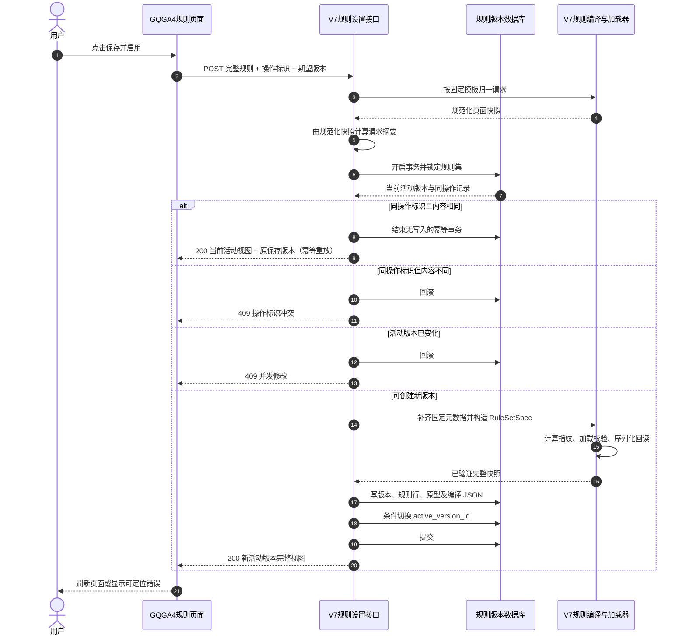

# APSGo V7 月计划规则设置接口详细设计

## 1. 文档信息

| 项目 | 内容 |
|---|---|
| 文档状态 | 实施中；阶段 0～4 已完成，下一阶段为接入两条 HTTP 路由 |
| 文档版本 | v0.6 |
| 编写日期 | 2026-09-07 |
| 适用范围 | GQGA4、默认工序、月计划场景 |
| 规则集身份 | `GQGA4/default/month` |
| 前端工程 | `/Users/miles/dev/dev-cs/aps-code-0806` |
| 求解器工程 | `/Users/miles/dev/dev-py/APSGOV7` |
| 实施入口 | [APSGo V7 月计划规则设置接口实施计划](../implementation/apsgo_v7_rule_setting_api_implementation_plan.md) |

> 本文描述目标设计；规则管理契约、GQGA4 完整规则编译、SQLite 规则版本存储及保存并启用事务已实现，不表示 HTTP 服务、正式初始化、求解绑定或 C# 页面已经完成改造。

## 2. 结论

月计划规则设置采用“**逐条保存、整体编译、立即启用、求解时只读完整快照**”的方式：

1. 数据库按“规则集版本 + 每条规则一行”保存，便于页面编辑、查询和追溯。
2. 用户点击一次“保存并启用”，前端只发送一次请求；后端在一个数据库事务内创建不可变的新版本、逐条落库、组装完整 V7 `RuleSetSpec`、执行权威校验并切换当前启用版本。
3. 求解开始时只读取当前启用版本的完整编译 JSON，并一次性绑定到 `SchedulingRequest`；搜索过程中不查数据库、不重新组装规则。
4. 不保留“保存草稿 → 再启用”的两步操作，也不为当前 GQGA4 引入审批流、定时生效或通用规则设计器。
5. 本接口不兼容 V3 的 DSL、草稿、预览和接口模型；V3 其他页面仍可保留原客户端，避免无关范围被破坏。

## 3. 目标与边界

### 3.1 目标

- 让现有 GQGA4 月计划规则配置页面能够查询、编辑并立即启用 V7 规则。
- 保持用户确认的固定接口地址、请求方式和页面基础功能。
- 确保保存成功的配置一定能被 V7 权威加载器接受，并具有可复算的规则指纹。
- 保证并发编辑、网络重试和持久化失败不会产生半套规则或错误启用版本。
- 保证已开始的求解任务使用启动时绑定的规则快照，不受后续规则修改影响。

### 3.2 本期不做

- 不提供规则草稿、单独启用、停用版本、版本删除、版本回滚接口。
- 不提供规则目录、表达式编辑器、规则预览或任意新增 Python 规则类型。
- 不把评分目标和允许最终偏差开放为页面可编辑项。
- 不在求解搜索过程中查询数据库或热切换规则。
- 不兼容 V3 的规则数据库结构、DSL 请求或运行时。
- 不改月计划排程接口的地址、参数和返回；排程接口适配另行设计。

## 4. 当前权威事实

当前 V7 的公开规则契约已经存在：

- `RuleDefinitionSpec`：单条规则的标识、类型、名称、作用范围、启停、版本和参数。
- `RuleSetSpec`：产线、工序、场景、版本、完整有序规则、完整评分定义、允许最终偏差和指纹。
- `SchedulingRequest`：订单、计划期、虚拟材料原型、规则集快照和求解策略的完整输入。
- `load_rule_set()`：将 `RuleSetSpec` 校验并加载为求解核心使用的规则集。
- `fingerprint_rule_set_spec()`：根据规范化内容计算规则集身份。

正式 GQGA4 基线为：

| 项目 | 当前值 |
|---|---|
| 规则数量 | 17 |
| 启用数量 | 16 |
| 停用规则 | `forbid_consecutive_reverse_width` |
| 评分目标数量 | 7 |
| 允许最终偏差 | `chain_weight_below_minimum` |
| 当前规则指纹 | `d963206b01c0d439303c1d6ae7d7374e20eaa0777801d12c0bebc89bfe6349c0` |
| 权威样本 | `tests/baselines/gqga4/gqga4_rule_set_spec.json` |

规则指纹是“规则完整内容的稳定摘要”，用于证明求解和审计读取的是同一套配置；它不是数据库主键，也不能由前端自行填写。

## 5. 术语说明

| 术语 | 含义 |
|---|---|
| 规则集身份 | 由产线、工序和场景组成的唯一业务身份，本期固定为 `GQGA4/default/month`。 |
| 活动版本 | 当前新求解任务应该读取的规则集版本。 |
| 完整快照 | 包含全部规则、评分定义、允许最终偏差和指纹的 `RuleSetSpec` JSON。 |
| 编译 | 后端把页面可编辑数据与服务端固定元数据组装为 `RuleSetSpec`，再通过 V7 加载器校验的过程；不是生成机器码。 |
| 乐观并发控制 | 保存时携带页面加载到的版本号；若期间他人已修改，则拒绝覆盖。 |
| 幂等 | 同一次保存因网络问题重试时，只创建一个版本，并返回第一次成功的结果。 |
| 虚拟材料原型 | 求解器可生成的虚拟材料模板，属于 `SchedulingRequest.virtual_prototypes`，不是规则定义。 |

## 6. 总体结构

物理部署采用独立 `apsgo_v7_service` 服务包：默认仅监听 `127.0.0.1:8001`，通过 C# 现有 `BACKEND_ALGORITHM_URL` 访问。服务包持有 FastAPI、SQLite 和 GQGA4 固定模板；现有 `apsgo_scheduler` 只提供框架无关契约、编译与求解能力，不依赖服务包。

```text
GQGA4 规则页面
  ├─ GET 读取当前活动版本
  └─ POST 提交完整可编辑快照
             │
             ▼
规则设置应用服务
  ├─ 并发与幂等检查
  ├─ 服务端补齐固定规则元数据
  ├─ 注入固定评分定义与允许最终偏差
  ├─ 复用 V7 指纹与规则加载器校验
  └─ 一个事务内写入版本、规则行、编译 JSON并切换活动版本
             │
             ▼
排程任务启动适配器
  ├─ 读取一次活动版本的编译 JSON
  ├─ 复算指纹并再次调用 V7 加载器
  └─ 将 RuleSetSpec 与虚拟原型绑定到 SchedulingRequest
```

### 6.1 权威边界

| 数据 | 管理/展示来源 | 求解时权威来源 |
|---|---|---|
| 单条规则启停与参数 | 版本下的逐条规则记录 | 活动版本的编译 `RuleSetSpec` JSON |
| 规则类型、名称、范围、顺序、规则版本 | 服务端 GQGA4 固定模板 | 编译 `RuleSetSpec` JSON |
| 七级评分目标 | 服务端固定定义 | 编译 `RuleSetSpec` JSON |
| 允许最终偏差 | 服务端固定定义 | 编译 `RuleSetSpec` JSON |
| 虚拟材料原型 | 同版本独立快照 | 启动时绑定到 `SchedulingRequest.virtual_prototypes` |
| 规则指纹 | 服务端计算 | 服务端复算并核对 |

数据库逐条规则记录服务于管理；编译 JSON 服务于运行。两者必须在同一事务中生成，不能由求解器临时从规则行拼装。

## 7. 接口总览

接口地址和 HTTP 方法按已确认契约固定：

| 功能 | 方法 | 地址 |
|---|---|---|
| 查询当前启用规则 | `GET` | `/api/v1/rule-sets/GQGA4/default/month/getActiveRules` |
| 保存并立即启用规则 | `POST` | `/api/v1/rule-sets/GQGA4/default/month/setActiveRules` |

路径中的 `GQGA4/default/month` 已表达规则集身份，请求体不再重复接受可变的产线、工序或场景字段，避免路径和正文不一致。

## 8. 查询当前启用规则

### 8.1 请求

```http
GET /api/v1/rule-sets/GQGA4/default/month/getActiveRules
```

无请求体。首期不增加查询参数。

### 8.2 成功响应

```json
{
  "product_line_code": "GQGA4",
  "process_code": "default",
  "scenario": "month",
  "active_version_id": 60,
  "version_no": 1,
  "based_on_version_id": null,
  "fingerprint": "d963206b01c0d439303c1d6ae7d7374e20eaa0777801d12c0bebc89bfe6349c0",
  "rules": [
    {
      "sequence_no": 1,
      "rule_id": "chain_weight_range",
      "rule_type": "ChainWeightRangeRule",
      "name": "链重范围",
      "scope": "chain",
      "enabled": true,
      "version": "1",
      "parameters": {
        "min_weight": 700,
        "target_weight": 2000,
        "max_weight": 2000
      }
    }
  ],
  "quality_spec": [
    {
      "criterion_id": "prohibited_violation_count",
      "metric_key": "prohibited_violation_count",
      "direction": "minimize",
      "aggregation": "named_value",
      "numeric_projection": "exact_decimal"
    }
  ],
  "allowed_final_deviation_codes": [
    "chain_weight_below_minimum"
  ],
  "virtual_prototypes": [],
  "remark": "GQGA4 月计划规则",
  "activated_at": "2026-09-06T10:00:00+08:00",
  "activated_by": "v7-rule-service"
}
```

示例数组为节选。真实响应必须返回当前版本的全部 17 条有序规则，包括停用规则；不得只返回页面可见项或启用项。

### 8.3 页面使用规则

- 页面缓存 `active_version_id`，保存时作为并发基线。
- 页面按 `rule_id` 映射控件，不依赖数组位置或中文名称。
- `rule_type`、`name`、`scope`、`version`、`sequence_no`、`quality_spec`、`allowed_final_deviation_codes` 和 `fingerprint` 只读。
- 页面没有编辑控件的规则仍保留在内存，并随保存请求完整回传其可编辑部分。

## 9. 保存并立即启用规则

### 9.1 请求

```http
POST /api/v1/rule-sets/GQGA4/default/month/setActiveRules
Content-Type: application/json
```

```json
{
  "save_operation_id": "b73d48a9-29c3-42a5-b4c7-131cfe8396ba",
  "expected_active_version_id": 60,
  "rules": [
    {
      "rule_id": "chain_weight_range",
      "enabled": true,
      "parameters": {
        "min_weight": 700,
        "target_weight": 2000,
        "max_weight": 2000
      }
    }
  ],
  "virtual_prototypes": [],
  "remark": "调整链重参数"
}
```

示例规则数组为节选；真实请求必须包含服务端要求的全部 17 个 `rule_id`，每个标识恰好一次。遗漏不解释为停用，未知标识和重复标识均拒绝。

### 9.2 请求字段

| 字段 | 必需 | 所有者 | 说明 |
|---|---|---|---|
| `save_operation_id` | 是 | 前端生成 | 一次用户保存操作的 UUID；网络重试复用同一个值。 |
| `expected_active_version_id` | 是 | 前端从 GET 取得 | 防止覆盖他人在页面打开后已经启用的新版本。 |
| `rules` | 是 | 前端 | 全部规则的 `rule_id`、`enabled` 和 `parameters`。 |
| `virtual_prototypes` | 是 | 前端 | 当前版本的完整虚拟材料原型；没有时传空数组。 |
| `remark` | 否 | 前端 | 本次变更说明；去除首尾空白后可为空。 |

前端不得提交或控制规则类型、名称、范围、顺序、规则版本、规则集版本、评分目标、允许最终偏差或指纹。这些字段由服务端固定模板与 V7 契约产生。

请求对象采用严格字段集合：顶层、规则项和虚拟材料原型出现未知字段时直接拒绝，不静默忽略；`parameters` 与 `rule_attributes` 内部仍按各自声明处理。这样可避免前端拼错字段后仍收到成功响应。

### 9.3 成功响应

成功响应返回与 GET 相同的完整活动版本视图，并增加：

```json
{
  "save_operation_id": "b73d48a9-29c3-42a5-b4c7-131cfe8396ba",
  "previous_active_version_id": 60,
  "saved_version_id": 61,
  "active_version_id": 61,
  "saved_version_is_active": true,
  "idempotent_replay": false
}
```

上述字段与完整活动版本视图合并返回。前端以响应中的 `active_version_id` 和完整规则刷新本地状态，不在成功后自行猜测版本号。

幂等重放时不重新启用历史版本。若该保存产生的 `saved_version_id` 后来已被其他版本替代，接口返回**当前**活动版本完整视图，同时令 `saved_version_is_active=false`；页面据此提示“本次保存曾成功，但当前规则后来已更新”，并显示当前活动配置。

## 10. 失败响应

### 10.1 统一结构

```json
{
  "error": {
    "code": "rule_set_validation_failed",
    "message": "规则配置未通过校验",
    "expected_active_version_id": 60,
    "current_active_version_id": 61,
    "issues": [
      {
        "code": "invalid_rule_parameters",
        "phase": "rule_loading",
        "field_path": "rules[0].parameters.min_weight",
        "subject_id": "chain_weight_range",
        "message": "min_weight must not exceed max_weight",
        "severity": "error"
      }
    ]
  }
}
```

`issues` 保留 V7 可定位诊断；页面优先按 `subject_id + field_path` 定位控件，无法定位时显示总错误，不丢弃原编辑内容。

### 10.2 状态码

| HTTP 状态 | 业务含义 | 页面行为 |
|---|---|---|
| `400` | JSON、字段类型或基础请求格式错误 | 保留输入并显示请求错误。 |
| `404` | 规则集身份不存在，或尚无活动版本 | 显示配置未初始化，不创建空白配置。 |
| `409` | 活动版本已变化，或同一操作标识被用于不同内容 | 保留编辑值，提示重新加载；禁止静默覆盖。 |
| `422` | 规则缺失、重复、未知，参数非法，或 V7 权威加载失败 | 展示字段级诊断。 |
| `500` | 事务、序列化或编译快照回读一致性失败 | 服务器回滚，页面可用同一操作标识重试。 |
| `503` | 数据库等必要基础设施暂不可用 | 保留编辑值，稍后重试。 |

错误响应不返回堆栈、数据库语句、连接信息或本机路径。

## 11. 保存、编译与启用事务

### 11.1 处理顺序

1. 校验请求结构；JSON 小数字面量直接解析为 Python `Decimal`，整数先保留为 `int`，不得经过二进制浮点数。调用阶段 2 的 GQGA4 固定模板，将规则参数归一到声明类型、按固定 17 条规则顺序排列，并生成唯一的规范化页面快照。
2. 由规范化页面快照计算请求摘要 `request_hash`。复用现有 `fingerprint()` 的稳定编码与 SHA-256；摘要包含规则集路径身份、`expected_active_version_id`、按固定 17 条模板排序的规则、保持用户顺序的虚拟材料原型和去除首尾空白后的 `remark`。`save_operation_id` 只作幂等查找键，不进入摘要。禁止直接对原始请求文本或未归一的数据传输对象计算摘要。
3. 开始事务并锁定 `GQGA4/default/month` 的规则集主记录。
4. **先检查 `save_operation_id`**：
   - 已存在且 `request_hash` 相同：不重新执行写入，读取当前活动版本并返回；同时返回原 `saved_version_id`，`idempotent_replay=true`。
   - 已存在但 `request_hash` 不同：返回 `409`。
5. 再比较 `expected_active_version_id` 与当前活动版本；不一致返回 `409`。
6. 使用已归一内容和新版本号，按照服务端固定顺序补齐规则类型、名称、范围和规则版本。
7. 注入固定七级 `quality_spec` 与固定 `allowed_final_deviation_codes`。
8. 生成新版本号和 `RuleSetSpec.version`，构造完整 `RuleSetSpec`。
9. 使用现有 `fingerprint_rule_set_spec()` 计算指纹，并使用现有 `load_rule_set()` 执行权威规则校验。
10. 将编译 JSON重新反序列化，复算指纹并再次加载；读回内容、指纹和规则数量必须一致。
11. 写入新版本、17 条规则记录、编译 JSON、虚拟原型快照和审计字段。
12. 以旧活动版本为条件切换 `active_version_id`；影响行数不是 1 时回滚并返回 `409`。
13. 在事务内完成活动视图回读和响应序列化；均成功后再提交，并返回已验证的完整视图。

幂等检查先于活动版本比较很重要：第一次保存已提交但响应丢失时，重试携带的旧 `expected_active_version_id` 已过期；如果先做版本比较，会把一次成功操作误报为并发冲突。

### 11.2 交互时序



### 11.3 原子性保证

- 编译或校验失败：不写入任何版本。
- 规则行、编译 JSON或虚拟原型写入失败：整个事务回滚。
- 活动版本指针切换失败：整个事务回滚。
- 只有事务提交成功的版本才可能成为活动版本。
- 历史版本不可修改；未来若需要回滚，也应复制为一个新版本，而不是重新激活或修改旧记录。

### 11.4 已实现边界

- GET 与 POST 应用服务每次调用均在当前线程打开、校验并关闭自己的 SQLite 连接，不跨 HTTP 线程共享连接。
- `editor_snapshot_json` 精确保存规范化后的 `rules`、`virtual_prototypes` 和 `remark` 三个页面可编辑部分；不把 `save_operation_id` 与 `expected_active_version_id` 复制到页面快照。初始版本不是页面 POST，因此不伪造公开请求对象。
- `request_hash` 仍单独包含规则集路径身份、基础活动版本及上述三个可编辑部分，不包含保存操作标识。
- 默认服务端审计主体为 `v7-rule-service`，时间由服务器生成并规范化为 UTC；仅单元测试可注入固定主体和时钟。
- 活动视图回读同时校验业务身份、版本、指纹、17 条规则内容与连续顺序、原型快照、页面快照、请求摘要和备注规范化；任一不一致都拒绝返回部分数据。

## 12. 数据库逻辑模型

数据库固定使用 V7 独立 SQLite 文件，默认路径为 `data/apsgo_v7_rules.sqlite3`，可通过 V7 专用环境变量 `APSGO_V7_RULE_DB_PATH` 覆盖；覆盖值去除首尾空白，空白值拒绝启动。直接使用 Python 标准库 `sqlite3`，不引入 ORM 或迁移框架。建表只由 V7 服务启动/初始化入口执行；普通请求只读校验并打开既有 schema，不为一次查询申请初始化写锁。

首期不提供生产反向迁移或自动删表入口。空的临时验收库可在关闭连接后删除数据库文件并重新初始化；有数据的生产库回退必须先保留数据库结构并按部署备份恢复，应用代码不得自行删除历史规则。

### 12.1 `v7_rule_set`

规则集业务身份与活动版本指针。

| 字段 | 说明 |
|---|---|
| `id` | 内部主键。 |
| `product_line_code` | 产线代码，本期 `GQGA4`。 |
| `process_code` | 工序代码，本期 `default`。 |
| `scenario` | 场景，本期 `month`。 |
| `active_version_id` | 当前活动版本，可在初始化事务完成前为空。 |
| `created_at` / `updated_at` | 服务端时间。 |

唯一约束：`(product_line_code, process_code, scenario)`。

### 12.2 `v7_rule_set_version`

一次“保存并启用”产生一个不可变版本。

| 字段 | 说明 |
|---|---|
| `id` | 版本内部主键，也是 API 的 `active_version_id`。 |
| `rule_set_id` | 所属规则集。 |
| `version_no` | 规则集内递增展示号。 |
| `based_on_version_id` | 本次编辑所基于的活动版本。 |
| `save_operation_id` | 一次用户保存操作标识。 |
| `request_hash` | 规范化可编辑请求摘要，用于幂等冲突判断。 |
| `compiled_rule_set_json` | 求解器权威读取的完整 `RuleSetSpec` JSON。 |
| `rule_set_fingerprint` | V7 规则集指纹。 |
| `virtual_prototypes_json` | 与该版本同时生效的虚拟材料原型快照。 |
| `editor_snapshot_json` | 页面可编辑输入的规范化快照，供回显和审计；不是求解权威。 |
| `remark` | 用户填写的变更说明。 |
| `created_by` / `created_at` | 由服务端进程身份和服务器时间生成。 |
| `activated_by` / `activated_at` | 由服务端进程身份和服务器时间生成的启用审计信息。当前保存与启用在同一事务，但字段语义分别保留。 |

唯一约束：`(rule_set_id, version_no)`、`(rule_set_id, save_operation_id)`。

编译时 `RuleSetSpec.version` 固定为 `version_no` 的无前导零十进制文本，例如版本号 2 写为 `"2"`。初始正式样本的 `version="1"` 因而可保持现有指纹；版本与内容共同参与后续指纹计算。

不增加 `draft/active/archived` 状态列；活动性只由 `v7_rule_set.active_version_id` 表达。

### 12.3 `v7_rule_definition`

每个版本中的每条规则一行。

| 字段 | 说明 |
|---|---|
| `id` | 内部主键。 |
| `rule_set_version_id` | 所属不可变版本。 |
| `sequence_no` | 服务端固定顺序。 |
| `rule_id` | 稳定规则标识。 |
| `rule_type` | V7 注册的规则实现类型。 |
| `rule_name` | 页面显示名称。 |
| `scope` | 规则作用范围。 |
| `enabled` | 是否启用。 |
| `rule_version` | 单条规则契约版本。 |
| `parameters_json` | 规则参数 JSON。 |

唯一约束：`(rule_set_version_id, rule_id)`、`(rule_set_version_id, sequence_no)`。

### 12.4 不单独建表的数据

- `quality_spec` 和 `allowed_final_deviation_codes` 当前固定且只读，直接进入编译快照，不建立可编辑表。
- 虚拟材料原型不是规则，不进入 `v7_rule_definition`；首期随版本保存为完整 JSON 快照。
- 不保存规则差异 JSON；需要比较时由两个不可变版本计算，避免重复事实源。

## 13. GQGA4 规则模板

服务端固定以下 17 个规则标识和顺序。页面可修改 `enabled` 与允许的参数；其他元数据由服务端产生。

| 顺序 | `rule_id` | 名称 | 当前启用 | 可编辑参数摘要 |
|---:|---|---|:---:|---|
| 1 | `chain_weight_range` | 链重范围 | 是 | `min_weight`、`target_weight`、`max_weight` |
| 2 | `forbid_consecutive_reverse_width` | 连续逆宽禁止 | 否 | 无参数，仅启停 |
| 3 | `max_reverse_width_count` | 链内逆宽次数 | 是 | `max_count` |
| 4 | `max_consecutive_virtual_sphc` | 连续虚拟材料数量 | 是 | `max_count` |
| 5 | `reverse_width_limit` | 宽度连接 | 是 | `max_reverse_width`、`virtual_width_tolerance` |
| 6 | `thickness_jump_limit` | 厚度跳跃 | 是 | `basis`、`ranges`、`fallback_tolerance` |
| 7 | `temperature_overlap_min` | 温度区间重叠 | 是 | `min_overlap`、`ignore_temperature`、`virtual_temperature_adaptive` |
| 8 | `gqga4_soft_hard_connection` | 软硬材连接 | 是 | 三项连接策略参数 |
| 9 | `chain_high_surface_run_count_lte` | 高表面连续数量 | 是 | `surface_grades`、`max_run_count` |
| 10 | `chain_if_narrow_real_weight_lte` | 窄钢连续真实重量 | 是 | `grade_class`、宽度上限、重量上限 |
| 11 | `chain_same_spec_real_weight_lte` | 同规格连续真实重量 | 是 | 分组字段、重量上限 |
| 12 | `strategic_customer_priority_objective` | 战略客户优先级 | 是 | 关键词和优先级 |
| 13 | `forbid_late_original_due_period` | 原订单延后计划期禁止 | 是 | 无参数，仅启停 |
| 14 | `future_fill_weight_target` | 未来填充目标 | 是 | `future_fill_weight_target` |
| 15 | `virtual_output_weight_ratio_limit` | 虚拟材料产出比例 | 是 | `max_ratio` |
| 16 | `controlled_order_split` | 受控订单拆分 | 是 | 拆分资格与允许模式 |
| 17 | `inter_chain_width_gap_objective` | 相邻链首尾宽度差 | 是 | 无参数，仅启停 |

“新增/删除/修改都使用 POST”表示所有允许的配置变化统一通过 `setActiveRules` 提交，不表示首期允许页面创建未知 Python 规则类型。固定 GQGA4 模板中，页面删除某项业务配置应表现为该规则允许时的 `enabled=false`，而不是省略规则行。

阶段 2 已将这份模板固化到 `apsgo_v7_service`，通用编译器仍位于 `apsgo_scheduler.app` 且不包含具体产线字面量。编辑值先按模板归一参数类型和规则顺序，再补全服务端元数据、生成指纹、执行首次权威加载；完整 JSON 回读后复算并第二次加载。规则具体的正负范围、枚举值、作用域和评分生产者关系仍由既有规则类与 `load_rule_set()` 判断，不在编译器复制。

27 个初始虚拟材料原型作为规则之外的独立生产种子固化；保存前会统一修剪原型标识、规范化牌号和已知文本属性，按修剪后标识判重，并根据当前启用规则检查宽度、厚度等必需物理字段。原型顺序保持页面顺序，不进入 `RuleSetSpec.rules` 或规则指纹。

## 14. 校验规则

### 14.1 请求边界校验

- `save_operation_id` 必须是合法、非空的 UUID 文本。
- `expected_active_version_id` 必须是正整数，并属于当前规则集。
- `rules` 必须是数组，恰好覆盖固定 17 个规则标识，每个标识出现一次。
- `enabled` 必须是 JSON 布尔值，不能接受 `0/1` 或文本替代。
- `parameters` 必须是 JSON 对象；数组次序对厚度区间等有序参数具有业务含义。
- 规则参数以 `parameters` 根对象为第 0 层，任一值距根最多 64 层；超过时在冻结或序列化前拒绝，避免递归异常逃逸。当前 GQGA4 参数远低于该边界。
- `virtual_prototypes` 必须完整覆盖当前页面管理的原型；原型标识不得重复。
- 顶层对象、每条规则和每个虚拟材料原型只接受已声明字段；未知字段严格拒绝。顶层字段诊断路径直接使用字段名，嵌套字段使用数组下标路径。
- 服务端设置字符串长度、数组长度和请求体大小上限，防止异常载荷耗尽资源；具体上限在阶段 5“接入两条 HTTP 路由”时依据正式 GQGA4 基线冻结，阶段 2 不提前虚构 HTTP 上限。

### 14.2 业务校验

校验不在 C# 页面复制一套规则逻辑。前端只做必填、格式和明显范围提示；是否可用于求解最终由服务端执行：

1. 固定规则标识和元数据补全校验。
2. `RuleDefinitionSpec` / `RuleSetSpec` 数据契约校验。
3. 现有 V7 规则注册表、参数和启停语义校验。
4. 七级评分定义与允许最终偏差的固定身份校验。
5. 指纹计算、JSON 回读、指纹复算和再次加载校验。
6. 虚拟材料原型的 `VirtualPrototypeInput` 契约校验。

保存接口不运行完整 GQGA4 排程。规则配置能成功加载是“可启用”条件；排程质量与性能仍由独立求解验收负责。

### 14.3 十进制数值

宽度、厚度、重量、比例和温度等已知业务数值进入 V7 领域契约前使用 `Decimal`。HTTP 入口对带小数点或指数的 JSON 数值直接解析为 `Decimal`，整数保留为 `int`；不能先经过 `float`。规则管理通用契约不知道某个参数是“整数次数”还是“十进制阈值”，因此不在入口统一转换；GQGA4 固定模板在编译时按参数定义完成类型归一。规范化 JSON 使用稳定字段顺序和稳定十进制表示，使 `20.0` 与 `20.00` 等价；整数型小数如 `2.0` 在次数参数位置归一为 `int`，非整数小数拒绝。次数类参数的入口表示边界统一采用 `sys.maxsize`（当前 Python 运行时的容器可索引上限），直接整数与整数型 `Decimal` 使用同一边界。

## 15. 求解任务绑定

新排程请求开始时执行一次：

1. 根据排程请求的产线、工序和场景定位规则集；本期只能命中 `GQGA4/default/month`。
2. 在同一个一致性读取中取得 `active_version_id`、`compiled_rule_set_json`、`rule_set_fingerprint` 和 `virtual_prototypes_json`。
3. 将 JSON 解析为 V7 `RuleSetSpec` 与 `VirtualPrototypeInput`。
4. 复算指纹并调用 `load_rule_set()`；任一步失败都拒绝启动，不回退到文件、历史版本或 V3 配置。
5. 将完整 `RuleSetSpec` 与虚拟原型写入本次 `SchedulingRequest`。
6. 在任务记录和结果审计中保存活动版本标识与规则指纹。

任务启动后使用内存中的不可变快照。此时另一个用户启用新版本，只影响后来启动的任务，不改变正在搜索的候选评价。

## 16. C# 规则页面适配

### 16.1 文件边界

目标页面位于：

- `SchedApp/Forms/RuleConf/RuleConfFormGQGA4.cs`
- `SchedApp/Forms/RuleConf/RuleConfFormGQGA4.designer.cs`

新增独立 V7 客户端，例如 `SchedApp/ApsgoV7RuleApiClient.cs`，并复用现有 `BACKEND_ALGORITHM_URL`（默认 `http://127.0.0.1:8001`）。不得直接删除或整体改名 `PipelineV3ApiClient.cs`，因为其他页面仍可能依赖 V3 客户端。

### 16.2 页面加载

1. 页面只调用一次 `getActiveRules`。
2. 按 `rule_id` 将返回数据映射到控件。
3. 缓存完整规则可编辑快照、虚拟原型和 `active_version_id`。
4. 不再加载 V3 规则目录、表单规范、草稿或四类预览结果。
5. 查询失败时保持页面不可保存，并明确显示失败原因，不使用内置默认值冒充活动配置。

### 16.3 保存

1. 执行页面格式校验。
2. 将控件值覆盖到加载时缓存的对应 `rule_id`；页面不可见的规则保持原值。
3. 为本次点击生成一个 `save_operation_id`。
4. 只调用一次 `setActiveRules`，不再先保存草稿再调用启用。
5. 成功后用响应完整刷新缓存和 `active_version_id`。
6. `409` 时保留未保存控件值并提示“规则已被其他用户修改，请重新加载后再保存”。
7. 网络结果不确定时，可让用户重试同一次操作，但必须复用原 `save_operation_id`；开始一次新的人工保存才生成新标识。
8. 幂等重放返回 `saved_version_is_active=false` 时，显示“原保存已成功但后来被更新”，并以响应中的当前活动视图刷新页面，不把旧版本重新提交。

### 16.4 控件与规则映射

| 页面含义 | V7 规则字段 |
|---|---|
| 普通逆宽范围 | `reverse_width_limit.parameters.max_reverse_width` |
| 虚拟材料宽度连接范围 | `reverse_width_limit.parameters.virtual_width_tolerance` |
| 逆宽次数 | `max_reverse_width_count.parameters.max_count` |
| 是否允许连续逆宽 | `forbid_consecutive_reverse_width.enabled` 的反向显示 |
| 厚度范围表格 | `thickness_jump_limit.parameters.basis/ranges/fallback_tolerance` |
| 忽略温度、最小重叠 | `temperature_overlap_min.parameters.ignore_temperature/min_overlap` |
| 链重下限、目标、上限 | `chain_weight_range.parameters.min_weight/target_weight/max_weight` |
| 连续虚拟材料上限 | `max_consecutive_virtual_sphc.parameters.max_count` |
| 未来填充目标 | `future_fill_weight_target.parameters.future_fill_weight_target` |
| 虚拟产出比例 | `virtual_output_weight_ratio_limit.parameters.max_ratio` |
| 其他固定规则控件 | 按稳定 `rule_id` 修改 `enabled` 或已声明参数 |
| 虚拟材料规格 | `virtual_prototypes`，不映射成规则 |

已取消的未来借用比例规则不得重新进入页面映射、POST 请求或编译模板。

### 16.5 页面按钮

- 保留一个“保存并启用”主操作。
- 删除或隐藏 GQGA4 页面的“保存草稿”“单独启用”和依赖旧预览的操作。
- 取消操作只恢复到最近一次成功 GET/POST 响应的本地快照，不发网络请求。

## 17. 安全与审计

- 首期服务只允许绑定 `127.0.0.1`，不开放非回环监听，不新增登录鉴权或权限体系。
- `created_by` / `activated_by` 由服务端使用进程身份生成；请求体不接受可信用户名字段。
- C# 的 `Environment.UserName` 不作为可信身份。若未来仅用于显示，可另增明确标注为客户端自报的字段，但不影响权限或审计主体。
- 日志记录规则集身份、操作标识、旧/新版本、指纹、结果码和服务端进程身份，不记录完整请求或本机敏感配置。
- 未来若要监听非回环地址，必须先增加服务端鉴权并重新评审，而不是只修改 host 配置。
- 规则参数只作为数据进入已注册规则构造器，禁止动态导入类名、执行表达式或反射调用任意代码。

## 18. 并发与重试语义

| 场景 | 结果 |
|---|---|
| 两人读取版本 60，甲先保存为 61，乙再保存 | 乙收到 `409`，版本 61 不被覆盖。 |
| 第一次保存成功但响应丢失，以同操作标识和同内容重试 | 不创建版本；返回当前活动视图、原保存版本和 `idempotent_replay=true`。 |
| 原保存版本后来已被替代，再重放同一操作 | 不重新启用旧版本；返回当前活动视图并令 `saved_version_is_active=false`。 |
| 同一操作标识被用于不同内容 | `409`，不创建新版本。 |
| 同一内容使用新的操作标识再次保存 | 视为新的人工保存，正常创建新版本。 |
| 编译成功但任一数据库写入失败 | 整体回滚，活动版本不变。 |
| 条件切换活动版本未更新一行 | 整体回滚并返回 `409`。 |

## 19. 初始化

首次部署通过一次性初始化命令或数据库迁移种子完成，不通过页面手工重建：

1. 从 `apsgo_v7_service` 包内的 GQGA4 生产种子读取初始规则和虚拟材料原型，不在生产运行时读取 `tests/`。
2. 使用生产代码路径重新构造、计算指纹并加载，不能直接信任种子或测试文件中已有指纹。
3. 开发期使用 `tests/baselines/gqga4/gqga4_rule_set_spec.json` 核对 17 条规则内容；使用冻结的 `inputs/optimization_problem.json` 核对 27 个虚拟材料原型及顺序。测试文件只作等价证据，不是部署输入或运行时回退。
4. 在一个事务中建立规则集、初始版本、17 条规则行并设置活动版本。
5. 回读验证 17 条规则、16 条启用、1 条指定停用、7 项评分、允许偏差和指纹。
6. 初始化重复执行必须检测已有身份并安全退出，不覆盖生产活动版本。

测试基线文件是初始化输入证据，不是生产运行时回退文件。部署后求解器只读数据库活动版本。

## 20. 性能与可用性边界

- GET 和 POST 都只处理一个规则集版本，数据量固定为几十条，不引入缓存层或消息队列。
- POST 中的编译与双重加载属于小规模配置校验，应在请求内同步完成；不创建异步任务。
- 求解搜索的数据库读取次数为零；每个排程任务只在启动绑定阶段读取一次规则快照。
- 数据库索引至少覆盖规则集业务身份、版本号、操作标识和版本下规则标识。
- 规则数据库不可用或活动快照损坏时应拒绝新任务，不能静默使用旧文件配置。

## 21. 验收标准

### 21.1 接口与存储

- 两个接口严格使用本文确认的方法和地址。
- GET 返回完整有序的 17 条规则、7 项评分、允许偏差、虚拟原型、版本和指纹。
- POST 一次成功请求只产生一个版本，并在同一事务内写入逐条记录、完整快照和活动指针。
- 任一校验或持久化失败不留下半版本，活动版本不变。
- 并发覆盖与操作标识冲突均稳定返回 `409`；网络重试不会重复建版本。

### 21.2 V7 契约

- 编译快照可通过现有 `RuleSetSpec`、指纹计算和 `load_rule_set()`。
- 初始 GQGA4 版本为 17 条规则、16 条启用、指定 1 条停用和 7 级目标。
- 逐条记录与编译 JSON回读内容一致；十进制数值无浮点漂移。
- 损坏、未知、缺失或重复规则均不能启用，也不能启动排程。

### 21.3 页面

- 打开页面只调用一次 GET；保存只调用一次 POST。
- 页面不再执行保存草稿、单独启用、规则目录、表单规范或规则预览流程。
- 不可见规则不会因保存页面可见字段而丢失或被误停用。
- 并发冲突和字段校验错误保留用户输入并给出可定位提示。
- 其他仍使用 V3 客户端的页面不受 GQGA4 专项改造影响。

### 21.4 求解绑定

- 新任务绑定当时活动版本的完整快照并记录版本与指纹。
- 任务运行中启用新规则版本，不改变已启动任务的规则。
- 求解搜索过程中没有规则数据库查询或重新编译。
- 规则快照损坏时任务明确失败，不回退、不带病求解。

## 22. 已确认的宿主环境

1. V7 新建独立 FastAPI 服务包 `apsgo_v7_service`，不修改 V3 `8008` 服务。
2. 服务默认且首期只监听 `127.0.0.1:8001`，C# 复用 `BACKEND_ALGORITHM_URL`。
3. V7 使用独立 SQLite 文件和标准库 `sqlite3`，不复用 V3 数据库，不同时实现 MySQL。
4. 首期没有登录鉴权；服务端进程身份作为审计主体，客户端用户名不可信。
5. `apsgo_scheduler` 继续只包含 `api/core/app`，无 FastAPI 或数据库依赖；外层服务包单向依赖它。

现状证据见 [接口宿主与数据库现状证据](../implementation/evidence/apsgo_v7_rule_setting_api/stage_00_environment_baseline/README.md)。

## 23. 已确认决策汇总

1. 查询统一使用 `GET /api/v1/rule-sets/GQGA4/default/month/getActiveRules`。
2. 增删改统一使用 `POST /api/v1/rule-sets/GQGA4/default/month/setActiveRules`。
3. 不保留规则草稿和单独启用接口，页面使用一次“保存并启用”。
4. 规则逐条保存，启用时组装完整 V7 配置、校验、编译并原子切换。
5. 不兼容 V3 的规则数据库、DSL 或运行时。
6. 求解器只读取完整编译快照，搜索过程中不访问规则数据库。
7. 评分定义和允许最终偏差由服务端固定，不开放页面编辑。
8. 虚拟材料原型与规则版本同时生效，但不伪装成规则。
9. 首期只适配 GQGA4 月计划规则设置，不建设通用规则平台。
10. V7 新建独立 FastAPI 服务，默认且首期只监听 `127.0.0.1:8001`。
11. C# 复用现有 `BACKEND_ALGORITHM_URL`，不增加第二个 V7 地址键。
12. V7 使用独立 SQLite 文件，不复用 V3 规则数据库，也不同时实现 MySQL。
13. 首期不新增登录鉴权，审计记录服务端进程身份；开放非回环地址前必须另行增加鉴权。
